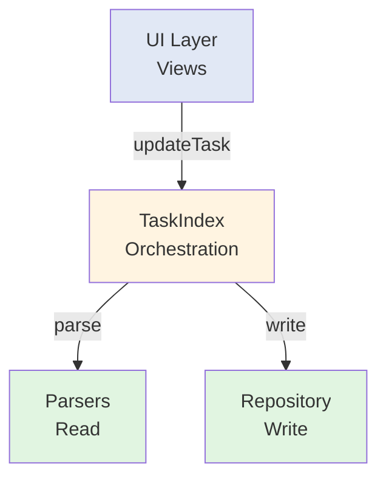

# Developer Documentation

## Task Card Rendering Architecture (v0.13.1+)

### Module layout

```
src/views/taskcard/
  TaskCardRenderer.ts      # Orchestrator for one task card
  ChildItemBuilder.ts      # Task/childLines -> ChildRenderItem[]
  ChildSectionRenderer.ts  # Child markdown/toggle rendering
  CheckboxWiring.ts        # Parent/child checkbox interaction and status menu
  NotationUtils.ts         # @notation label formatting helpers
  types.ts                 # ChildRenderItem / CheckboxHandler (taskcard-local types)
```

### Responsibility boundaries

1. `TaskCardRenderer` is the entry point used by Timeline/Schedule renderers.
2. `TaskCardRenderer` keeps frontmatter child rendering on a single path:
   parent render -> frontmatter child section render (no inline child branch).
3. `ChildSectionRenderer` owns child markdown render pipeline and notation injection.
4. `CheckboxWiring` owns all checkbox event binding and line-resolution logic.
5. `ChildItemBuilder` owns descendant expansion order and duplicate suppression.

### Frontmatter child rendering rule

1. Frontmatter cards must show a single child toggle set per card.
2. Child ordering follows file order from `childLines` first, then remaining `childIds`.
3. Duplicate line rendering is prevented with consumed line keys (`file:line`).
4. Checkbox updates for frontmatter child lines use absolute body line offsets.

### Shared type policy

1. `src/types.ts` is reserved for cross-layer models/settings only.
2. View-only split helpers moved to `src/views/utils/RenderableTaskUtils.ts`.
3. `RenderableTask`, `shouldSplitTask`, and `splitTaskAtBoundary` must be imported from `src/views/utils/RenderableTaskUtils.ts`.
4. Task-card-local render helper types are defined in `src/views/taskcard/types.ts`.

### Task content invariant

1. `Task.content` stores raw user-provided content only.
2. Frontmatter parser keeps `content` as empty string when `tv-content` is absent.
3. UI fallback labels (file basename / `Untitled`) must be resolved in view helpers (`src/utils/TaskContent.ts`), not in parsers.
4. AI Index resolves `content` at normalization time: when `Task.content` is empty for `inline`/`frontmatter`, it falls back to file basename for index output only.
5. AI Index row-level `updatedAt` is removed; index freshness must be read from `ai-task-index.meta.json` (`generatedAt`).
6. AI Index location is represented by `locator` (`ln:*`, `blk:*`, `tid:*`, `fm-root`); `sourceLine/sourceCol` are no longer exported.

---

## Architecture Overview

### Layer separation



| Layer | Responsibility |
|-------|----------------|
| **Parsers** | Convert markdown to Task objects |
| **Repository** | Write tasks back to files (CRUD) |
| **TaskIndex** | Central orchestration; route reads and writes |
| **Views** | UI rendering and user interaction |

---

## Directory Structure (v0.18.0+)

> The earlier tree in this document reflected an older layout. The actual `src/` structure is:

```
src/
├── main.ts                    # Plugin entry point (onload / onunload)
├── types.ts                   # Cross-layer types and settings (Task, TaskViewerSettings, etc.)
├── settings.ts                # Settings UI (TaskViewerSettingTab)
├── constants/                 # Constants and view registry
├── services/
│   ├── core/                  # Core services (TaskIndex, TaskStore, WikiLinkResolver, etc.)
│   ├── parsing/               # Parser layer (ParserChain, AtNotationParser, etc.)
│   │   ├── inline/            # Line-level parsers (AtNotationParser, etc.)
│   │   └── file/              # File-level parsers (FrontmatterTaskBuilder, etc.)
│   ├── persistence/           # Write layer (TaskRepository, FrontmatterWriter, etc.)
│   │   ├── writers/           # FrontmatterWriter, InlineTaskWriter
│   │   └── utils/             # FrontmatterLineEditor, etc.
│   ├── execution/             # Task conversion (InlineToFrontmatterConversionService)
│   └── aiindex/               # AI Index generation service
├── views/
│   ├── timelineview/          # Timeline view (including renderers/)
│   ├── scheduleview/          # Schedule view
│   ├── taskcard/              # Task card rendering (see section above)
│   ├── utils/                 # View-only utilities (RenderableTaskUtils, etc.)
│   ├── CalendarView.ts        # Calendar view
│   ├── MiniCalendarView.ts    # Mini calendar view
│   └── PomodoroView.ts        # Timer view (Pomodoro / Countdown / Countup modes)
├── widgets/                   # Floating timer widget
├── interaction/
│   ├── drag/                  # Drag & drop (DragHandler, MoveStrategy, etc.)
│   └── menu/                  # Context menus (MenuHandler, Builder classes)
├── commands/                  # Flow command execution (next / repeat / move)
├── modals/                    # Modal UI (CreateTaskModal, etc.)
├── suggest/                   # Obsidian property panel autocomplete
├── utils/                     # General utilities (AudioUtils, DateUtils, etc.)
└── styles/                    # CSS (BEM naming, --tv-* tokens)
```

---

## Subsystem Responsibility Map

Quick reference for locating the right layer when implementing a feature.

| Subsystem | Primary file | Responsibility |
|-----------|--------------|----------------|
| **TaskIndex** | `services/core/TaskIndex.ts` | Central orchestrator for scanning, indexing, and event management; branches on `parserId` |
| **TaskStore** | `services/core/TaskStore.ts` | In-memory task cache; notifies UI via `onChange` listeners |
| **TaskScanner** | `services/core/TaskScanner.ts` | File scanning → ParserChain invocation |
| **WikiLinkResolver** | `services/core/WikiLinkResolver.ts` | Resolves frontmatter wikilink parent–child relationships (`wikiLinkTargets` / `childLines`) |
| **SyncDetector / EditorObserver** | `services/core/SyncDetector.ts` et al. | Distinguishes local edits from remote sync changes |
| **ParserChain** | `services/parsing/ParserChain.ts` | Tries multiple parsers in order (Strategy chain) |
| **AtNotationParser** | `services/parsing/inline/AtNotationParser.ts` | Parses `@date` inline notation (line-level) |
| **FrontmatterTaskBuilder** | `services/parsing/file/FrontmatterTaskBuilder.ts` | Converts YAML frontmatter to Task objects (file-level) |
| **TaskRepository** | `services/persistence/TaskRepository.ts` | Write facade; dispatches to the correct writer based on `parserId` |
| **FrontmatterWriter** | `services/persistence/writers/FrontmatterWriter.ts` | Surgical YAML edits + heading-based child insertion |
| **FrontmatterLineEditor** | `services/persistence/utils/FrontmatterLineEditor.ts` | Low-level YAML line operations; never touches unrelated lines |
| **InlineTaskWriter** | `services/persistence/writers/InlineTaskWriter.ts` | Direct inline task line rewriting |
| **AiIndexService** | `services/aiindex/AiIndexService.ts` | NDJSON task index output with debounce, retry, and hash-based diff |
| **TaskCommandExecutor** | `commands/TaskCommandExecutor.ts` | Executes `==>` flow commands (next / repeat / move) |
| **DragHandler** | `interaction/drag/DragHandler.ts` | Dispatches pointer events to Move/Resize strategies |
| **MenuHandler** | `interaction/menu/MenuHandler.ts` | Context menu facade coordinating multiple Builder classes |
| **TimerWidget** | `widgets/TimerWidget.ts` | Floating timer UI; manages and persists all timer instances |
| **PomodoroView** | `views/PomodoroView.ts` | Standalone timer view (Pomodoro / Countdown / Countup) |
| **TaskCardRenderer** | `views/taskcard/TaskCardRenderer.ts` | Task card rendering orchestrator (see section above) |
| **CreateTaskModal** | `modals/CreateTaskModal.ts` | Task creation modal UI |
| **AudioUtils** | `utils/AudioUtils.ts` | Web Audio API notifications with serialized context management |

---

## Task Type Specifications

### Task type matrix

The plugin recognizes eight task types internally.

| Type | Syntax example | start | end | deadline |
|------|---------------|-------|-----|----------|
| **SED** | `@2001-11-11>2001-11-12>2001-11-13` | ✓ | ✓ | ✓ |
| **SE** | `@2001-11-11>2001-11-12` | ✓ | ✓ | — |
| **SD** | `@2001-11-11>>2001-11-13` | ✓ | — | ✓ |
| **ED** | `@>2001-11-12>2001-11-13` | — | ✓ | ✓ |
| **S-All** | `@2001-11-11` | ✓ | — | — |
| **S-Timed** | `@2001-11-11T12:00` | ✓ (with time) | — | — |
| **E** | `@>2001-11-12` | — | ✓ | — |
| **D** | `@>>2001-11-13` | — | — | ✓ |

### Duration calculation

Duration is calculated relative to the configured `startHour`.

1. **SED / SE**: actual elapsed time from `start` to `end`
2. **SD / S-All**: from `startHour` on the start day to `startHour + 23:59` (= 24 h)
3. **S-Timed**: always 1 hour from `start` (fixed for timeline display)
4. **E / ED**: `startHour` on the leftmost visible date is used as implicit start
5. **D**: `startHour` on the leftmost visible date is start; `start + 23:59` is end

### Task placement rules

| Type | Has time | Duration | Placed in |
|------|----------|----------|-----------|
| SED / SE | yes | ≥ 24 h | All-day lane |
| SED / SE | yes | < 24 h | Timeline lane |
| SED / SE | no | ≥ 24 h | All-day lane |
| SD / S-All / ED / E / D | — | always ≥ 24 h | All-day lane |
| S-Timed | yes | always 1 h | Timeline lane |

### 24-hour boundary

- Duration ≥ 24 h → All-day lane
- Duration < 24 h → Timeline lane
- Exactly 24 h (e.g. 12:00 → 12:00 next day) → All-day lane

### Frontmatter child element extraction (v0.13.1)

The heading configured in settings (`frontmatterTaskHeader` / `frontmatterTaskHeaderLevel`) acts as the virtual root for child elements.

1. `FrontmatterTaskBuilder.parse()` receives `frontmatterTaskHeader` and `frontmatterTaskHeaderLevel` and locates the matching heading section.
2. Starting from the first root-level list item under that heading, only the first contiguous list block is extracted.
3. Results are stored in `Task.childLines` and `Task.childLineBodyOffsets` (absolute line numbers).
4. `TaskScanner` attaches unparented tasks found in `childLineBodyOffsets` to `fmTask.childIds`.
5. `TaskCardRenderer` renders frontmatter tasks on a dedicated path (no inline branch) to prevent duplicate toggle rendering.
6. `ChildItemBuilder` prioritises absolute line numbers and skips already-expanded descendants to prevent duplicate rendering.

Notes:
- `wikiLinkTargets` is collected only from the same contiguous list block.
- When the configured heading is absent, child elements are treated as empty.

---

## Timeline View Implementation

### Type conversion rules for UI operations

Drag/resize operations may change a task's type.

#### All-day lane operations

**SED (≥ 24 h)**
- Move handle: update start/end dates (preserve duration)
- Right resize: update end date (deadline unchanged)
- Left resize: update start date (deadline unchanged)

**SE (≥ 24 h)**
- Move handle: update start/end dates (preserve duration)
- Right resize: update end date
- Left resize: update start date
- Move to Future: convert to F-type (start → `future`, drop end)

**SD**
- Move handle: update start date, add end to convert to SED (preserve width)
- Right resize: add end to convert to SED
- Left resize: update start date (duration changes)

**ED**
- Move handle: update end date, add start to convert to SED (preserve width)
- Right resize: update end date (duration changes)
- Left resize: add start to convert to SED

**E**
- Move handle: update end date, add start to convert to SE (preserve width)
- Right resize: update end date (duration changes)
- Left resize: add start to convert to SE

**D**
- Move handle: add start to convert to S-All
- Right resize: add end to convert to ED
- Left resize: add start to convert to SD

**S-All**
- Move handle: update start date (preserve duration)
- Right resize: add end to convert to SE
- Left resize: update start date (stays S-All)
- Move to Timeline: convert to S-Timed (assign time on timeline)

#### Timeline lane operations

**All types**
- Top resize: update start time and date (duration changes)
- Bottom resize: update end time and date (duration changes)
- Move handle: update start/end time and date (preserve duration)

**SED (< 24 h)**
- Move to All Day: convert to D-type (drop start/end, keep deadline only)

**SE (< 24 h)**
- Move to Future: convert to F-type (start → `future`, drop end)
- Move to All Day: convert to S-All (drop start time and entire end)

**S-Timed**
- Move to Future: convert to F-type (start → `future`)
- Move to All Day: convert to S-All (drop start time)

### Auto-scroll

While dragging or resizing in the timeline lane, the view auto-scrolls when the mouse leaves the visible area. The task card follows the mouse.

---

## CSS Naming Convention (BEM)

This project follows [BEM (Block Element Modifier)](https://getbem.com/).

### Structure

```css
.block                   /* Block: standalone component */
.block__element          /* Element: part of a block */
.block--modifier         /* Modifier: variation or state */
.block__element--modifier
```

### Examples

```css
.task-card               /* Block: task card */
.task-card__content      /* Element: content area */
.task-card__time         /* Element: time display */
.task-card__handle       /* Element: handle container */
.task-card__handle-btn   /* Element: handle button */
.task-card--allday       /* Modifier: all-day task */
.task-card--multi-day    /* Modifier: multi-day task */
.task-card__handle--move        /* Element + modifier: move handle */
.task-card__handle--resize-top  /* Element + modifier: top resize handle */
```

### CSS file structure

```
src/styles/
├── _variables.css            # CSS variable definitions
├── _base.css                 # Global styles
├── _task-card.css            # Task card component
├── _checkboxes.css           # Checkbox icons
├── _timeline-grid.css        # Timeline grid
├── _timeline-date-header.css # Date header
├── _timeline-allday.css      # All-day lane
├── _timeline-drag.css        # Drag-related styles
└── _schedule.css             # Schedule view
```

---

## Testing

### Sample tasks for manual verification

```markdown
- [ ] SED task @2026-01-01>2026-01-03>2026-01-05
- [ ] SE task @2026-01-01>2026-01-03
- [ ] SD task @2026-01-01>>2026-01-05
- [ ] ED task @>2026-01-03>2026-01-05
- [ ] S-All task @2026-01-01
- [ ] E task @>2026-01-03
- [ ] D task @>>2026-01-05

- [ ] SED task (with time) @2026-01-01T10:00>2026-01-01T15:00>2026-01-02T17:00
- [ ] SE task (with time) @2026-01-01T09:00>12:00
- [ ] S-Timed task @2026-01-01T14:00

- [ ] SE long-duration task @2026-01-01T10:00>2026-01-03T10:00
- [ ] SED long-duration task @2026-01-01>2026-01-04>2026-01-07
```

### Build commands

```bash
npm install       # Install dependencies
npm run dev       # Development build (watch)
npm run build     # Production build
```

---

## Coding Guidelines

### File naming

- **Parsers**: `<Target>Parser.ts` (e.g. `FrontmatterParser.ts`, `InlineTaskParser.ts`)
- **Services**: `<Feature>Service.ts` (e.g. `PomodoroService.ts`)
- **Views**: `<Name>View.ts` (e.g. `TimelineView.ts`)

### Type placement rules

| Location | Contents |
|----------|----------|
| `src/types.ts` | Cross-layer model types and settings only |
| `src/views/taskcard/types.ts` | Task-card-local render helper types |
| `src/views/utils/RenderableTaskUtils.ts` | `RenderableTask` and split helpers |
| Inside each subsystem directory | Subsystem-specific types (do not promote to cross-layer) |

### Tooltip convention

Use `aria-label` for tooltips. **Never set `title`** on interactive elements — Obsidian renders styled tooltips from `aria-label`, and a `title` attribute would cause a duplicate native browser tooltip.

```ts
// Good
btn.setAttribute('aria-label', 'Filter');

// Bad — causes double tooltip
btn.setAttribute('aria-label', 'Filter');
btn.setAttribute('title', 'Filter');
```

### Wording: "Remove" vs "Delete"

- **Remove** — internal data operations (removing a filter condition, removing an item from a list, removing a DOM element)
- **Delete** — user-facing actions that erase text in a markdown file (deleting a task line, deleting a child line)

```ts
// Internal: removing a filter node from the tree
menu.addItem(item => item.setTitle('Remove condition'));

// User-facing: deleting a task line from the file
menu.addItem(item => item.setTitle('Delete task'));
```

### Design patterns in use

| Pattern | Where used |
|---------|-----------|
| **Facade** | `TaskIndex`, `MenuHandler`, `TaskRepository` |
| **Strategy** | `DragStrategy` (Move/Resize), `CommandStrategy` (next/repeat/move), `ParserStrategy` |
| **Builder** | `PropertiesMenuBuilder`, `TimerMenuBuilder`, and other menu builders |
| **Observer** | `TaskStore.onChange()` notifies UI of task changes |
| **Surgical Edit** | `FrontmatterLineEditor` operates on YAML one key range at a time |

---

## URI Scheme

### Protocol

`obsidian://task-viewer`

All parameters are flat query params. No nested encoding (the former `state=<base64 blob>` and shorthand `tag=`/`status=`/`file=` params have been removed).

### Parameters

| Parameter | Format | Description | Example |
|-----------|--------|-------------|---------|
| `view` | string | **Required.** View short name | `timeline` / `calendar` / `schedule` / `mini-calendar` |
| `position` | string | Leaf placement | `left` / `right` / `tab` / `window` |
| `name` | string | Custom view name (URL-encoded) | `My%20Timeline` |
| `days` | integer | Display days (validated: 1, 3, 7) | `3` |
| `zoom` | float | Zoom level (validated: 0.25–10.0) | `1.5` |
| `date` | YYYY-MM-DD | Start date | `2026-02-28` |
| `showSidebar` | boolean | Sidebar visibility | `true` / `false` |
| `filter` | base64 | FilterState JSON (`{ version: 4, root: {...} }`) | `eyJ2ZXJzaW9uIjo0LC...` |
| `pinnedLists` | base64 | `PinnedListDefinition[]` JSON | `W3siaWQiOiJwbC0xIi...` |

### Example URIs

```
# Minimal
obsidian://task-viewer?view=timeline

# With view params and custom name
obsidian://task-viewer?view=timeline&position=right&name=Work%20Timeline&days=3&zoom=1.5&showSidebar=true

# With filter and pinned lists
obsidian://task-viewer?view=calendar&position=tab&showSidebar=true&filter=<base64>&pinnedLists=<base64>

# Markdown link format (generated by "Copy as link")
[Work Timeline](obsidian://task-viewer?view=timeline&position=right&name=Work%20Timeline&days=3)
```

### Position values

| Value | Behavior | API used |
|-------|----------|----------|
| `left` | Left sidebar | `workspace.getLeftLeaf(false)` |
| `right` | Right sidebar | `workspace.getRightLeaf(false)` |
| `tab` | New tab in main area | `workspace.getLeaf('tab')` |
| `window` | Popout window (desktop) | `workspace.getLeaf('window')` |
| *(omitted)* | Default: right sidebar if new, new tab if exists | — |

### Implementation

| Component | File | Role |
|-----------|------|------|
| **URI builder** | `src/utils/ViewUriBuilder.ts` | `build()` — generates URI from `ViewUriOptions` |
| **Position detection** | `src/utils/ViewUriBuilder.ts` | `detectLeafPosition()` — auto-detects leaf placement via parent chain |
| **Settings menu** | `src/views/ViewToolbar.ts` | `ViewSettingsMenu` — gear icon menu with Rename, Copy URI, Copy as link, Position |
| **URI handler** | `src/main.ts` | `registerObsidianProtocolHandler('task-viewer', ...)` — parses params |
| **View activation** | `src/main.ts` | `activateView()` — creates leaf at specified position and sets view state |
| **Filter serialization** | `src/services/filter/FilterSerializer.ts` | `toURIParam()` / `fromURIParam()` — base64 encode/decode |

### View settings menu

Each view's toolbar has a gear icon (settings) button. The menu provides:

| Item | Action |
|------|--------|
| **Rename...** | Opens `InputModal` to set a custom view name (stored in `ViewState.customName`, per-leaf) |
| **Copy URI** | Copies `obsidian://task-viewer?...` with current state including auto-detected `position` and `name` |
| **Copy as link** | Copies `[View Name](obsidian://task-viewer?...)` — Obsidian markdown link format |
| **Position** | Read-only display of current leaf position with checkmark |

### Copy URI parameters per view

- **TimelineView**: `filterState`, `days`, `zoom`, `pinnedLists`, `showSidebar`, `position`, `name`
- **CalendarView**: `filterState`, `pinnedLists`, `showSidebar`, `position`, `name`
- **ScheduleView**: `filterState`, `position`, `name`

### Toolbar icon order

```
[date-nav] [view-mode] [zoom]  ── spacer ──  [filter] [settings] [sidebar-toggle]
```

ScheduleView omits view-mode, zoom, and sidebar-toggle.

### Error handling

- Invalid `position` value → ignored, falls back to default behavior
- Invalid `name` → used as-is (stored as `customName` in view state)
- Invalid `filter` or `pinnedLists` base64 → silently ignored (empty filter / no pinned lists)
- Invalid `days`, `zoom`, `date` → ignored (view uses its defaults)

---

## Sync Detection

### Mechanism

The plugin detects local edits through two channels:

1. **Active editor input event monitoring**
   - Listens for `beforeinput` / `input` events on the active editor.
   - Marks the file as "locally edited".

2. **Plugin UI operations**
   - Timeline view drag/edit operations.
   - Internally marks the file as "locally edited".

If `vault.modify` fires without either mark being set, the change is classified as a remote sync.

### Implementation

- [`TaskIndex.ts`](./src/services/core/TaskIndex.ts): central sync detection logic
- `setupInteractionListeners()`: attaches editor event listeners
- `markLocalEdit()`: sets the local-edit flag for a given file path

---

## Changelog

See individual release tags for detailed change history.

---

## License

MIT License

---

## Style Token Rules (v0.13.1+)

1. Do not reference Obsidian theme variables directly outside `src/styles/_variables.css`.
2. `:root` is reserved for theme-independent constants (size, spacing, z-index).
3. Use `body` in `src/styles/_variables.css` as the single mapping layer from Obsidian vars to `--tv-*`.
4. Component/style files must use only `--tv-*` tokens.
5. Keep token design effectively single-layer; only keep `theme-light`/`theme-dark` overrides for app/card background and shadow strength.
6. Drag-and-drop visuals must separate drop-zone tokens (`--tv-drop-*`) from drag-ghost tokens (`--tv-ghost-*`).

---

## Timer Widget

`src/widgets/` — A fully independent floating UI. Operates separately from the Timeline and Schedule views.

### Timer types (defined in `widgets/TimerInstance.ts`)

| Type | Description |
|------|-------------|
| `CountupTimer` | Elapsed time measurement; supports both task-linked and standalone modes |
| `CountdownTimer` | Countdown; tracks `timeRemaining` |
| `IntervalTimer` | Multi-segment (work/break) loop; Pomodoro is implemented as this type |
| `IdleTimer` | Passive idle tracking; no task association |

Timer phases: `'idle'` | `'work'` | `'break'` | `'prepare'`

### Persistence

- Storage key: `task-viewer.active-timers.v5:{vaultFingerprint}`
- Migration logic exists for v3 → v4 → v5.
- **Always bump the version number and add a migration handler when changing the storage key.**

### Task integration

- `TimerTaskResolver` — resolves both inline and frontmatter tasks
- `TimerRecorder` — inserts a child task line or calls `updateTask()` directly
- `timerTargetId` (frontmatter key `tv-timer-target-id`) — tracks the task across file renames

### Components

- `TimerProgressUI` — circular progress ring + time display
- `TimerSettingsMenu` — Pomodoro settings context menu
- `IntervalParser` — parses interval notation

---

## AI Index Service

`src/services/aiindex/` — Generates a searchable task index as vault files.

**Output files**:
- `ai-task-index.ndjson` — one JSON object per line (NDJSON format)
- `ai-task-index.meta.json` — freshness tracking; read `generatedAt` for the last update time

**Design patterns**:
- Debounced writes (default 1000 ms)
- Retry on write failure (exponential backoff, max 30 s)
- Hash-based diff detection (skips write when content is unchanged)
- Cooldown notifications (15 s) to prevent spamming the user

**`locator` field format**: `ln:<number>` | `blk:<blockId>` | `tid:<timerTargetId>` | `fm-root`

**`content` fallback**: For `inline`/`frontmatter` tasks where `Task.content` is empty, the file basename is used in index output only. The `Task` object itself keeps `content` as an empty string (parsers must not populate it).

---

## Drag & Drop and Context Menus

### Drag (`src/interaction/drag/`)

- `DragHandler` receives pointer events and delegates to `MoveStrategy` or `ResizeStrategy` (Strategy pattern).
- `GhostFactory` + `GhostManager` manage the drag-preview DOM element.
- Split tasks (`RenderableTask`) carry `splitOriginalId` to track the original `taskId` during drag.

### Context menus (`src/interaction/menu/`)

`MenuHandler` coordinates the following Builder classes:

| Builder | Role |
|---------|------|
| `PropertiesMenuBuilder` | Date/time property editing |
| `TimerMenuBuilder` | Timer launch shortcuts |
| `MoveMenuBuilder` | Move and clone operations |
| `TaskActionsMenuBuilder` | Complete, delete, and convert actions |

Touch support: `TouchEventHandler` detects long-press (configurable via `longPressThreshold`, default 400 ms) to open the menu.

---

## Persistence Layer — Key Rules

### Surgical edit principle

When working with `FrontmatterWriter` / `FrontmatterLineEditor`:

- `FrontmatterLineEditor.applyUpdates()` touches **only the target key's lines** and leaves all other lines intact.
- `findKeyRange()` identifies the range `[start, end)` covering the key line and any continuation lines before any update, delete, or insert.
- YAML arrays and block scalars (multi-line values) are never corrupted.
- Key order is preserved exactly as the user wrote it.
- **Never reconstruct the entire frontmatter as a string** — this risks data loss.

### vault.process()

- All writes must use `vault.process()` for atomicity.
- In collapsed handlers, forgetting `childLine.replace()` causes `vault.process` to become a no-op.

### parserId-based write dispatch

```
task.parserId === 'frontmatter'   →  FrontmatterWriter
task.parserId === 'at-notation'   →  InlineTaskWriter
```

- `line: -1` means "no valid line number" only — **do not use it for type detection** (use `parserId`).
- In `TimerRecorder`, `line: -1` specifically means "line number unknown → force content-based search".

---

## Settings Schema

Defined in `src/types.ts` as `TaskViewerSettings`. Defaults are in `DEFAULT_SETTINGS` in the same file.

| Key | Type | Default | Description |
|-----|------|---------|-------------|
| `startHour` | number | 5 | Day boundary hour (used for visual date calculation) |
| `frontmatterTaskKeys` | FrontmatterTaskKeys | `tv-*` family | Frontmatter key names (all fields are individually customisable) |
| `completeStatusChars` | string[] | `['x','X','-','!']` | Status characters considered "complete" |
| `habits` | HabitDefinition[] | `[]` | Habit tracking definitions (boolean / number / string) |
| `frontmatterTaskHeader` | string | `'Tasks'` | Heading text under which child tasks are inserted |
| `frontmatterTaskHeaderLevel` | number | 2 | Heading level for the above (2 = `##`) |
| `longPressThreshold` | number | 400 | Long-press detection time (ms) |
| `aiIndex` | AiIndexSettings | — | AI Index generation settings (`services/aiindex/AiIndexSettings.ts`) |
| `pomodoroWorkMinutes` | number | 25 | Pomodoro work segment length |
| `pomodoroBreakMinutes` | number | 5 | Pomodoro break segment length |
| `countdownMinutes` | number | 25 | Default countdown duration |

All `FrontmatterTaskKeys` fields (`start`, `end`, `deadline`, `status`, `content`, `timerTargetId`, `color`, `linestyle`, `ignore`) are independently customisable. Duplicate key values are not allowed.

---

## Adding CSS Styles

1. New CSS variables → define as `--tv-*` tokens in the `body` block of `src/styles/_variables.css`.
2. `:root` is for theme-independent constants only (sizes, z-index values).
3. Component stylesheets must reference only `--tv-*` tokens (never Obsidian variables directly).
4. Drag visuals: use `--tv-drop-*` for drop zones and `--tv-ghost-*` for drag ghosts.
