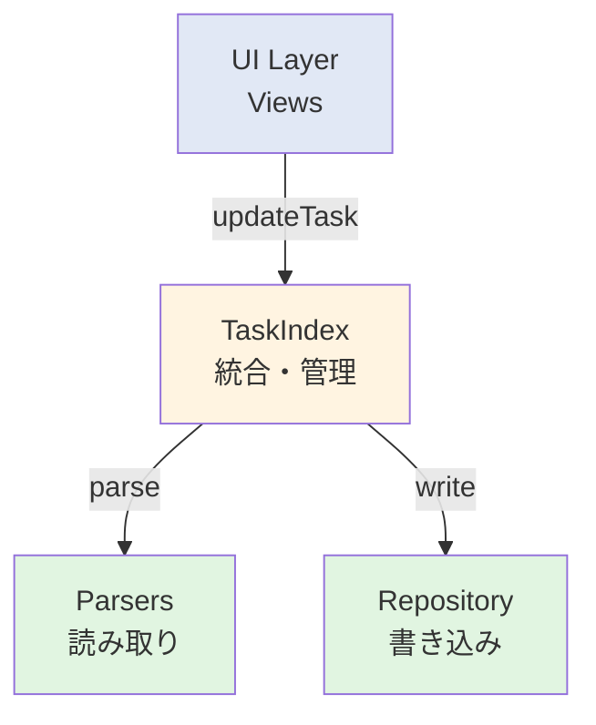

# Developer Documentation

## Task Card Rendering Architecture (v0.13.1+)

### Module layout

```
src/views/taskcard/
  TaskCardRenderer.ts      # Orchestrator for one task card
  ChildItemBuilder.ts      # Task/childLines -> ChildRenderItem[]
  ChildSectionRenderer.ts  # Child markdown/toggle rendering
  CheckboxWiring.ts        # Parent/child checkbox interaction and status menu
  NotationUtils.ts         # @notation label formatting helpers
  types.ts                 # ChildRenderItem / CheckboxHandler (taskcard-local types)
```

### Responsibility boundaries

1. `TaskCardRenderer` is the entry point used by Timeline/Schedule renderers.
2. `TaskCardRenderer` keeps frontmatter child rendering on a single path:
   parent render -> frontmatter child section render (no inline child branch).
3. `ChildSectionRenderer` owns child markdown render pipeline and notation injection.
4. `CheckboxWiring` owns all checkbox event binding and line-resolution logic.
5. `ChildItemBuilder` owns descendant expansion order and duplicate suppression.

### Frontmatter child rendering rule

1. Frontmatter cards must show a single child toggle set per card.
2. Child ordering follows file order from `childLines` first, then remaining `childIds`.
3. Duplicate line rendering is prevented with consumed line keys (`file:line`).
4. Checkbox updates for frontmatter child lines use absolute body line offsets.

### Shared type policy

1. `src/types.ts` is reserved for cross-layer models/settings only.
2. View-only split helpers moved to `src/views/utils/RenderableTaskUtils.ts`.
3. `RenderableTask`, `shouldSplitTask`, and `splitTaskAtBoundary` must be imported from `src/views/utils/RenderableTaskUtils.ts`.
4. Task-card-local render helper types are defined in `src/views/taskcard/types.ts`.

### Task content invariant

1. `Task.content` stores raw user-provided content only.
2. Frontmatter parser keeps `content` as empty string when `tv-content` is absent.
3. UI fallback labels (file basename / `Untitled`) must be resolved in view helpers (`src/utils/TaskContent.ts`), not in parsers.
4. AI Index resolves `content` at normalization time: when `Task.content` is empty for `inline`/`frontmatter`, it falls back to file basename for index output only.
5. AI Index row-level `updatedAt` is removed; index freshness must be read from `ai-task-index.meta.json` (`generatedAt`).
6. AI Index location is represented by `locator` (`ln:*`, `blk:*`, `tid:*`, `fm-root`); `sourceLine/sourceCol` are no longer exported.

開発者向けのドキュメントです。実装の詳細、アーキテクチャ、コーディング規約などを記載しています。

---

## アーキテクチャ概要

### ディレクトリ構造

```
src/
├── services/               # ビジネスロジック層
│   ├── parsers/           # タスク解析
│   │   ├── FrontmatterTaskParser.ts   # frontmatter専用パーサー
│   │   ├── ParserStrategy.ts          # インライン記法のインターフェース
│   │   └── TaskViewerParser.ts        # インライン記法の実装
│   ├── TaskIndex.ts       # タスク管理の中枢（読み取り・統合）
│   ├── TaskRepository.ts  # ファイルI/O（書き込み）
│   ├── TaskParser.ts      # パーサーのファサード
│   ├── TaskCommandExecutor.ts  # コマンド実行
│   ├── PomodoroService.ts      # ポモドーロ機能
│   └── WikiLinkResolver.ts     # Wiki Link解決
├── views/                 # UI層
│   ├── timelineview/      # タイムラインビュー
│   └── ScheduleView.ts    # スケジュールビュー
├── utils/                 # ユーティリティ
└── types.ts               # 型定義

```

### レイヤー分離



| レイヤー | 責務 |
|---------|------|
| **Parsers** | markdownからTaskオブジェクトへの変換 |
| **Repository** | ファイルへの書き込み（CRUD） |
| **TaskIndex** | タスク管理、読み書きの振り分け |
| **Views** | UI表示と操作 |

---

## タスク型の内部仕様

### タスク型一覧

プラグイン内部では、7つのタスク型を識別・処理しています。

| 型名 | 記法例 | start | end | deadline |
|-----|--------|-------|-----|----------|
| **SED型** | `@2001-11-11>2001-11-12>2001-11-13` | ○ | ○ | ○ |
| **SE型** | `@2001-11-11>2001-11-12` | ○ | ○ | - |
| **SD型** | `@2001-11-11>>2001-11-13` | ○ | - | ○ |
| **ED型** | `@>2001-11-12>2001-11-13` | - | ○ | ○ |
| **S-All型** | `@2001-11-11` | ○ | - | - |
| **S-Timed型** | `@2001-11-11T12:00` | ○(時刻あり) | - | - |
| **E型** | `@>2001-11-12` | - | ○ | - |
| **D型** | `@>>2001-11-13` | - | - | ○ |

### 期間の計算ロジック

タスクの期間は、設定された`startHour`を基準として計算されます。

1. **SED、SE型**: `start`から`end`までの実際の時間
2. **SD、S-All型**: start日の`startHour`から`startHour + 23:59`まで（1日=24時間）
3. **S-Timed型**: start時刻から+1時間（常に1時間、タイムライン表示用）
4. **E、ED型**: ビュー左端の日付の`startHour`を暗黙のstartとみなす
5. **D型**: ビュー左端の日付の`startHour`をstart、`start + 23:59`をendとみなす

### タスク配置ルール

| タスク型 | 時刻の有無 | 期間 | 配置先 |
|---------|-----------|------|--------|
| SED/SE | あり | >=24h | 長期タスク欄 |
| SED/SE | あり | <24h | タイムライン欄 |
| SED/SE | なし | >=24h | 長期タスク欄 |
| SD/S-All/ED/E/D | - | 常に>=24h | 長期タスク欄 |
| S-Timed | あり | 常に1h | タイムライン欄 |

### Frontmatter子要素の抽出・描画仕様（v0.13.1）

frontmatterタスクの子要素は、`## Tasks`（設定可能）を仮想ルートとして扱います。

1. `FrontmatterTaskBuilder.parse()` で、`frontmatterTaskHeader` と `frontmatterTaskHeaderLevel` を受け取り、該当見出しセクションを特定
2. 見出し配下の最初のルートリスト行を起点に、最初の連続リストブロックのみ抽出
3. 抽出結果を `Task.childLines` と `Task.childLineBodyOffsets`（絶対行番号）に格納
4. `TaskScanner` は `childLineBodyOffsets` に含まれる行の未親タスクを `fmTask.childIds` に接続
5. `TaskCardRenderer` では frontmatter を inline 経路で描画せず、frontmatter専用経路1本に統一（トグル二重描画防止）
6. `ChildItemBuilder` は絶対行番号を優先し、既に展開済み子孫行をスキップして重複描画を防止

補足:
- `wikiLinkTargets` は同じ連続リストブロック由来のみ収集する
- 見出しが存在しない場合、frontmatter子要素は空扱い

### 24時間境界の扱い

- 期間が24時間以上（`>=24:00`）→ 長期タスク欄
- 期間が24時間未満（`<24:00`）→ タイムライン欄
- 24時間ちょうど（例: 12:00-12:00翌日）→ 長期タスク欄

---

## タイムラインビューの実装詳細

### 各タスク型の変換ルール

UI操作（移動・伸縮）によって、タスクの型が変換されることがあります。

#### 終日タスク欄での操作

**SED型（24時間以上）**
- 移動ハンドル: start/endの日付を更新（期間不変）
- 右端伸縮: endの日付を更新（deadlineは不変）
- 左端伸縮: startの日付を更新（deadlineは不変）

**SE型（24時間以上）**
- 移動ハンドル: start/endの日付を更新（期間不変）
- 右端伸縮: endの日付を更新
- 左端伸縮: startの日付を更新
- Move to Future: F型に変換（start→`future`、end削除）

**SD型**
- 移動ハンドル: startの日付を更新、endを与えてSED型に変換（幅不変）
- 右端伸縮: endを与えてSED型に変換
- 左端伸縮: startの日付を更新（期間変化）

**ED型**
- 移動ハンドル: endの日付を更新、startを与えてSED型に変換（幅不変）
- 右端伸縮: endの日付を更新（期間変化）
- 左端伸縮: startを与えてSED型に変換

**E型**
- 移動ハンドル: endの日付を更新、startを与えてSE型に変換（幅不変）
- 右端伸縮: endの日付を更新（期間変化）
- 左端伸縮: startを与えてSE型に変換

**D型**
- 移動ハンドル: startを与えてS-All型に変換
- 右端伸縮: endを追加してED型に変換
- 左端伸縮: startを追加してSD型に変換

**S-All型**
- 移動ハンドル: startの日付を更新（期間不変）
- 右端伸縮: endを追加してSE型に変換
- 左端伸縮: startの日付を更新（S-All型のまま）
- Move to Timeline: S-Timed型に変換（タイムライン上で時刻指定）

#### タイムライン欄での操作

**全タスク共通**
- 上端伸縮: start時刻と日付を更新（期間変化）
- 下端伸縮: end時刻と日付を更新（期間変化）
- 移動ハンドル: start/endの時刻と日付を更新（期間不変）

**SED型（24時間未満）**
- Move to All Day: D型に変換（start/end削除、deadlineのみ残す）

**SE型（24時間未満）**
- Move to Future: F型に変換（start→`future`、end削除）
- Move to All Day: S-All型に変換（startの時刻とend全体を削除）

**S-Timed型**
- Move to Future: F型に変換（start→`future`）
- Move to All Day: S-All型に変換（startの時刻を削除）

### 自動スクロール

タイムライン欄での移動・伸縮操作中、マウスが表示領域外に出た場合、自動的にスクロールします。タスクカードはマウスに追従します。

---

## CSS命名規則（BEM）

本プロジェクトでは[BEM（Block Element Modifier）](https://getbem.com/)命名規則に従っています。

### 基本構造

```css
.block                  /* ブロック: 独立したコンポーネント */
.block__element         /* 要素: ブロックの一部 */
.block--modifier        /* 修飾子: バリエーション・状態 */
.block__element--modifier
```

### 例

```css
.task-card              /* ブロック: タスクカード */
.task-card__content     /* 要素: コンテンツ部分 */
.task-card__time        /* 要素: 時刻表示部分 */
.task-card__handle      /* 要素: ハンドルコンテナ */
.task-card__handle-btn  /* 要素: ハンドルボタン */
.task-card--allday      /* 修飾子: 終日タスク */
.task-card--multi-day   /* 修飾子: 複数日タスク */
.task-card__handle--move        /* 要素+修飾子: 移動ハンドル */
.task-card__handle--resize-top  /* 要素+修飾子: 上端リサイズハンドル */
```

### CSSファイル構造

```
src/styles/
├── _variables.css          # CSS変数定義
├── _base.css               # グローバルスタイル
├── _task-card.css          # タスクカードコンポーネント
├── _checkboxes.css         # チェックボックスアイコン
├── _timeline-grid.css      # タイムライングリッド
├── _timeline-date-header.css # 日付ヘッダー
├── _timeline-allday.css    # 終日タスク欄
├── _timeline-drag.css      # ドラッグ関連スタイル
└── _schedule.css           # スケジュールビュー
```

---

## テスト

### テスト用タスクサンプル

各タスク型の動作確認用サンプルです。

```markdown
- [ ] SED型タスク @2026-01-01>2026-01-03>2026-01-05
- [ ] SE型タスク @2026-01-01>2026-01-03
- [ ] SD型タスク @2026-01-01>>2026-01-05
- [ ] ED型タスク @>2026-01-03>2026-01-05
- [ ] S-All型タスク @2026-01-01
- [ ] E型タスク @>2026-01-03
- [ ] D型タスク @>>2026-01-05

- [ ] SED型タスク（時刻あり） @2026-01-01T10:00>2026-01-01T15:00>2026-01-02T17:00
- [ ] SE型タスク（時刻あり） @2026-01-01T09:00>12:00
- [ ] S-Timed型タスク @2026-01-01T14:00

- [ ] SE型長期タスク @2026-01-01T10:00>2026-01-03T10:00
- [ ] SED型長期タスク @2026-01-01>2026-01-04>2026-01-07
```

### ビルドとテスト

```bash
# 依存関係のインストール
npm install

# 開発ビルド
npm run dev

# プロダクションビルド
npm run build
```

---

## コーディングガイドライン

### ファイル命名

- **Parsers**: `<対象>Parser.ts`（例: `FrontmatterParser.ts`, `InlineTaskParser.ts`）
- **Services**: `<機能名>Service.ts`（例: `PomodoroService.ts`）
- **Views**: `<ビュー名>View.ts`（例: `TimelineView.ts`）

### 推奨されるリファクタリング

将来的に複雑性が増した場合:

1. `TaskParser.ts` → `parsers/index.ts`（ファサードの明確化）
2. `TaskViewerParser.ts` → `InlineTaskParser.ts`（命名の明確化）
3. `TaskCommandExecutor.ts` → `commands/`サブフォルダに分割

---

## 同期検出の実装詳細

### メカニズム

プラグインは以下の2つの方法でローカル操作を検出します。

1. **アクティブエディタの入力イベント監視**
   - `beforeinput`/`input`イベントを検出
   - 該当ファイルを「ローカル編集中」としてマーク

2. **プラグインUI経由の操作**
   - タイムラインビューでの操作
   - 内部で明示的に「ローカル編集」としてマーク

これらのマークがない状態で`vault.modify`イベントが発火した場合、同期による変更と判定します。

### 実装箇所

- [`TaskIndex.ts`](./src/services/TaskIndex.ts): 同期検出ロジックの中枢
- `setupInteractionListeners()`: エディタイベントリスナーの設定
- `markLocalEdit()`: ローカル編集のマーキング

---

## 変更履歴

主要な変更は各リリースタグで確認できます。

---

## ライセンス

MIT License

---

## Style Token Rules (v0.13.1+)

1. Do not reference Obsidian theme variables directly outside `src/styles/_variables.css`.
2. `:root` is reserved for theme-independent constants (size, spacing, z-index).
3. Use `body` in `src/styles/_variables.css` as the single mapping layer from Obsidian vars to `--tv-*`.
4. Component/style files must use only `--tv-*` tokens.
5. Keep token design effectively single-layer; only keep `theme-light`/`theme-dark` overrides for app/card background and shadow strength.
6. Drag-and-drop visuals must separate drop-zone tokens (`--tv-drop-*`) from drag-ghost tokens (`--tv-ghost-*`).
