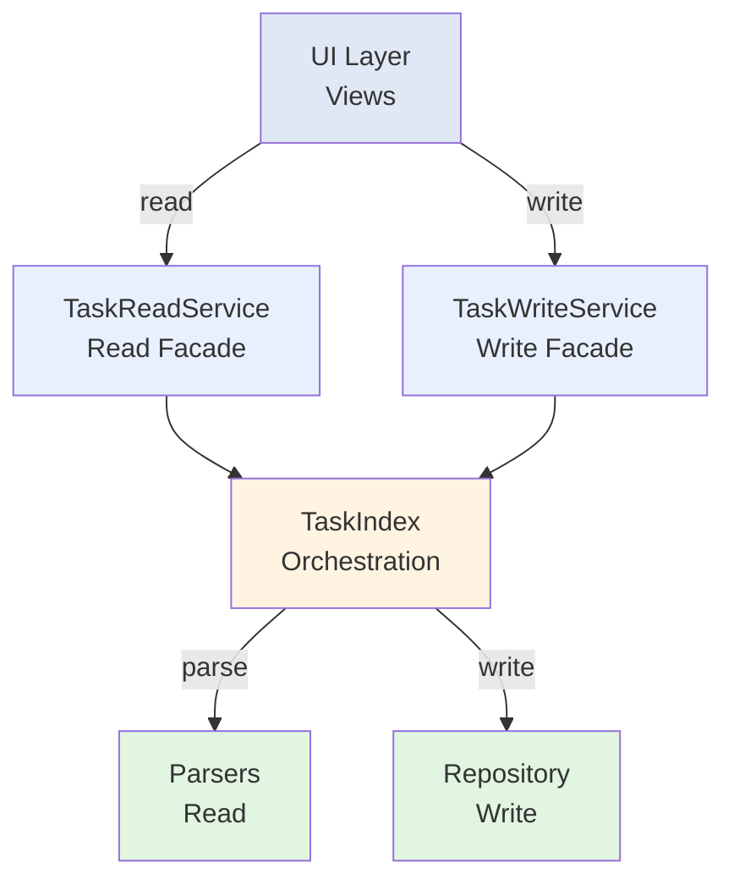

# Developer Documentation

## Task Card Rendering Architecture (v0.13.1+)

### Module layout

```
src/views/taskcard/
  TaskCardRenderer.ts              # Orchestrator for one task card
  ChildItemBuilder.ts              # Task/childLines -> ChildRenderItem[]
  ChildLineResolver.ts             # Child line resolution from file content
  ChildLineUtils.ts                # Child line utility helpers
  ChildRenderItemMapper.ts         # Maps child data to ChildRenderItem[]
  ChildSectionRenderer.ts          # Child markdown/toggle rendering
  CheckboxWiring.ts                # Parent/child checkbox interaction and status menu
  NotationUtils.ts                 # @notation label formatting helpers
  TaskLinkInteractionManager.ts    # Internal link click/hover handling
  types.ts                         # ChildRenderItem / CheckboxHandler (taskcard-local types)
  index.ts                         # Barrel exports
```

### Responsibility boundaries

1. `TaskCardRenderer` is the entry point used by Timeline/Schedule renderers.
2. `TaskCardRenderer` keeps frontmatter child rendering on a single path:
   parent render -> frontmatter child section render (no inline child branch).
3. `ChildSectionRenderer` owns child markdown render pipeline and notation injection.
4. `CheckboxWiring` owns all checkbox event binding and line-resolution logic.
5. `ChildItemBuilder` owns descendant expansion order and duplicate suppression.

### Frontmatter child rendering rule

1. Frontmatter cards must show a single child toggle set per card.
2. Child ordering follows file order from `childLines` first, then remaining `childIds`.
3. Duplicate line rendering is prevented with consumed line keys (`file:line`).
4. Checkbox updates for frontmatter child lines use absolute body line offsets.

### Shared type policy

1. `src/types.ts` is reserved for cross-layer models/settings only.
2. Split helpers (`DisplayTask`, `shouldSplitDisplayTask`, `splitDisplayTaskAtBoundary`) are in `src/services/display/DisplayTaskConverter.ts`.
3. Task-card-local render helper types are defined in `src/views/taskcard/types.ts`.

### Task content invariant

1. `Task.content` stores raw user-provided content only.
2. Frontmatter parser keeps `content` as empty string when `tv-content` is absent.
3. UI fallback labels (file basename / `Untitled`) must be resolved in view helpers (`src/services/parsing/utils/TaskContent.ts`), not in parsers.
4. API normalizer (`TaskNormalizer`) resolves `content` at normalization time: when `Task.content` is empty for `inline`/`frontmatter`, it falls back to file basename for API output only.

---

## Architecture Overview

### Layer separation


```mermaid
graph TB
    UI[UI Layer<br/>Views]
    Read[TaskReadService<br/>Read Facade]
    Write[TaskWriteService<br/>Write Facade]
    Index[TaskIndex<br/>Orchestration]
    Parser[Parsers<br/>Read]
    Repo[Repository<br/>Write]

    UI -->|read| Read
    UI -->|write| Write
    Read --> Index
    Write --> Index
    Index -->|parse| Parser
    Index -->|write| Repo

    style Parser fill:#e1f5e1
    style Repo fill:#e1f5e1
    style Index fill:#fff4e1
    style Read fill:#e8f0fe
    style Write fill:#e8f0fe
    style UI fill:#e1e8f5
```

| Layer | Responsibility |
|-------|----------------|
| **Views** | UI rendering and user interaction |
| **TaskReadService** | Read facade; cached DisplayTask conversion, filtering, date-range queries |
| **TaskWriteService** | Write facade; delegates all mutations to TaskIndex |
| **TaskIndex** | Central orchestration; scanning, indexing, event management |
| **Parsers** | Convert markdown to Task objects |
| **Repository** | Write tasks back to files (CRUD) |

---

## Directory Structure

```
src/
├── main.ts                    # Plugin entry point (onload / onunload)
├── types/                     # Cross-layer types and settings (Task, DisplayTask, TaskViewerSettings, etc.)
├── settings/                  # Settings UI (7 tabs: General, Views, ViewDetails, Notes, Frontmatter, Habits, Parsers)
├── constants/                 # Constants and view registry
├── i18n/                      # Internationalization (locale files)
├── api/                       # Public API (TaskApi, TaskNormalizer, FilterParamsBuilder, FilterFileLoader, TaskApiTypes)
├── cli/                       # CLI handlers (CliRegistrar, CliFilterBuilder, CliDatePresetParser, CliOutputFormatter, handlers/)
├── services/
│   ├── core/                  # Core services (TaskIndex, TaskStore, WikiLinkResolver, PropertyInheritanceResolver, TaskValidator, etc.)
│   ├── data/                  # Data access facade (TaskReadService, TaskWriteService)
│   ├── display/               # Display conversion (DisplayTaskConverter, TaskSplitter, TaskDateCategorizer, TaskIdGenerator, ImplicitCalendarDateResolver)
│   ├── parsing/               # Parser layer
│   │   ├── inline/            # Line-level parsers (AtNotationParser, DayPlannerParser, TasksPluginParser, ReadOnlyParserBase)
│   │   ├── file/              # File-level parsers (FrontmatterTaskBuilder)
│   │   ├── strategies/        # ParserChain, ParserStrategy
│   │   ├── tree/              # Document structure tree (DocumentTree, DocumentTreeBuilder, SectionPropertyResolver, etc.)
│   │   └── utils/             # Parser utilities (ChildLineClassifier, TagExtractor, TaskContent, TaskLineClassifier)
│   ├── persistence/           # Write layer (TaskRepository, TaskCloner, TaskConverter)
│   │   ├── writers/           # FrontmatterWriter, InlineTaskWriter
│   │   └── utils/             # FrontmatterLineEditor, FileOperations
│   ├── export/                # View data export (ViewExporter, per-view ExportStrategy)
│   ├── filter/                # Filter engine, serializer, types, value collector
│   ├── sort/                  # Task sorting (TaskSorter, SortTypes)
│   └── template/              # View template load/save (ViewTemplateLoader/Writer)
├── editor/                    # Editor extensions (TaskMenuExtension)
├── views/
│   ├── timelineview/          # Timeline view (including renderers/)
│   ├── scheduleview/          # Schedule view (including renderers/, utils/)
│   ├── calendar/              # CalendarView, MiniCalendarView
│   ├── kanban/                # Kanban view
│   ├── taskcard/              # Task card rendering (see section above)
│   ├── sharedUI/              # Shared UI components (ViewToolbar, PinnedListRenderer, etc.)
│   ├── sharedLogic/           # Shared logic (GridTaskLayout, etc.)
│   ├── customMenus/           # Filter/Sort popover menus, IntervalTemplateCreator
│   ├── sidebar/               # SidebarManager, SidebarToggleButton
│   └── TimerView.ts           # Timer view (Pomodoro / Countdown / Countup / Interval)
├── timer/                     # Timer widget and all timer services (including AudioUtils)
├── interaction/
│   ├── drag/                  # Drag & drop (DragHandler, DragStrategy, strategies/, ghost/)
│   └── menu/                  # Context menus (MenuHandler, PropertyCalculator, PropertyFormatter, builders/)
├── commands/                  # Flow command execution (next / repeat / move)
├── modals/                    # Modal UI (CreateTaskModal, ConfirmModal, etc.)
├── suggest/                   # Obsidian property panel autocomplete (color/, line/, tags/)
├── utils/                     # General utilities (DateUtils, ViewUriBuilder, etc.)
└── styles/                    # CSS (BEM naming, --tv-* tokens)
```

---

## Subsystem Responsibility Map

Quick reference for locating the right layer when implementing a feature.

| Subsystem | Primary file | Responsibility |
|-----------|--------------|----------------|
| **TaskIndex** | `services/core/TaskIndex.ts` | Central orchestrator for scanning, indexing, and event management; branches on `parserId` |
| **TaskStore** | `services/core/TaskStore.ts` | In-memory task cache; notifies UI via `onChange` listeners |
| **TaskScanner** | `services/core/TaskScanner.ts` | File scanning → ParserChain invocation |
| **WikiLinkResolver** | `services/core/WikiLinkResolver.ts` | Resolves frontmatter wikilink parent–child relationships (via `WikilinkRef` in TaskStore / `childLines`) |
| **SyncDetector / EditorObserver** | `services/core/SyncDetector.ts` et al. | Distinguishes local edits from remote sync changes |
| **ParserChain** | `services/parsing/strategies/ParserChain.ts` | Tries multiple parsers in order (Strategy chain) |
| **AtNotationParser** | `services/parsing/inline/AtNotationParser.ts` | Parses `@date` inline notation (line-level) |
| **FrontmatterTaskBuilder** | `services/parsing/file/FrontmatterTaskBuilder.ts` | Converts YAML frontmatter to Task objects (file-level) |
| **TaskRepository** | `services/persistence/TaskRepository.ts` | Write facade; dispatches to the correct writer based on `parserId` |
| **FrontmatterWriter** | `services/persistence/writers/FrontmatterWriter.ts` | Surgical YAML edits + heading-based child insertion |
| **FrontmatterLineEditor** | `services/persistence/utils/FrontmatterLineEditor.ts` | Low-level YAML line operations; never touches unrelated lines |
| **InlineTaskWriter** | `services/persistence/writers/InlineTaskWriter.ts` | Direct inline task line rewriting |
| **TaskFilterEngine** | `services/filter/TaskFilterEngine.ts` | Filter condition evaluation |
| **FilterSerializer** | `services/filter/FilterSerializer.ts` | Filter state serialization (v4 recursive group format) |
| **TaskSorter** | `services/sort/TaskSorter.ts` | Task sort processing |
| **ViewTemplateLoader/Writer** | `services/template/` | View template read/write |
| **TaskReadService** | `services/data/TaskReadService.ts` | Read facade; filter, sort, DisplayTask conversion |
| **TaskWriteService** | `services/data/TaskWriteService.ts` | Write facade; create, update, delete, duplicate, convert |
| **DisplayTaskConverter** | `services/display/DisplayTaskConverter.ts` | Task → DisplayTask conversion with effective field resolution |
| **TaskSplitter** | `services/display/TaskSplitter.ts` | Visual-date / date-range task splitting |
| **TaskDateCategorizer** | `services/display/TaskDateCategorizer.ts` | Categorizes tasks into allDay / timed / dueOnly |
| **ViewExporter** | `services/export/ViewExporter.ts` | View data export with per-view ExportStrategy |
| **PropertyInheritanceResolver** | `services/core/PropertyInheritanceResolver.ts` | Task-level parent→child property inheritance (BFS; separate from section-level cascade) |
| **TaskValidator** | `services/core/TaskValidator.ts` | Task validation |
| **DocumentTreeBuilder** | `services/parsing/tree/DocumentTreeBuilder.ts` | Document structure tree for section property inheritance |
| **DayPlannerParser** | `services/parsing/inline/DayPlannerParser.ts` | Day Planner compatible parser (read-only) |
| **TasksPluginParser** | `services/parsing/inline/TasksPluginParser.ts` | Tasks plugin compatible parser (read-only) |
| **TaskApi** | `api/TaskApi.ts` | Public API (15 methods) |
| **TaskNormalizer** | `api/TaskNormalizer.ts` | Task → NormalizedTask conversion for API output |
| **FilterFileLoader** | `api/FilterFileLoader.ts` | Filter file (.json/.md) loading |
| **TaskCommandExecutor** | `commands/TaskCommandExecutor.ts` | Executes `==>` flow commands (next / repeat / move) |
| **DragHandler** | `interaction/drag/DragHandler.ts` | Dispatches pointer events to Move/Resize strategies |
| **MenuHandler** | `interaction/menu/MenuHandler.ts` | Context menu facade coordinating multiple Builder classes |
| **TimerWidget** | `timer/TimerWidget.ts` | Floating timer UI; manages and persists all timer instances |
| **IntervalTemplateLoader/Writer** | `timer/IntervalTemplateLoader.ts` et al. | Interval template read/write |
| **AudioUtils** | `timer/AudioUtils.ts` | Web Audio API notifications with serialized context management |
| **KanbanView** | `views/kanban/KanbanView.ts` | Kanban board view |
| **TimerView** | `views/TimerView.ts` | Standalone timer view (Pomodoro / Countdown / Countup / Interval) |
| **TaskCardRenderer** | `views/taskcard/TaskCardRenderer.ts` | Task card rendering orchestrator (see section above) |
| **TaskLinkInteractionManager** | `views/taskcard/TaskLinkInteractionManager.ts` | Internal link click/hover handling within task cards |
| **SidebarManager** | `views/sidebar/SidebarManager.ts` | Sidebar visibility and pinned list management |
| **CreateTaskModal** | `modals/CreateTaskModal.ts` | Task creation modal UI |
| **TaskParser** | `services/parsing/TaskParser.ts` | Static facade wrapping active ParserChain; rebuilt on settings change |
| **InlineToFrontmatterConversionService** | `services/core/InlineToFrontmatterConversionService.ts` | Inline task → frontmatter file conversion (creates file, replaces original with wikilink) |

---

## Document Tree Pipeline

`TaskScanner` processes each file through a multi-stage pipeline:

```
1. DocumentTreeBuilder.build()         — Parse file into heading-based hierarchy tree
2. SectionPropertyResolver.resolve()   — Cascade properties through section nesting
3. TreeTaskExtractor.extract()         — Extract Task[] from tree with section properties attached
4. PropertyInheritanceResolver.resolve() — BFS parent→child property inheritance across tasks
```

### Two-tier property inheritance

| Tier | Resolver | Basis | Merge strategy |
|------|----------|-------|----------------|
| **Section-level** | `SectionPropertyResolver` | Heading nesting (e.g. `## A` → `### B`) | Child-wins cascade; resolves `color`, `linestyle`, `mask`, custom properties |
| **Task-level** | `PropertyInheritanceResolver` | `parentId` / `childIds` relationships | BFS child-wins; inherits `color`, `linestyle`, `mask`, `tags`, custom properties |

Section-level resolution happens **during** tree building.
Task-level resolution happens **after** task extraction, on the flat `Task[]` array.

### Inline child line extraction

TreeTaskExtractor がインラインタスクの `childLines` を構築するルール:

1. `DocumentTreeBuilder` がタスク行配下のインデント行を全て収集（`childRawLines`）
2. `- [x]` パターンの行は `childTaskBlocks` として構造的にグループ化される
3. `TreeTaskExtractor` は各 childTaskBlock に対して `isTaskProducing()` で判定:
   - @notation/日付/コマンドがある → タスクとして抽出、`childLines` から除外
   - ない → `childLines` に残す（プレーンチェックボックスとして表示）
4. `childLineBodyOffsets` に各 childLine の絶対行番号を格納

原則: **ブロック内の全行がタスクカードに表示される。**

#### childLineBodyOffsets のセマンティクス

| タスク種別 | 格納値 | 利用側 |
|-----------|--------|--------|
| frontmatter | body 相対オフセット（FM末尾からの距離） | `ChildLineUtils`: `fmEndLine + 1 + offset` |
| inline | 絶対行番号 | `ChildLineResolver` / `ChildLineUtils`: そのまま返す |

---

## Task Type Specifications

### Task type matrix

The plugin recognizes eight task types internally.

| Type | Syntax example | start | end | due |
|------|---------------|-------|-----|----------|
| **SED** | `@2001-11-11>2001-11-12>2001-11-13` | ✓ | ✓ | ✓ |
| **SE** | `@2001-11-11>2001-11-12` | ✓ | ✓ | — |
| **SD** | `@2001-11-11>>2001-11-13` | ✓ | — | ✓ |
| **ED** | `@>2001-11-12>2001-11-13` | — | ✓ | ✓ |
| **S-All** | `@2001-11-11` | ✓ | — | — |
| **S-Timed** | `@2001-11-11T12:00` | ✓ (with time) | — | — |
| **E** | `@>2001-11-12` | — | ✓ | — |
| **D** | `@>>2001-11-13` | — | — | ✓ |

### Display-based task classification

Tasks are classified by **display behavior** — where they appear and what values are inferred.
All times are relative to the configured `startHour` (default 5 → visual day 05:00–04:59).
Display-layer implicit value resolution is centralised in `toDisplayTask()` (in `services/display/DisplayTaskConverter.ts`).
Storage-layer daily-note date inheritance is in `ImplicitCalendarDateResolver.resolveDailyNoteDates()`.

#### 1. Timed tasks (S-Timed / E-Timed / SD-Timed / ED-Timed)

At least one side has an explicit time, and only one side (start or end) is specified.

- **Display**: Timeline lane, 1 h fixed duration
- **Inference**: reverse time on the missing side (startTime + 1 h → endTime, or endTime − 1 h → startTime)
- Examples: `@2026-03-09T10:00`, `@>2026-03-09T11:00`, `@2026-03-09T10:00>>due`

#### 2. All-day tasks (S-All / E-All / SD-All / ED-All)

Only one side specified, no time on that side.

- **Display**: Calendar (all-day) lane, 1 visual-day duration
- **Inference**: implicit time = startHour:00 / (startHour−1):59; reverse date = same day
- Examples: `@2026-03-09`, `@>2026-03-09`, `@2026-03-09>>due`

#### 3. SE / SED All-day (no time on either side)

Both start and end are specified, neither has a time.

- **Display**: Calendar (all-day) lane, spanning the specified days
- **Inference**: implicit times = startHour:00 / (startHour−1):59
- Examples: `@2026-03-09>2026-03-11`, `@2026-03-09>2026-03-11>due`

#### 4. SE / SED Timed (at least one side has time)

Both start and end are specified, at least one has an explicit time.

- **Display**: < 24 h → Timeline lane; ≥ 24 h → Calendar (all-day) lane
- **Inference**: if one side's time is missing, infer from startHour:00 / (startHour−1):59
- Daily-note special case: startDate can be omitted (inherited from filename)
- Examples: `@2026-03-09T10:00>12:00`, `@2026-03-09T10:00>2026-03-10T18:00`

#### 5. D (due only)

Only a due is specified, no start or end.

- **Display**: Calendar (all-day) lane on the due date (display only)
- **Inference**: none — D does not affect display position or duration inference
- Example: `@>>2026-03-13`

### Implicit value resolution rules (`toDisplayTask()`)

All display-layer implicit resolution is centralised in `toDisplayTask()` (in `services/display/DisplayTaskConverter.ts`).
Written dates are **calendarDates**. Complement uses `startHour` where possible,
falling back to `00:00`/`23:59` when same-day end < start occurs.

#### Stage 1: E-type start resolution (no startDate, has endDate)

| Subtype | Condition | Rule |
|---|---|---|
| E-Timed | endTime present | start = endTime − 1h (may cross to previous calendarDate) |
| E-AllDay | no endTime | endTime = `(startHour−1):59`, startDate = `toVisualDate(endDate, endTime, startHour)`, startTime = `startHour:00` |

#### Stage 2: All-day startTime complement

| Condition | Rule |
|---|---|
| startDate present, no startTime | startTime = `startHour:00` |

#### Stage 3: S-type end resolution (has startDate, no endDate)

| Subtype | Condition | Rule |
|---|---|---|
| S + explicit endTime | endTime present, no endDate | endDate = startDate (same-day inheritance) |
| S-Timed | startTime present, no endTime | end = startTime + 1h (may cross to next calendarDate) |
| S-AllDay | no startTime, no endTime | end = startTime + 23h59m |

#### Stage 4: SE/SED endTime complement

| Condition | Rule |
|---|---|
| endDate present, no endTime | endTime = `(startHour−1):59` |

#### Stage 5: Same-day fallback

| Condition | Rule |
|---|---|
| same calendarDate, one side implicit, end < start | implicit startTime → `00:00`, implicit endTime → `23:59` |

#### D-Only

D-Only tasks (`@>>due`) have no start or end — `toDisplayTask()` produces
`effectiveStartDate = ''` and `effectiveEndDate = undefined`. No resolution is applied.

#### Due complement (conceptual)

Due represents a deadline date (calendarDate). If time complement is needed,
`23:59` is used (end of calendar day, startHour-independent).

### 24-hour boundary

- Duration ≥ 24 h → All-day lane
- Duration < 24 h → Timeline lane
- Exactly 24 h (e.g. 12:00 → 12:00 next day) → All-day lane

### Frontmatter child element extraction (v0.13.1)

The heading configured in settings (`frontmatterTaskHeader` / `frontmatterTaskHeaderLevel`) acts as the virtual root for child elements.

1. `FrontmatterTaskBuilder.parse()` receives `frontmatterTaskHeader` and `frontmatterTaskHeaderLevel` and locates the matching heading section.
2. Starting from the first root-level list item under that heading, only the first contiguous list block is extracted.
3. Results are stored in `Task.childLines` and `Task.childLineBodyOffsets` (absolute line numbers).
4. `TaskScanner` attaches unparented tasks found in `childLineBodyOffsets` to `fmTask.childIds`.
5. `TaskCardRenderer` renders frontmatter tasks on a dedicated path (no inline branch) to prevent duplicate toggle rendering.
6. `ChildItemBuilder` prioritises absolute line numbers and skips already-expanded descendants to prevent duplicate rendering.

Notes:
- `WikilinkRef` entries are collected only from the same contiguous list block and stored in `TaskStore`.
- When the configured heading is absent, child elements are treated as empty.

---

## Timeline View Implementation

### Type conversion rules for UI operations

Drag/resize operations may change a task's type.

#### All-day lane operations

**SED (≥ 24 h)**
- Move handle: update start/end dates (preserve duration)
- Right resize: update end date (due unchanged)
- Left resize: update start date (due unchanged)

**SE (≥ 24 h)**
- Move handle: update start/end dates (preserve duration)
- Right resize: update end date
- Left resize: update start date

**SD**
- Move handle: update start date, add end to convert to SED (preserve width)
- Right resize: add end to convert to SED
- Left resize: update start date (duration changes)

**ED**
- Move handle: update end date, add start to convert to SED (preserve width)
- Right resize: update end date (duration changes)
- Left resize: add start to convert to SED

**E**
- Move handle: update end date, add start to convert to SE (preserve width)
- Right resize: update end date (duration changes)
- Left resize: add start to convert to SE

**D**
- Move handle: add start to convert to S-All
- Right resize: add end to convert to ED
- Left resize: add start to convert to SD

**S-All**
- Move handle: update start date (preserve duration)
- Right resize: add end to convert to SE
- Left resize: update start date (stays S-All)
- Move to Timeline: convert to S-Timed (assign time on timeline)

#### Timeline lane operations

**All types**
- Top resize: update start time and date (duration changes)
- Bottom resize: update end time and date (duration changes)
- Move handle: update start/end time and date (preserve duration)

**SED (< 24 h)**
- Move to All Day: convert to D-type (drop start/end, keep due only)

**SE (< 24 h)**
- Move to All Day: convert to S-All (drop start time and entire end)

**S-Timed**
- Move to All Day: convert to S-All (drop start time)

### Auto-scroll

While dragging or resizing in the timeline lane, the view auto-scrolls when the mouse leaves the visible area. The task card follows the mouse.

---

## CSS Naming Convention (BEM)

This project follows [BEM (Block Element Modifier)](https://getbem.com/).

### Structure

```css
.block                   /* Block: standalone component */
.block__element          /* Element: part of a block */
.block--modifier         /* Modifier: variation or state */
.block__element--modifier
```

### Examples

```css
.task-card               /* Block: task card */
.task-card__content      /* Element: content area */
.task-card__time         /* Element: time display */
.task-card__handle       /* Element: handle container */
.task-card__handle-btn   /* Element: handle button */
.task-card--allday       /* Modifier: all-day task */
.task-card--multi-day    /* Modifier: multi-day task */
.task-card__handle--move        /* Element + modifier: move handle */
.task-card__handle--resize-top  /* Element + modifier: top resize handle */
```

### CSS file structure

```
src/styles/
├── _variables.css            # CSS variable definitions (--tv-* tokens)
├── _base.css                 # Global styles
├── _task-card.css            # Task card component
├── _checkboxes.css           # Checkbox icons
├── _editor-task-menu.css     # Editor task menu
├── _timeline-grid.css        # Timeline grid
├── _timeline-date-header.css # Date header
├── _timeline-allday.css      # All-day lane
├── _timeline-drag.css        # Drag-related styles
├── _timeline-toolbar.css     # Timeline toolbar
├── _toolbar.css              # Shared toolbar styles
├── _schedule.css             # Schedule view
├── _calendar.css             # Calendar view
├── _mini-calendar.css        # Mini calendar view
├── _timer-view.css           # Timer view
├── _timer-widget.css         # Floating timer widget
├── _filter-popover.css       # Filter menu popover
├── _sort-popover.css         # Sort menu popover
├── _pinned-list.css          # Pinned list component
├── _sidebar.css              # Sidebar styles
├── _settings.css             # Settings tab
├── _modal.css                # Modal dialogs
├── _habits.css               # Habit tracker
├── _kanban.css               # Kanban view
└── _template-creator.css     # Template creator UI
```

---

## Testing

### Sample tasks for manual verification

```markdown
- [ ] SED task @2026-01-01>2026-01-03>2026-01-05
- [ ] SE task @2026-01-01>2026-01-03
- [ ] SD task @2026-01-01>>2026-01-05
- [ ] ED task @>2026-01-03>2026-01-05
- [ ] S-All task @2026-01-01
- [ ] E task @>2026-01-03
- [ ] D task @>>2026-01-05

- [ ] SED task (with time) @2026-01-01T10:00>2026-01-01T15:00>2026-01-02T17:00
- [ ] SE task (with time) @2026-01-01T09:00>12:00
- [ ] S-Timed task @2026-01-01T14:00

- [ ] SE long-duration task @2026-01-01T10:00>2026-01-03T10:00
- [ ] SED long-duration task @2026-01-01>2026-01-04>2026-01-07
```

### Build commands

```bash
npm install       # Install dependencies
npm run dev       # Development build (watch)
npm run build     # Production build
```

---

## Coding Guidelines

### File naming

- **Parsers**: `<Target>Parser.ts` (e.g. `AtNotationParser.ts`)
- **Services**: `<Feature>Service.ts` (e.g. `TaskReadService.ts`)
- **Views**: `<Name>View.ts` (e.g. `TimelineView.ts`, `TimerView.ts`)

### Type placement rules

| Location | Contents |
|----------|----------|
| `src/types.ts` | Cross-layer model types and settings only |
| `src/views/taskcard/types.ts` | Task-card-local render helper types |
| Inside each subsystem directory | Subsystem-specific types (do not promote to cross-layer) |

### Tooltip convention

Use `aria-label` for tooltips. **Never set `title`** on interactive elements — Obsidian renders styled tooltips from `aria-label`, and a `title` attribute would cause a duplicate native browser tooltip.

```ts
// Good
btn.setAttribute('aria-label', 'Filter');

// Bad — causes double tooltip
btn.setAttribute('aria-label', 'Filter');
btn.setAttribute('title', 'Filter');
```

**Native `<input type="date/time">` の注意**: Electron/Chromium はこれらの入力要素にビルトインのブラウザツールチップを表示する。`title=""` では抑制できない。対処法:

1. CSS で `pointer-events: none` を設定してホバーが native input に到達しないようにする
2. 表示用の要素（アイコンボタン等）に `aria-label` を設定して Obsidian 標準ツールチップを表示
3. アイコンボタンの `click` イベントで `showPicker()` を呼んでピッカーを開く
4. iOS Safari では `showPicker()` が動かない (WebKit Bug #261703) ため `focus()` + `click()` でフォールバック

```ts
// Native input: pointer-events: none (CSS), aria-hidden
nativeInput.setAttribute('aria-hidden', 'true');

// Icon button: aria-label for Obsidian tooltip, click to open picker
pickerButton.setAttribute('aria-label', 'Open date picker');
pickerButton.addEventListener('click', () => {
    try {
        nativeInput.showPicker();
    } catch {
        nativeInput.focus();
        nativeInput.click();
    }
});
```

### Wording: "Remove" vs "Delete"

- **Remove** — internal data operations (removing a filter condition, removing an item from a list, removing a DOM element)
- **Delete** — user-facing actions that erase text in a markdown file (deleting a task line, deleting a child line)

```ts
// Internal: removing a filter node from the tree
menu.addItem(item => item.setTitle('Remove condition'));

// User-facing: deleting a task line from the file
menu.addItem(item => item.setTitle('Delete task'));
```

### Design patterns in use

| Pattern | Where used |
|---------|-----------|
| **Facade** | `TaskIndex`, `TaskReadService`, `TaskWriteService`, `MenuHandler`, `TaskRepository`, `TaskParser` |
| **Strategy** | `DragStrategy` (Move/Resize), `CommandStrategy` (next/repeat/move), `ParserStrategy` |
| **Builder** | `PropertiesMenuBuilder`, `TimerMenuBuilder`, and other menu builders |
| **Observer** | `TaskStore.onChange()` notifies UI of task changes |
| **Surgical Edit** | `FrontmatterLineEditor` operates on YAML one key range at a time |
| **Document Tree** | `DocumentTreeBuilder` builds heading-based hierarchy for section property cascade |

---

## URI Scheme

### Protocol

`obsidian://task-viewer`

All parameters are flat query params. No nested encoding (the former `state=<base64 blob>` and shorthand `tag=`/`status=`/`file=` params have been removed).

### Parameters

| Parameter | Format | Description | Example |
|-----------|--------|-------------|---------|
| `view` | string | **Required.** View short name | `timeline` / `calendar` / `schedule` / `mini-calendar` / `timer` |
| `position` | string | Leaf placement | `left` / `right` / `tab` / `window` / `override` |
| `name` | string | Custom view name (URL-encoded) | `My%20Timeline` |
| `days` | integer | Display days (validated: 1, 3, 7) | `3` |
| `zoom` | float | Zoom level (validated: 0.25–10.0) | `1.5` |
| `date` | YYYY-MM-DD | Start date | `2026-02-28` |
| `showSidebar` | boolean | Sidebar visibility | `true` / `false` |
| `filter` | base64 | FilterState JSON (`{ version: 4, root: {...} }`) | `eyJ2ZXJzaW9uIjo0LC...` |
| `pinnedLists` | base64 | `PinnedListDefinition[]` JSON | `W3siaWQiOiJwbC0xIi...` |
| `template` | string | View template name (URL-encoded). When set, `filter`/`pinnedLists` are omitted | `My%20Template` |
| `mode` | string | Timer view mode | `countup` / `countdown` / `pomodoro` / `interval` |
| `intervalTemplate` | string | Interval template name (URL-encoded) | `Deep%20Work` |

### Example URIs

```
# Minimal
obsidian://task-viewer?view=timeline

# With view params and custom name
obsidian://task-viewer?view=timeline&position=right&name=Work%20Timeline&days=3&zoom=1.5&showSidebar=true

# With filter and pinned lists
obsidian://task-viewer?view=calendar&position=tab&showSidebar=true&filter=<base64>&pinnedLists=<base64>

# Markdown link format (generated by "Copy as link")
[Work Timeline](obsidian://task-viewer?view=timeline&position=right&name=Work%20Timeline&days=3)
```

### Position values

| Value | Behavior | API used |
|-------|----------|----------|
| `left` | Left sidebar | `workspace.getLeftLeaf(false)` |
| `right` | Right sidebar | `workspace.getRightLeaf(false)` |
| `tab` | New tab in main area | `workspace.getLeaf('tab')` |
| `window` | Popout window (desktop) | `workspace.getLeaf('window')` |
| `override` | Reuse existing leaf of same view type | Finds existing leaf and updates state in place |
| *(omitted)* | Default: uses per-view default position from settings | — |

### Implementation

| Component | File | Role |
|-----------|------|------|
| **URI builder** | `src/utils/ViewUriBuilder.ts` | `build()` — generates URI from `ViewUriOptions` |
| **Position detection** | `src/utils/ViewUriBuilder.ts` | `detectLeafPosition()` — auto-detects leaf placement via parent chain |
| **Settings menu** | `src/views/sharedUI/ViewToolbar.ts` | `ViewSettingsMenu` — gear icon menu with Save/Load view, Copy URI, Copy as link, Position |
| **URI handler** | `src/main.ts` | `registerObsidianProtocolHandler('task-viewer', ...)` — parses params |
| **View activation** | `src/main.ts` | `activateView()` — creates leaf at specified position and sets view state |
| **Filter serialization** | `src/services/filter/FilterSerializer.ts` | `toURIParam()` / `fromURIParam()` — base64 encode/decode |

### View settings menu

Each view's toolbar has a gear icon (settings) button. The menu provides:

| Item | Action |
|------|--------|
| **Save view...** | Saves current view state as a named template (stored in configured `viewTemplateFolder`) |
| **Load view...** | Submenu listing saved templates; applies selected template to current view |
| **Reset view** | Resets view state to defaults |
| **Copy URI** | Copies `obsidian://task-viewer?...` with current state including auto-detected `position` and `name` |
| **Copy as link** | Copies `[View Name](obsidian://task-viewer?...)` — Obsidian markdown link format |
| **Position** | Read-only display of current leaf position with checkmark |

### Copy URI parameters per view

- **TimelineView**: `filterState`, `days`, `zoom`, `pinnedLists`, `showSidebar`, `position`, `name`
- **CalendarView**: `filterState`, `pinnedLists`, `showSidebar`, `position`, `name`
- **ScheduleView**: `filterState`, `position`, `name`
- **TimerView**: `mode`, `intervalTemplate`, `position`, `name`
- All views support `template` (when set, `filter`/`pinnedLists` are omitted from URI)

### Toolbar icon order

```
[date-nav] [view-mode] [zoom]  ── spacer ──  [filter] [settings] [sidebar-toggle]
```

ScheduleView omits view-mode, zoom, and sidebar-toggle.

### Error handling

- Invalid `position` value → ignored, falls back to default behavior
- Invalid `name` → used as-is (stored as `customName` in view state)
- Invalid `filter` or `pinnedLists` base64 → silently ignored (empty filter / no pinned lists)
- Invalid `days`, `zoom`, `date` → ignored (view uses its defaults)

---

## Sync Detection

### Mechanism

The plugin detects local edits through two channels:

1. **Active editor input event monitoring**
   - Listens for `beforeinput` / `input` events on the active editor.
   - Marks the file as "locally edited".

2. **Plugin UI operations**
   - Timeline view drag/edit operations.
   - Internally marks the file as "locally edited".

If `vault.modify` fires without either mark being set, the change is classified as a remote sync.

### Implementation

- [`TaskIndex.ts`](./src/services/core/TaskIndex.ts): central sync detection logic
- `setupInteractionListeners()`: attaches editor event listeners
- `markLocalEdit()`: sets the local-edit flag for a given file path

---

## Changelog

See individual release tags for detailed change history.

---

## License

MIT License

---

## Style Token Rules (v0.13.1+)

1. Do not reference Obsidian theme variables directly outside `src/styles/_variables.css`.
2. `:root` is reserved for theme-independent constants (size, spacing, z-index).
3. Use `body` in `src/styles/_variables.css` as the single mapping layer from Obsidian vars to `--tv-*`.
4. Component/style files must use only `--tv-*` tokens.
5. Keep token design effectively single-layer; only keep `theme-light`/`theme-dark` overrides for app/card background and shadow strength.
6. Drag-and-drop visuals must separate drop-zone tokens (`--tv-drop-*`) from drag-ghost tokens (`--tv-ghost-*`).

---

## Timer Widget

`src/timer/` — A fully independent floating UI. Operates separately from the Timeline and Schedule views.

### Timer types (defined in `timer/TimerInstance.ts`)

| Type | Description |
|------|-------------|
| `CountupTimer` | Elapsed time measurement; supports both task-linked and standalone modes |
| `CountdownTimer` | Countdown; tracks `timeRemaining` |
| `IntervalTimer` | Multi-segment (work/break) loop; Pomodoro is implemented as this type |
| `IdleTimer` | Passive idle tracking; no task association |

Timer phases: `'idle'` | `'work'` | `'break'` | `'prepare'`

### Persistence

- Storage key: `task-viewer.active-timers.v5:{vaultFingerprint}`
- Migration logic exists for v3 → v4 → v5.
- **Always bump the version number and add a migration handler when changing the storage key.**

### Task integration

- `TimerTaskResolver` — resolves both inline and frontmatter tasks
- `TimerRecorder` — inserts a child task line or calls `updateTask()` directly
- `timerTargetId` (frontmatter key `tv-timer-target-id`) — tracks the task across file renames

### Components (all in `src/timer/`)

- `TimerProgressUI` — circular progress ring + time display
- `TimerSettingsMenu` — Pomodoro settings context menu
- `TimerRenderer` — timer UI rendering
- `TimerContext` — timer context management
- `TimerCreator` — timer instance creation
- `TimerLifecycle` — timer lifecycle management
- `TimerStorageUtils` — timer storage utilities
- `TimerTargetManager` — timer-task association management
- `IntervalTemplateLoader` / `IntervalTemplateWriter` — interval template read/write (markdown files with `_tv-*` frontmatter keys)

### Audio notifications (`timer/AudioUtils.ts`)

State-transition-based sound mapping. All sounds use Web Audio API scheduling (no `setTimeout`).

| Action | Sound | Method | Notes |
|--------|-------|--------|-------|
| Start (initial) | Long × 2 (660 Hz, 0.35 s each) | `playStartSound()` | — |
| Resume | Long × 2 | `playStartSound()` | Same as Start |
| Pause | G5→E5→C5 descending 3-note | `playPauseSound()` | Mirrors finish sound in reverse |
| Stop (manual) | C5→E5→G5 ascending 3-note | `playFinishSound()` | Same as auto-complete |
| Auto-complete | C5→E5→G5 ascending 3-note | `playFinishSound()` | Interval finish / countdown expire |
| Segment transition | Long × 2 | `playTransitionConfirm()` | Same pattern as Start |
| Warning (3, 2, 1 s) | Short × 1 per tick (660 Hz, 0.25 s) | `playWarningBeep()` | Called each tick when remaining ≤ 3 s |

**Design notes**:
- Multi-note patterns prevent wireless earphone auto-sleep from swallowing notifications.
- Ascending = completion/stop, descending = pause, rhythmic = start/resume/transition.
- 10 ms gain envelope (fade-in/fade-out) on every note prevents audible clicks.
- `getReadyContext()` serializes concurrent `resume()` calls to avoid AudioContext race conditions.

---

## Drag & Drop and Context Menus

### Drag (`src/interaction/drag/`)

- `DragHandler` receives pointer events and delegates to `MoveStrategy` or `ResizeStrategy` (Strategy pattern).
- `GhostFactory` + `GhostManager` manage the drag-preview DOM element.
- Split tasks (`DisplayTask`) carry `originalTaskId` to track the original `taskId` during drag.

### Context menus (`src/interaction/menu/`)

`MenuHandler` coordinates the following Builder classes:

| Builder | Role |
|---------|------|
| `PropertiesMenuBuilder` | Date/time property editing |
| `TimerMenuBuilder` | Timer launch shortcuts |
| `TaskActionsMenuBuilder` | Complete, delete, convert, and move/clone actions |
| `CheckboxMenuBuilder` | Checkbox status menu |
| `ChildLineMenuBuilder` | Child line context menu |

Touch support: `TouchEventHandler` detects long-press (configurable via `longPressThreshold`, default 400 ms) to open the menu.

---

## Persistence Layer — Key Rules

### Surgical edit principle

When working with `FrontmatterWriter` / `FrontmatterLineEditor`:

- `FrontmatterLineEditor.applyUpdates()` touches **only the target key's lines** and leaves all other lines intact.
- `findKeyRange()` identifies the range `[start, end)` covering the key line and any continuation lines before any update, delete, or insert.
- YAML arrays and block scalars (multi-line values) are never corrupted.
- Key order is preserved exactly as the user wrote it.
- **Never reconstruct the entire frontmatter as a string** — this risks data loss.

### vault.process()

- All writes must use `vault.process()` for atomicity.
- In collapsed handlers, forgetting `childLine.replace()` causes `vault.process` to become a no-op.

### parserId-based write dispatch

```
task.parserId === 'frontmatter'   →  FrontmatterWriter
task.parserId === 'at-notation'   →  InlineTaskWriter
```

- `line: -1` means "no valid line number" only — **do not use it for type detection** (use `parserId`).
- In `TimerRecorder`, `line: -1` specifically means "line number unknown → force content-based search".

### Inline vs Frontmatter persistence rules

#### Date field handling

| Aspect | Inline (`at-notation`) | Frontmatter |
|--------|----------------------|-------------|
| Time-only values | ✅ Allowed (`@10:00`) | ❌ Prohibited (returns null → key deleted) |
| startDateInherited | ✅ Used (daily note date inheritance) | ❌ Never set |
| endDate same-day omission | ✅ Normal (`>14:00` = same day as start) | ❌ Always explicit date |
| Update strategy | Full line re-format via `AtNotationParser.format()` | Surgical YAML key edit via `FrontmatterLineEditor` |
| Empty field in Properties modal | Sparse update (field omitted → preserved) | Resolved value written (field filled from PropertyCalculator) |

#### Inline notation format rules (`AtNotationParser.format()`)

**startDateInherited**:
- `true` + startTime → `@10:00` (date omitted)
- `false` / unset → `@2026-03-07T10:00` (date explicit)
- Drag/resize always sets startDate → clears inherited flag

**endDate same-day omission**:
- `endDate === startDate` + endTime → `>14:00` (date omitted)
- `endDate !== startDate` → `>2026-03-08T02:00` (date explicit)
- `endDate` undefined + endTime → `>14:00` (implicit same-day)
- Round-trip safe: parser re-derives endDate=undefined → DisplayTaskConverter resolves it

#### Frontmatter write rules

**Time-only prohibition**: `formatFrontmatterDateTime()` returns `null` when only time is available.
Prevents YAML sexagesimal misinterpretation and Obsidian frontmatter editor incompatibility.

**fallbackDate pattern**: When endDate is undefined but endTime exists, startDate is used as fallback.
In FrontmatterWriter, task is already updated via `Object.assign(task, updates)` so startDate is current.
In TaskConverter (inline→frontmatter), task comes from parser with parsed startDate.

#### Properties modal update behavior (`PropertiesMenuBuilder.buildTaskUpdatesFromResult()`)

- **Frontmatter**: Empty fields filled with PropertyCalculator resolved values → all dates always explicit in YAML
- **Inline**: Empty fields excluded from updates → preserves `startDateInherited` and time-only notation

### startDateInherited lifecycle

| Event | Result |
|-------|--------|
| Daily note parse (startTime present, startDate absent) | Set `true` |
| Drag / resize | Cleared (startDate always set explicitly) |
| Properties modal — inline, startDate left empty | Preserved (not in updates) |
| Properties modal — inline, startDate filled in | Cleared |
| Properties modal — frontmatter | N/A (never set for frontmatter) |
| `TaskIndex.updateTask()` condition | `'startDate' in updates && updates.startDate !== undefined` |

---

## Terminology

### Date boundary concepts

| Term | Meaning | Determined by |
|------|---------|---------------|
| **calendarDate** | The date as defined by midnight (00:00). `task.startDate`, `task.endDate`, `task.due` are all calendar dates. | Fixed (midnight) |
| **visualDate** | The date as perceived by the user, shifted by `startHour`. A task at 03:00 with `startHour=5` belongs to the previous visual day. | `startHour` setting |

- `getVisualDateOfNow()`, `toVisualDate()` return **visualDate**
- `DateUtils.getToday()`, `DateUtils.addDays()` operate on **calendarDate**
- `startHour` is the boundary between two visual days (default: 5:00 AM)

### @notation endDate semantics

`task.endDate` is stored as a **calendarDate** and is **exclusive** in visual terms.

```
@2026-03-24>2026-03-29  →  startDate='2026-03-24', endDate='2026-03-29'
toDisplayTask() resolves:  effectiveEndTime = '04:59' (startHour−1)
toVisualDate('2026-03-29', '04:59', 5)  →  '2026-03-28'
Visual span: 03-24 ~ 03-28 = 5 visual days
```

The mechanism: `toDisplayTask()` sets `effectiveEndTime = (startHour−1):59` for tasks without explicit endTime. Since this time is before `startHour`, `toVisualDate` shifts back by 1 day. The resulting visualDate is the **last inclusive visual day** of the task.

**Rule: always use `toVisualDate()` to convert both start and end dates to visual dates. There is no separate `getVisualEndDate()` — the same function handles both because the shift direction depends solely on whether the time is before startHour.**

### Visual date pipeline

All visual date calculations MUST flow through the same code path. Two canonical functions exist:

| Function | Location | Purpose |
|----------|----------|---------|
| `toDisplayTask()` | `services/display/DisplayTaskConverter.ts` | Resolves implicit effective fields from raw Task |
| `getTaskDateRange()` | `views/calendar/CalendarDateUtils.ts` | Converts DisplayTask effective fields to inclusive visual start/end dates |

Any code that needs a task's visual date range — renderers, grid layout, drag ghosts, split boundaries — must use this pipeline, never compute visual dates independently from raw task fields.

```
Raw Task
  ↓  toDisplayTask(task, startHour)
DisplayTask (effectiveStartDate/Time, effectiveEndDate/Time)
  ↓  getTaskDateRange(displayTask, startHour)
{ effectiveStart: visualDate, effectiveEnd: visualDate }  ← inclusive range
```

### Pitfall: raw endDate ≠ visual end

`task.endDate` (raw, exclusive) and the inclusive visual end date are different by 1 day for allDay tasks.
Any code that converts between the two must do so explicitly:

| Direction | Method |
|-----------|--------|
| raw → visual (for rendering/ghost) | `getTaskDateRange(toDisplayTask(task, startHour), startHour).effectiveEnd` |
| visual → raw (for write-back) | `DateUtils.addDays(visualEndDate, 1)` |

**Never mix raw and visual dates in the same calculation** (e.g., comparing `task.endDate` with a grid column date, or computing span from `getDiffDays(startDate, endDate)` using raw values).

---

## Task Split Architecture

### Overview

Calendar and AllDay views display tasks on a date grid. Tasks spanning multiple visual days or crossing view boundaries need splitting into segments. This is handled by `TaskSplitter` (`services/display/TaskSplitter.ts`).

### Split boundary types

```typescript
type SplitBoundary =
  | { type: 'visual-date'; startHour: number }     // Splits timed tasks at startHour
  | { type: 'date-range'; start; end; startHour }   // Clips tasks at view/week boundaries
```

| Type | Purpose | Applies to |
|------|---------|-----------|
| **visual-date** | Splits timed tasks crossing the `startHour` boundary into [head, tail] | Timed tasks only (allDay tasks span by design) |
| **date-range** | Clips tasks extending beyond a date range (e.g. week boundaries) into segments | All task types |

### Two-step split pipeline (CalendarView)

```
allTasks (DisplayTask[])
  ↓  splitTasks(tasks, { type: 'visual-date', startHour })
     Timed tasks crossing startHour → [head, tail]
  ↓  splitTasks(tasks, { type: 'date-range', start: weekStart, end: weekEnd, startHour })
     Tasks extending beyond week → clipped segments
  ↓  computeGridLayout(tasks, { dates, getDateRange })
     Position on grid with colStart, span, trackIndex
```

AllDaySectionRenderer uses only the date-range split (allDay tasks don't need visual-date splitting).

### Split segment fields

Split segments inherit all fields from the original via `...dt` spread. Modified fields:

| Field | Head segment | Tail segment |
|-------|-------------|--------------|
| `id` | `makeSegmentId(originalId, startDate)` | `makeSegmentId(originalId, boundaryDate)` |
| `effectiveEndDate/Time` | Set to boundary | Inherited from original |
| `effectiveStartDate/Time` | Inherited from original | Set to boundary |
| `isSplit` | `true` | `true` |
| `splitContinuesBefore` | From original (or `false`) | `true` |
| `splitContinuesAfter` | `true` | From original (or `false`) |
| `originalTaskId` | Original task ID | Original task ID |

### Drag ghost and visual dates

Drag strategies (Move/Resize) must use the same visual date pipeline as the renderer to ensure ghost size matches the displayed task card.

```typescript
// In BaseDragStrategy:
protected getVisualDateRange(task: Task, startHour: number): { start: string; end: string }
  // Internally: toDisplayTask(task, startHour) → getTaskDateRange(dt, startHour)
```

Each strategy maintains two sets of dates:

| Field | Semantic | Used for |
|-------|----------|----------|
| `initialCalendarDate` / `initialCalendarEndDate` | Raw calendarDates (endDate is exclusive) | Write-back to task (preserves @notation format) |
| `initialCalendarVisualStart` / `initialCalendarVisualEnd` | Inclusive visualDates | Ghost rendering, `updateCalendarSplitPreview`, span calculation |

**Never pass `initialCalendarEndDate` to `updateCalendarSplitPreview()`** — it expects inclusive dates, but `initialCalendarEndDate` is exclusive.

---

## Settings Schema

Defined in `src/types/index.ts` as `TaskViewerSettings`. Defaults are in `DEFAULT_SETTINGS` in the same file.

| Key | Type | Default | Description |
|-----|------|---------|-------------|
| `startHour` | number | 5 | Visual day boundary hour. Times before this hour belong to the previous visualDate. |
| `applyGlobalStyles` | boolean | `false` | Apply plugin CSS globally |
| `enableStatusMenu` | boolean | `true` | Show status menu on checkbox long-press |
| `statusDefinitions` | StatusDefinition[] | *(see below)* | Status character definitions (char, label, isComplete) |
| `frontmatterTaskKeys` | FrontmatterTaskKeys | `tv-*` family | Frontmatter key names (all fields are individually customisable) |
| `habits` | HabitDefinition[] | `[]` | Habit tracking definitions (boolean / number / string) |
| `frontmatterTaskHeader` | string | `'Tasks'` | Heading text under which child tasks are inserted |
| `frontmatterTaskHeaderLevel` | number | 2 | Heading level for the above (2 = `##`) |
| `longPressThreshold` | number | 400 | Long-press detection time (ms) |
| `taskSelectAction` | `'click'` \| `'dblclick'` | `'click'` | Task card select action to open file |
| `zoomLevel` | number | 1.0 | Default timeline zoom level |
| `pastDaysToShow` | number | 0 | Number of past days to show in timeline |
| `pomodoroWorkMinutes` | number | 25 | Pomodoro work segment length |
| `pomodoroBreakMinutes` | number | 5 | Pomodoro break segment length |
| `countdownMinutes` | number | 25 | Default countdown duration |
| `dailyNoteHeader` | string | `'Tasks'` | Heading for daily note task insertion |
| `dailyNoteHeaderLevel` | number | 2 | Heading level for daily note (2 = `##`) |
| `calendarWeekStartDay` | 0 \| 1 | 0 | Calendar week start day (0=Sun, 1=Mon) |
| `calendarShowWeekNumbers` | boolean | `false` | Show ISO week numbers in calendar |
| `weeklyNoteFormat` | string | `'gggg-[W]ww'` | Weekly note filename format |
| `monthlyNoteFormat` | string | `'YYYY-MM'` | Monthly note filename format |
| `yearlyNoteFormat` | string | `'YYYY'` | Yearly note filename format |
| `weeklyNoteFolder` | string | `''` | Folder for weekly notes |
| `monthlyNoteFolder` | string | `''` | Folder for monthly notes |
| `yearlyNoteFolder` | string | `''` | Folder for yearly notes |
| `intervalTemplateFolder` | string | `''` | Folder for interval timer templates |
| `viewTemplateFolder` | string | `''` | Folder for view templates |
| `pinnedListPageSize` | number | 10 | Pinned list page size |
| `defaultViewPositions` | object | *(see below)* | Per-view default leaf position |
| `reuseExistingTab` | boolean | `true` | Reuse existing tab of same view type |
| `editorMenuForTasks` | boolean | `true` | Show task operations in editor context menu |
| `editorMenuForCheckboxes` | boolean | `true` | Show checkbox operations in editor context menu |
| `suggestColor` | boolean | `true` | Show color suggestions in property panel |
| `suggestLinestyle` | boolean | `true` | Show linestyle suggestions in property panel |
| `hideViewHeader` | boolean | `true` | Hide view header |
| `mobileTopOffset` | number | 32 | Top offset for mobile (px) |
| `fixMobileGradientWidth` | boolean | `true` | Fix mobile gradient width |
| `enableTasksPlugin` | boolean | `false` | Enable Tasks plugin compatible parser (read-only) |
| `enableDayPlanner` | boolean | `false` | Enable Day Planner compatible parser (read-only) |
| `tasksPluginMapping` | TasksPluginMapping | *(see below)* | Tasks plugin field mappings |

**`statusDefinitions` defaults**: `[{' ':Todo}, {'/':Doing}, {'x':Done✓}, {'X':Done✓}, {'-':Cancelled✓}, {'!':Important}, {'?':Question}, {'>':Deferred}]` (✓ = isComplete)

**`defaultViewPositions` defaults**: `{ timeline: 'tab', schedule: 'right', calendar: 'tab', miniCalendar: 'left', timer: 'right', kanban: 'tab' }`

**`tasksPluginMapping` defaults**: `{ start: 'startDate', scheduled: 'startDate', due: 'due' }`

All `FrontmatterTaskKeys` fields (`start`, `end`, `due`, `status`, `content`, `timerTargetId`, `color`, `linestyle`, `mask`, `ignore`) are independently customisable. Duplicate key values are not allowed.

---

## Adding CSS Styles

1. New CSS variables → define as `--tv-*` tokens in the `body` block of `src/styles/_variables.css`.
2. `:root` is for theme-independent constants only (sizes, z-index values).
3. Component stylesheets must reference only `--tv-*` tokens (never Obsidian variables directly).
4. Drag visuals: use `--tv-drop-*` for drop zones and `--tv-ghost-*` for drag ghosts.

### Button and input selector specificity

Obsidian applies global styles to bare `button` and `input` elements (e.g. `button` at specificity 0,0,1, `input[type="text"]` at 0,1,1). Plugin selectors must reliably beat these.

**Rule: always scope `button` and `input` elements under their block root class.**

Use the `.block .block__element` pattern (specificity 0,2,0) instead of `button.block__element` (0,1,1) or bare `.block__element` (0,1,0).

```css
/* Good — specificity 0,2,0, beats Obsidian globals */
.filter-popover .filter-popover__dropdown { ... }
.filter-popover .filter-popover__text-input { ... }
.timer-view .timer-view__btn { ... }

/* Bad — specificity 0,1,1, ties with Obsidian's button styles */
button.filter-popover__dropdown { ... }

/* Bad — specificity 0,1,0, loses to input[type="text"] (0,1,1) */
.filter-popover__text-input { ... }
```

This applies to all interactive elements (`<button>`, `<input>`) in:
- Popovers mounted to `document.body` (filter, sort, template-creator)
- View-scoped components (timer-view buttons)

Modifiers and pseudo-classes follow the same pattern:

```css
.sort-popover .sort-popover__add-btn:hover { ... }
.timer-view .timer-view__btn--primary { ... }
.template-creator .template-creator__type-btn--work { ... }
```

---

## CLI & Public API Architecture (Experimental)

> Both CLI and Public API are experimental. Signatures may change in future versions.

### Overview

External integration uses two channels sharing the same core logic:
- **CLI** — for external tools / AI agents (Obsidian v1.12.2+ CLI API)
- **Public API** — for inter-plugin communication / DataviewJS

```
CLI handler → string parse → TaskApi method → typed result → string format
DataviewJS  →                TaskApi method → typed result (used directly)
```

### File structure

```
src/api/
  TaskApi.ts             # Public API class (15 methods)
  TaskApiTypes.ts        # Param/result interfaces + TaskApiError
  TaskNormalizer.ts      # Task → NormalizedTask conversion
  FilterParamsBuilder.ts # ListParams → FilterState conversion
  FilterFileLoader.ts    # Vault filter file (.json/.md) loading

src/cli/
  CliRegistrar.ts        # Registers 14 CLI handlers with Obsidian
  CliFilterBuilder.ts    # String flags → FilterState
  CliDatePresetParser.ts # Date preset parsing (today, thisWeek, etc.)
  CliOutputFormatter.ts  # Field selection + JSON/TSV/JSONL formatting
  handlers/
    TaskQueryHandlers.ts   # list / today / get
    TaskCrudHandlers.ts    # create / update / delete
    TaskActionHandlers.ts  # duplicate / convert / tasks-for-date-range / tasks-for-date / insert-child-task / create-frontmatter / get-start-hour
    HelpHandler.ts         # help
```

### API entry point

Exposed on the plugin instance as `plugin.api`:

```typescript
// src/main.ts
this.api = new TaskApi(this);
```

Consumer access:
```javascript
const api = app.plugins.plugins['obsidian-task-viewer'].api;
```

### Method summary

| Method | Sync/Async | Returns |
|--------|-----------|---------|
| `list(params?)` | async | `TaskListResult { count, tasks: NormalizedTask[] }` |
| `today(params?)` | sync | `TaskListResult` |
| `get({ id })` | sync | `NormalizedTask` |
| `create({ file, content, ... })` | async | `MutationResult { task: NormalizedTask }` |
| `update({ id, ... })` | async | `MutationResult` |
| `delete({ id })` | async | `DeleteResult { deleted: string }` |
| `duplicate({ id, ... })` | async | `DuplicateResult { duplicated: string }` |
| `convertToFrontmatter({ id })` | async | `ConvertResult { convertedFrom, newFile }` |
| `tasksForDateRange({ start, end, ... })` | async | `TaskListResult` |
| `tasksForDate({ date, ... })` | sync | `CategorizedTasksResult { allDay, timed, dueOnly }` |
| `insertChildTask({ parentId, content })` | async | `InsertChildTaskResult { parentId }` |
| `createFrontmatterTask({ content, ... })` | async | `CreateFrontmatterResult { newFile }` |
| `getStartHour()` | sync | `StartHourResult { startHour }` |
| `onChange(callback)` | sync | `() => void` (unsubscribe) |
| `help()` | sync | `string` |

### CLI commands (14)

| Command | Description | Key flags |
|---------|-------------|-----------|
| `list` | List tasks with filters | file, status, tag, content, date, from, to, due, leaf, root, property, color, type, filter-file, list, sort, limit, offset |
| `today` | Today's active tasks | leaf, sort, limit, offset |
| `get` | Single task by ID | id (required) |
| `create` | Create inline task | file (req), content (req), start, end, due, status, heading |
| `update` | Update task fields | id (req), content, start, end, due, status (use `none` to clear) |
| `delete` | Delete task | id (required) |
| `duplicate` | Duplicate task | id (req), day-offset, count |
| `convert` | Inline → frontmatter | id (required) |
| `tasks-for-date-range` | Tasks in date range | start (req), end (req), sort, limit, offset |
| `tasks-for-date` | Categorized tasks for date | date (required) |
| `insert-child-task` | Insert child task | parent-id (req), content (req) |
| `create-frontmatter` | Create frontmatter file | content (req), start, end, due, status |
| `get-start-hour` | Get startHour setting | *(none)* |
| `help` | Show CLI reference | *(none)* |

### Error handling

- API methods throw `TaskApiError` on validation or not-found errors.
- CLI handlers catch `TaskApiError` and return `{ "error": "message" }` JSON.
