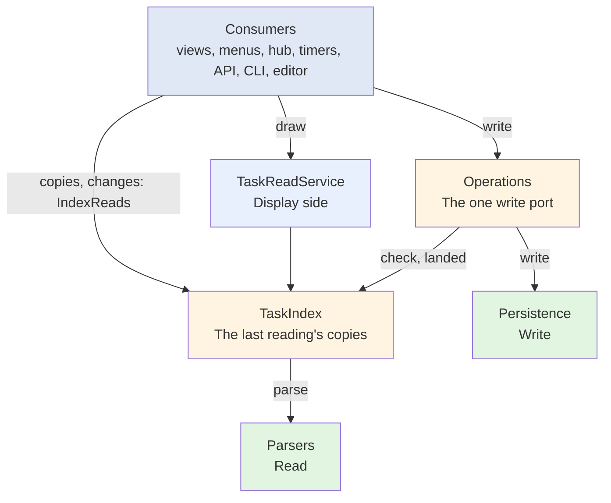

# Developer Documentation

## Task Card Rendering Architecture (v0.13.1+)

### Module layout

```
src/views/taskcard/
  TaskCardRenderer.ts              # Orchestrator for one task card
  ChildItemBuilder.ts              # Task/childLines -> ChildRenderItem[]
  ChildRenderItemMapper.ts         # Maps child data to ChildRenderItem[]
  ChildSectionRenderer.ts          # Child markdown/toggle rendering
  CardMarkdown.ts                  # The one call of MarkdownRenderer.render for a card
  CheckboxWiring.ts                # Parent/child checkbox interaction and status menu
  NotationUtils.ts                 # @notation label formatting helpers
  TaskLinkInteractionManager.ts    # Internal link click/hover handling
  TaskViewHoverParent.ts           # HoverParent decoupling Page Preview popovers from the WorkspaceLeaf
  types.ts                         # ChildRenderItem / CheckboxHandler (taskcard-local types)
  index.ts                         # Barrel exports
```

### Responsibility boundaries

1. `TaskCardRenderer` is the entry point used by Timeline/Schedule renderers.
2. `ChildSectionRenderer` owns child markdown render pipeline and notation injection.
3. `CheckboxWiring` owns all checkbox event binding. Every checkbox, parent or child, is a task, so every write goes through `Operations.updateTask(taskId, { statusChar })`.
4. `ChildItemBuilder` walks `TaskReadService.getChildEntries(parent)` — the single source of truth for child render order.
5. A card is drawn whole when `TaskCardRenderer.render` returns: it is synchronous, and lays the body, the children, their notation, the links and the mask in one go. No view waits on a card. `renderCardMarkdown` is the one call of `MarkdownRenderer.render`; that the body is in the element when the call returns is how Obsidian's renderer behaves, not what its API promises, so an empty element right after the call is logged once a session. The promise the call returns tells only when truly asynchronous content (images, embeds, math, code, mermaid, other plugins' post-processors) is in; the mask is laid again then, if the card still shows that draw.
6. How a card is drawn is said by `RenderOptions`, one field per policy: `expandChildren` (no collapsed section), `alwaysLinks` (links live whatever `enableCardFileLink` says), `doubleTap`, `mask`. The renderer has no branch for any caller; the hub's preview passes its set and puts its own `task-card--in-hub-preview` class on the card.
7. The renderer gives the card all of its look and its menu, on every draw before the signature is compared: the content, the color, the line style and the read-only mark (`TaskStyling`, which takes a value off when the task has none, so a kept card loses a color its task lost), and the context menu (`CardActions.bindMenu`). A view places the card and marks its split; it decorates nothing else. What a card does when used (details, menu, a child's menu, open in the editor, the double-tap action) is given once, as `CardActions`, when the renderer is made. Every view, and the plugin for a hub opened outside the views, makes its renderer, its `MenuHandler` and the hub they open together with `createCardRendering` (`views/sharedUI/CardRendering.ts`).

### Child rendering rule

1. The renderer consumes `getChildEntries(parent): ChildEntry[]` (`'task' | 'line'`). A `'line'` entry is never a checkbox: every checkbox line is a task of its own. A `- [ ]` inside a code fence is an example and renders as plain text (no checkbox, not counted in the card's n/m). A `- [[note]]` child is an ordinary link line.
2. Each entry carries an absolute `bodyLine`, so render code does no line-number arithmetic.
3. Every body line is one task's at most: the extraction (`NoteTasks`) leaves a child task's subtree and a task's own `- ==>` lines out of its `childLines`. The data layer (`buildChildEntries`) only merges `childIds` and `childLines` by line, so neither it nor the renderer deduplicates.
4. `ChildItemBuilder` walks the entries depth-first: a `'task'` entry renders the child and recurses into its own entries (depth-capped, cycle-guarded); a `'line'` entry renders the raw line.

### Line write rule

Raw `updateLine(file, line, text)` is reserved for editor-cursor callers (`TaskMenuExtension`) and persistence internals. Card and hub UI write through `updateTask` only.

### Shared type policy

1. `src/types/index.ts` is reserved for cross-layer models/settings only.
2. Split helpers (`DisplayTask`, `shouldSplitDisplayTask`, `splitDisplayTaskAtBoundary`) are in `src/services/display/DisplayTaskConverter.ts`.
3. Task-card-local render helper types are defined in `src/views/taskcard/types.ts`.

### Task content invariant

1. `Task.content` stores raw user-provided content only.
2. A bare `- [ ]` keeps `content` as an empty string.
3. UI fallback labels (file basename / `Untitled`) must be resolved in view helpers (`src/services/display/TaskContent.ts`), not in parsers.
4. API normalizer (`TaskNormalizer`) passes `content` through as-is (`t => t.content`); it does not fall back to file basename. Basename fallback is a display-only concern handled by `getTaskDisplayName` (`src/services/display/TaskContent.ts`).

---

## Architecture Overview

### Layer separation


```mermaid
graph TB
    UI[Consumers<br/>views, menus, hub, timers, API, CLI, editor]
    Read[TaskReadService<br/>Display side]
    Ops[Operations<br/>The one write port]
    Index[TaskIndex<br/>The last reading's copies]
    Parser[Parsers<br/>Read]
    Repo[Persistence<br/>Write]

    UI -->|draw| Read
    UI -->|copies, changes: IndexReads| Index
    UI -->|write| Ops
    Read --> Index
    Ops -->|check, landed| Index
    Ops -->|write| Repo
    Index -->|parse| Parser

    style Parser fill:#e1f5e1
    style Repo fill:#e1f5e1
    style Index fill:#fff4e1
    style Ops fill:#fff4e1
    style Read fill:#e8f0fe
    style UI fill:#e1e8f5
```

| Layer | Responsibility |
|-------|----------------|
| **Consumers** | UI rendering and user interaction, the API, the CLI, timers, the editor's extensions |
| **TaskReadService** | The display side of the read: cached DisplayTask conversion, date ranges, filters and sorts, a row's children in order. It passes no copy through |
| **TaskIndex** (`services/core`) | The copies of the last reading of each note, looked up by name, anchor and line; whether a copy is what the disk holds; the telling of a change. Its read port is the type `IndexReads` (`PluginContext.getIndex`), which has no method that writes a note. The copies are written by the scan and by what a write of ours left (`landed`), nothing else. It knows nothing of the operations |
| **Operations** (`services/operations`) | The one way a consumer writes (`PluginContext.getOperations`): checks the copy it plans from against the disk (`planCopy`, the read-only check included), orders the writes asked of one row (`onRow`), writes through the repository with the row's fire (a completion's planned inside the write, a deletion's planned before it, both by `FlowExecutor`), tells the user a refusal once and a flow that was not run (`FlowNotices`). Daily and periodic notes (`putInDailyNote`, `openPeriodicNote`) and template notes (`saveTemplateNote`) are written here too; the write channel does not leave it |
| **Parsers** | Convert markdown to Task objects |
| **Persistence** | Write rows back to files: each write checks the lines it planned from and writes them in one `vault.process` (`TaskRepository`, `writers/`, `FileLines`, `Notes`) |

A write does not change the index's copy. What it left comes back to the index as its next reading (`landed`), and that reading's notification draws it. A view that shows new values before then shows them from its own state (the hub's draft, the box a click changed).

**Notification.** The index tells its `onChange` listeners through two ports only, both of its coalescer (`NotifyCoalescer`): `schedule`, merged over one frame (16ms), and `flushNow` (`TaskIndex.notifyImmediate`), for a view that has to match the index in this frame (the end of a drag, the overdue watch). It tells only when what it holds changed: a scan that committed, a write that landed, a note forgotten, the settings. A reading of the whole vault is told to each listener in a task of its own (`staggered`).

**Delete notification.** `IndexReads.onTaskDeleted` hears each name that ends: a row the index held that it holds no more, under that name or the one a write of ours carried it to (`getTask`). A delete of ours ends the rows it took away; an edit from outside ends every row of its note, as it ends their names; a note deleted or renamed ends all of its rows. It is told in the task after the change, whoever made it, apart from the drawing notification. The selection (`SelectionController`) and a card's open children (`TaskCardRenderer`) let go of the name.

---

## Directory Structure

```
src/
├── main.ts                    # Plugin entry point (onload / onunload)
├── types/                     # Cross-layer types and settings (Task, DisplayTask, TaskViewerSettings, etc.)
├── settings/                  # Settings UI (9 tabs: Basic, Behavior, Views, View Details, Notes, Note scope, Parsers, Log, About)
├── constants/                 # Constants (layout, hover, styles, status options)
├── i18n/                      # Internationalization (locale files)
├── api/                       # Public API (TaskApi, TaskApiTypes, TaskIds, TaskNormalizer, OperationSchemas: the parameters; Reference: the help texts; FilterParamsBuilder, FilterFileLoader)
├── cli/                       # CLI handlers (CliRegistrar: registers Reference's CLI_COMMANDS; CliParamValidator, CliFilterBuilder, CliOutputFormatter, handlers/)
├── services/
│   ├── core/                  # The index (TaskIndex, IndexReads, TaskStore, TaskScanner, NotifyCoalescer, Reading, RowNames, ReadingCheck, DiskReconciler, etc.)
│   ├── data/                  # The display side of the read (TaskReadService), children in order, effective properties, NoteOps
│   ├── operations/            # The one write port (Operations), DuplicateShift
│   ├── display/               # Display conversion (DisplayTaskConverter, TaskSplitter, SegmentIds, TaskDateCategorizer, TaskContent)
│   ├── parsing/               # Parser layer (TaskParser: lineParsers; TaskLineFormat: formatTaskLine, formatRow; FileParsePipeline)
│   │   ├── tv-inline/         # Line-level parsers (TVInlineParser, DayPlannerParser, TasksPluginParser, ReadOnlyParserBase)
│   │   ├── strategies/        # ParserChain, ParserStrategy
│   │   ├── tree/              # A note's sections and rows (NoteSections, NoteTasks, Sections, SectionPropertyResolver, BuiltinPropertyExtractor)
│   │   └── utils/             # Parser utilities (ChildLineClassifier, CodeFenceTracker, InlineNotation, Outline, TagExtractor, TaskLineClassifier)
│   ├── persistence/           # Write layer (FileLines: one target type `RowRef`, `createFile`; Notes: a block put in a note, a note made; FiringTrials: which fires of a completion are written; TaskRepository, InlineTaskWriter)
│   │   ├── writers/           # FrontmatterWriter, InlineTaskWriter, SendWriter, SendRows (which rows a send takes)
│   │   └── utils/             # FrontmatterLineEditor, Placement (where a write puts lines, and a child's indentation)
│   ├── export/                # View image export (ViewExporter; ExportRegistry: what each view expands; ExportSave: where an export is saved; ExportService: the CLI's export-image)
│   ├── filter/                # Filter types, serializer (the one reader), FilterExpr (the tree evaluated), engine, FilterEdit (edits as new values), PinnedListQuery, value collector, TaskValues (what the filter and the sort compare)
│   ├── sort/                  # Task sorting (TaskSorter, SortTypes)
│   ├── template/              # View template load/save (ViewTemplateLoader/Writer; TemplateNote: a template note, saved)
│   ├── flow/                  # ==> フローの計画と通知 (FlowExecutor: 計画だけで書かない; FlowPlanner/GenBodyRenderer/ScheduleEngine/FlowTrigger; FlowNotices: 発火しなかったことを告げる)
│   └── lang/                  # 式と文の言語 (Lexer/ExprParser/ExprEvaluator/StmtParser, Diagnostic)
│       └── flow/              # ==> フロー記法の言語 (FlowAst/FlowParser/FlowChecker/FlowSegments/FlowSerializer/diagnosticText)。lang、i18n、types だけに依存する
├── editor/                    # Editor extensions (TaskMenuExtension, DiagnosticsExtension, GenHighlight, etc.)
├── views/
│   ├── ViewDescriptors.ts     # The view table (VIEW_DESCRIPTORS); see "View Skeleton"
│   ├── base/                  # TaskViewerView, ViewStore, ViewSettings (the settings menu), ViewedDay
│   ├── timelineview/          # Timeline view (including renderers/, TimelineDays)
│   ├── scheduleview/          # Schedule view (including renderers/, utils/)
│   ├── calendar/              # CalendarView, MiniCalendarView, CalendarGrid, WeekNumberCell
│   ├── kanban/                # Kanban view
│   ├── taskcard/              # Task card rendering (see section above)
│   ├── sharedUI/              # Shared UI components (ViewToolbar, TaskListSections, PinnedListPanel, DateGridLane, PeriodicNoteLink, etc.)
│   ├── sharedLogic/           # Shared logic (ViewEvents, MinuteClock, ViewUriBuilder, GridTaskLayout, etc.)
│   ├── customMenus/           # Filter/Sort popover menus, IntervalTemplateCreator
│   ├── sidebar/               # SidebarManager, SidebarToggleButton
│   └── TimerView.ts           # Timer view (Pomodoro / Countdown / Countup / Interval)
├── timer/                     # Timer widget and all timer services (including AudioUtils, TimerTargetIdUtils)
├── interaction/
│   ├── drag/                  # Drag & drop (DragHandler, DragStrategy, strategies/, ghost/)
│   └── menu/                  # Context menus (MenuHandler, PropertyCalculator, PropertyFormatter, builders/)
├── modals/                    # Modal UI (CreateTaskModal, ConfirmModal, etc.)
├── suggest/                   # Obsidian property panel autocomplete (color/, line/, tags/)
├── utils/                     # Layer-less leaves used by two or more layers (DateUtils, LineBreak, HostWindow, etc.; see "utils placement rule")
│   └── values/                # Input codecs: how typed text is read into a value (Read<T>, Normalize, DateValues, NumberValues, ChoiceValues, IssueText)
└── styles/                    # CSS (BEM naming, --tv-* tokens)
```

---

## DOM Class Taxonomy

CSS / DOM クラス名の付け方を 4 層 + state/modifier 規則で固定する。新規追加時はこの規約に必ず従う。

### Block prefix layers

| 層 | prefix | 例 | 対象 |
|---|---|---|---|
| **Shared primitive** | `tv-` | `tv-sidebar`, `tv-grid-row`, `tv-section-toggle` | 複数 view が利用する layout / widget |
| **View shell** | `<view>-view` | `timeline-view`, `schedule-view`, `kanban-view` | view ルート (Obsidian 慣例) |
| **View-specific block** | `<view>-` | `schedule-grid`, `calendar-week-row`, `kanban-view__cell` | その view 内でのみ使う |
| **Domain block** | `<domain>-` | `task-card`, `pinned-list`, `allday-section`, `cal-week-row` | view を跨ぐドメイン要素 |

迷ったとき: その class 名を **2 つ以上の view で生成** するなら shared primitive (`tv-*`) または domain block。**1 view 専用**なら view-specific (`<view>-*`)。view shell に `__*` element をぶら下げるのは妥当だが、層を跨いで参照される素材は domain block に切り出す。

### Element / modifier / state

- **Element**: `<block>__<element>` (BEM 二重アンダースコア)
- **Modifier (`--*`)**: 永続 variant — data-driven、render 時点で決まる
  - 例: `task-card--allday`, `task-card--multi-day`, `tv-sidebar--mobile`, `cal-week-row--mini`
- **State (`is-*` / `has-*`)**: 動的 state — JS の `classList.toggle` で出し入れする ephemeral な印
  - 例: `is-today`, `is-selected`, `is-current-week`, `is-dragging`, `has-overdue`

判別: ある属性が **タスクの不変 attribute** なら `--*`、ユーザー操作や時間で変わるなら `is-*` / `has-*`。

### Frozen names (歴史的に taxonomy 違反だが据置)

外部 API / 公開 CLI / Obsidian 提供のため rename しない:

- Obsidian 提供 (絶対に触らない): `view-content`, `internal-link`, `task-list-item`, `task-list-item-checkbox`, `is-checked`, `contains-task-list`
- プラグイン提供だが据置: `task-card` (ドメイン block、各 view から大量参照されるため stable な API として扱う)
- toolbar 周り: `view-toolbar` (shared primitive 相当だが歴史的に `tv-` 接頭辞なし。新規追加なら `tv-toolbar` 推奨)

### 参考: 過去のリファクタ

`memory/project_dom_naming_audit.md` (2026-05-03) に統合リファクタ前の負債列挙。代表的な解消:

- `view-sidebar-{layout, main, backdrop, panel}` 5 ブロック分裂 → `tv-sidebar` 1 ブロックに統合
- `section-toggle-btn` + `schedule-section__toggle` 二系統 → `tv-section-toggle` + `--axis`/`--header` modifier
- `timeline-row` (timeline と schedule で共有) → `tv-grid-row` (shared primitive)
- `selected` (unscoped state) → `is-selected`
- `mini-calendar-*` 独自再実装 → `cal-*` + `--mini` modifier で共有化

---

## Subsystem Responsibility Map

Quick reference for locating the right layer when implementing a feature.

| Subsystem | Primary file | Responsibility |
|-----------|--------------|----------------|
| **TaskIndex** | `services/core/TaskIndex.ts` | The copies of the last readings, their lookups (`IndexReads`), the vault's change events, the drag's hold, the check of a copy against the disk (`checkCopy`, `checkFile`, `learnFrom`), the report of a write of ours (`landed`, `followLine`, `readingOf`), and the two notifications (`onChange`, `onTaskDeleted`) |
| **Operations** | `services/operations/Operations.ts` | The one write port: rows (`updateTask`, `updateByAnchor`, `deleteTask`, `duplicateTask`, `createTask`, `insertLine`, `replaceSubtree`, `send`, `writeLine`), the editor's hosts, notes (`putInDailyNote`, `openPeriodicNote`, `saveTemplateNote`, `setFrontmatterKeys`), and the checks a caller asks before it acts (`confirmTask`, `rowSnapshot`, `freshByAnchor`, `assessFlowDelete`) |
| **TaskStore** | `services/core/TaskStore.ts` | In-memory copies and the `(file, anchor)` table; written by the scanner only, tells no one |
| **TaskScanner** | `services/core/TaskScanner.ts` | File scanning → `FileParsePipeline` invocation (parse/name/commit); the one writer of the store, and what hands the index the names a change dropped |
| **NotifyCoalescer** | `services/core/NotifyCoalescer.ts` | The index's listeners and the two ports that tell them (`schedule`, `flushNow`) |
| **ReadingCheck** | `services/core/ReadingCheck.ts` | Whether the index's reading of a note is the note on disk, asked before an operation is planned from a copy (`checkCopy`, the same `followLine` question as a write's first check) or a row is looked up by anchor (`checkFile`). `Operations.planCopy` and `freshByAnchor` act on the answer; a stale reading is refused through `reportRefusal` |
| **DiskReconciler** | `services/core/DiskReconciler.ts` | Brings the index's readings to the disk when a change notice never comes: on start, focus, a plugin view, a refusal, a stale check and each minute (desktop), stats the notes Obsidian holds (`DiskProbe`; the whole vault on desktop, the notes the index has read elsewhere), reads again what moved through `queueScan`, forgets what is gone, and logs where Obsidian's stat of a note lasted apart from the disk (`modified`, `deleted`). Obsidian's model is only observed, never mended; a note Obsidian never heard created stays out of the index |
| **FlowFireExtension** | `editor/FlowFireExtension.ts` | Fires a completion made in the editor, in the same transaction (see Flow Firing) |
| **ParserChain** | `services/parsing/strategies/ParserChain.ts` | Tries multiple parsers in order (Strategy chain); parses only, never writes |
| **TVInlineParser** | `services/parsing/tv-inline/TVInlineParser.ts` | Parses `@date` inline notation (line-level); cuts the `==>` command off the content without reading it (`readFlow` does) |
| **TaskRepository** | `services/persistence/TaskRepository.ts` | Assembles the writers and the index's channel; its ports: `write(file, target, ops, { fire?, refused? })` (the one write of ops to a row, duplicates included as a `copies` op), `applyOps`, `replaceSubtree`, `send`, `putInNote`, `setFrontmatterKeys` |
| **Notes** | `services/persistence/Notes.ts` | The one way a block is put in a note's section or at its end, the note made when the caller gives its seed (`putInNote`), the one way a note is made of lines (`createNote`, over `createFile`, the only `vault.create`), and daily / periodic notes made from their template (`openPeriodicNote`, `putInPeriodicNote`, called by `Operations`). Writes to one path run one at a time |
| **PeriodicNotes** | `utils/PeriodicNotes.ts` | The description of a daily or periodic note (`PeriodicNote`) and the pure answers of which note a date names: `notePath`, `linkTarget`, `label`, `dateOfPath` (formats with `/` included), `findNote` |
| **FrontmatterWriter** | `services/persistence/writers/FrontmatterWriter.ts` | Surgical frontmatter key writes (`setKeys`, used by the color / line-style property suggests) |
| **FrontmatterLineEditor** | `services/persistence/utils/FrontmatterLineEditor.ts` | Low-level YAML line operations; never touches unrelated lines |
| **InlineTaskWriter** | `services/persistence/writers/InlineTaskWriter.ts` | Direct inline task line rewriting |
| **TaskValues** | `services/filter/TaskValues.ts` | What the filter and the sort compare for each property: the effective value, one table (`of`, `length`, `property`), the text a sort rule compares (`sortKey`) and each value in words for the references (`words`). The API's `leaf` (`list` and `today`) is its `children`. A flow's expression is not read through it: `start`, `end` and `due` in `at(due+7d)` are the row's own, since the value is written to the next instance's line and an inherited due would be written out onto it (`FlowPlanner`) |
| **FilterExpr** | `services/filter/FilterExpr.ts` | `compileFilter(state)`: the saved FilterState compiled into the tree the engine evaluates — groups, `not`, `ancestors` (some ancestor) and positive atoms. A negative operator is `not(positive)`; with `target: parent`, `not(ancestors(positive))`. An unfinished condition (no value chosen) is `ALWAYS`. Never saved |
| **TaskFilterEngine** | `services/filter/TaskFilterEngine.ts` | Evaluates a compiled `FilterExpr` over the values `TaskValues` gives, in a required `FilterContext` (start hour, week start, task lookup, now) |
| **FilterSerializer** | `services/filter/FilterSerializer.ts` | Filter state serialization (v4 recursive group format). `parse(raw)` is the one reader of every saved or handed-in filter: it returns `{ state, issues }`, dropping a condition of an unknown property, an operator the property does not take, or a value of the wrong shape into `issues` (the API throws them, a view drops them with a notice), and dropping conditions on retired properties (`kind`) silently; a group left empty stays, and evaluates as true. `SortSerializer.parse` does the same for sorts |
| **TaskSorter** | `services/sort/TaskSorter.ts` | Task sort processing, over the values `TaskValues` gives; without rules, `DEFAULT_SORT_ORDER` (due, startDate, content) |
| **FilterEdit** | `services/filter/FilterEdit.ts` | The filter menu's edits as functions that return a new tree (`updateConditionAt`, `replaceAt`, `appendTo`, `toggleLogic`, `withOperator`, ...), a node addressed by its path from the root (`NodePath`). `FilterState` and `SortState` are `readonly` values: no holder changes one in place, so none copies one to protect itself |
| **PinnedListQuery** | `services/filter/PinnedListQuery.ts` | Which tasks a pinned list shows: `resolve(list, viewFilter)` (the list's filter, and the view's when `applyViewFilter`) for the views' lists and Kanban's cells; `fromTemplate(template, listName?)` for a filter file, the template read by its view's schema and its lists by the schema's `listsOf` |
| **ViewTemplateLoader/Writer** | `services/template/` | View template read/write |
| **TaskReadService** | `services/data/TaskReadService.ts` | The display side of the read: filter, sort, date ranges, DisplayTask conversion, children in order |
| **DisplayTaskConverter** | `services/display/DisplayTaskConverter.ts` | Task → DisplayTask conversion with effective field resolution |
| **TaskSplitter** | `services/display/TaskSplitter.ts` | Visual-date / date-range task splitting |
| **SectionClassifier** | `services/display/SectionClassifier.ts` | Single owner of the allDay / timed / dueOnly kind decision (`classifyForSection`); `bucketBySection` for section dispatch |
| **TaskDateCategorizer** | `services/display/TaskDateCategorizer.ts` | Per-date bucketing: delegates kind to `classifyForSection`, owns date membership (allDay/timed = visual span, dueOnly = calendar due) and sort via TaskRenderOrder |
| **TaskRenderOrder** | `services/display/TaskRenderOrder.ts` | The canonical order of each section's bucket, which every view draws in; a tie goes by where the task is written (file, then line as a number, then ID). See "Canonical order within a section" |
| **ViewExporter** | `services/export/ViewExporter.ts` | Clones a view's container, grows what scrolls (each view's `ExportTargetSpec` in `ExportRegistry`) and captures it as a PNG |
| **ExportSave** | `services/export/ExportSave.ts` | Where an export is saved and saving it, for the view menu and the CLI alike: `exportFolderOf(settings, override?)` (the folder asked for, else the setting, else `DEFAULT_SETTINGS.exportFolder`), `saveExportImage` (a vault-relative folder through the vault, an absolute one through Node's `fs`, desktop only) |
| **PropertyValues** | `services/parsing/utils/PropertyValues.ts` | The one reading of a property's value (`PropertyValue`): `fromText` for a line, `fromYaml` / `fromFrontmatter` for the frontmatter; see "プロパティの値" |
| **EffectiveProperties** | `services/data/EffectiveProperties.ts` | `getEffective*()` derived helpers merging raw + cascadeContext for properties/tags/style; see "Inheritance pipeline" |
| **TaskValidator** | `services/core/TaskValidator.ts` | Task validation |
| **NoteSections** | `services/parsing/tree/NoteSections.ts` | A note's sections from `outline.headings`, each with its own property lines (the section scope of the cascade) |
| **NoteTasks** | `services/parsing/tree/NoteTasks.ts` | A note's rows: every line that opens a task, its parent, child lines, flow, properties and section cascade, read once |
| **FlowLineScanner** | `services/parsing/utils/FlowLineScanner.ts` | `readFlow(outline, taskLine)`: the one place a flow program is read from a note (the task line's tail and its own `- ==>` lines); the extraction and the editor diagnostics both use it |
| **DayPlannerParser** | `services/parsing/tv-inline/DayPlannerParser.ts` | Day Planner compatible parser (read-only) |
| **TasksPluginParser** | `services/parsing/tv-inline/TasksPluginParser.ts` | Tasks plugin compatible parser (read-only) |
| **TaskApi** | `api/TaskApi.ts` | Public API (13 methods). Checks every parameter once (required, whole numbers, dates); the CLI passes its flags on unchecked |
| **OperationSchemas** | `api/OperationSchemas.ts` | The parameters of each operation (`ParamSpec`: key, required, a whole number's range, description), bound to the param types by `satisfies`; the shared blocks `SIMPLE_FILTER_SCHEMA`, `FILTER_SOURCE_SCHEMA`, `SORT_PARAM`, `LIMIT_PARAM` |
| **Reference** | `api/Reference.ts` | `api.help()` and the CLI's `help`, made from the tables: the operations (`OPERATIONS`, whose CLI side `CLI_COMMANDS` the registrar registers), `ALL_FIELD_NAMES`, `PROPERTY_OPERATORS` with `FILTER_VALUE_DOC`, and the sort properties with `TaskValues.words` |
| **Input codecs** | `utils/values/` | How a value typed by a person or a script is read: `Read<T>` (a value, or an `Issue`), `typed` (NFKC, trimmed) and `dashed` (hyphen-like characters as `-`, dates only), `DateInput` (a day that exists), `TimeInput` (`9:40` as `09:40`), `DateTimeInput`, `IntInput` / `IntValue` (whole numbers, a range), `FloatInput`, `BoolInput`, `ChoiceInput`, and `issueText` (the English sentence of an issue). The API, the CLI, the URI and saved view state (`FieldCodecs`' `F.*`) read through them; the note's notation does not |
| **TaskNormalizer** | `api/TaskNormalizer.ts` | Task → NormalizedTask conversion for API output |
| **FilterFileLoader** | `api/FilterFileLoader.ts` | Filter file (.json/.md) loading |
| **FlowExecutor** | `services/flow/FlowExecutor.ts` | Plans what a `==>` command (every / + / at / x / until / move) writes, and writes nothing: a completion's fire from the lines the completing write holds (`planFire`, as a `fire` op: `fireOp`), a deletion's next instance and removal (`planDeletion`). Reads the notes only through `FlowReads` (a generation block, a row by id). A `move` carries the row to a heading of its own note (`[[#heading]]`) as one `move` op; a heading that is not one place in the note fails the plan |
| **FlowNotices** | `services/flow/FlowNotices.ts` | What the user is told of the flow: for each completed row whose flow was not run, why (`notRunsOf(outcome)`, the one rule for a card's write, a send and the editor), and a delete its fire stopped (`deletionStopped`); the same failure once per window |
| **FiringTrials** | `services/persistence/FiringTrials.ts` | `firingTrials`: the one rule of which fires of a completion are written — every fire, else none, else each put back from the top and kept or set aside with its refusal — for `InlineTaskWriter`, `SendWriter` and the editor's fire alike (`FiringOutcome`) |
| **DragHandler** | `interaction/drag/DragHandler.ts` | Delegates pointer events to `DragRouter` (Strategy selection) / `DragSession` (gesture lifecycle) |
| **MenuHandler** | `interaction/menu/MenuHandler.ts` | Context menu facade coordinating multiple Builder classes |
| **TimerWidget** | `timer/TimerWidget.ts` | Floating timer UI; starts timers and owns their board, lifecycle and recorder |
| **IntervalTemplateLoader/Writer** | `timer/IntervalTemplateLoader.ts` et al. | Interval template read/write |
| **AudioUtils** | `timer/AudioUtils.ts` | Web Audio API notifications with serialized context management |
| **KanbanView** | `views/kanban/KanbanView.ts` | Kanban board view: the grid of its lists, their rows and columns (see "Saved lists, lanes and note links") |
| **TimerView** | `views/TimerView.ts` | Standalone timer view (Pomodoro / Countdown / Countup / Interval) |
| **TaskCardRenderer** | `views/taskcard/TaskCardRenderer.ts` | Task card rendering orchestrator (see section above) |
| **TaskLinkInteractionManager** | `views/taskcard/TaskLinkInteractionManager.ts` | Internal link click/hover handling within task cards |
| **SidebarManager** | `views/sidebar/SidebarManager.ts` | The sidebar of Timeline and Calendar: its layout, and whether it is open (closed at narrow width until the toggle opens it). What it holds is the pinned lists' panel (`PinnedListPanel`) |
| **CreateTaskModal** | `modals/CreateTaskModal.ts` | Task creation modal UI, also used by "Convert to inline" (shared form widgets live in `modals/form/`) |
| **TaskHubPanel** | `modals/hub/TaskHubPanel.ts` | Single "open task" destination: live card preview + per-field instant-save property form (content/status/dates/tags/color/linestyle/mask/custom). Self-hosted surface (not an Obsidian Modal) in the filter-popover family: own backdrop/close/Escape, root carries `tv-ctrl`, owns a PopoverStack for SuggestController-based fields. Entry: card double-tap, menu Properties items (with field focus) |
| **onFormEnter** | `modals/form/formEnter.ts` | The one answer to whether a field's Enter is the form's: not an IME's commit (`isComposing`, `keyCode` 229, the field's own composition flag; Windows sends `Process`), nor one a list open on the field takes (`takesEnter`, e.g. `ShownSuggest.listShown`). Every field of ours puts its Enter through it; the commit Enter of an IME commits only, and the next Enter is the form's |
| **SuggestController** | `views/customMenus/SuggestController.ts` | Shared suggest-dropdown machinery (tv-ctrl__suggest) used by both filter-popover value selectors and TaskHubPanel form fields |
| **PropertyUpdatePlanner** | `services/persistence/PropertyUpdatePlanner.ts` | Pure diff: `Partial<Task>` updates → normalized PropertyOp[] for non-time properties (canonical-location / clear semantics) |
| **ChildPropertyLineEditor** | `services/persistence/utils/ChildPropertyLineEditor.ts` | Surgical CRUD for inline child property lines (`- key:: value`), representation-preserving |
| **TaskParser** | `services/parsing/TaskParser.ts` | `lineParsers(settings)`: the ParserChain the settings read lines with, built by whoever reads (FileParsePipeline, editor diagnostics); no chain is held. `lineParsersFingerprint` says when settings read lines differently |
| **TaskLineFormat** | `services/parsing/TaskLineFormat.ts` | `formatTaskLine(fields)`: the one spelling of a task line the plugin writes (new or rewritten); `formatRow(task)`: a read row written back (tv-inline via `formatTaskLine`, read-only notations return `originalText`) |

---

## Parse Pipeline

`FileParsePipeline` (`services/parsing/FileParsePipeline.ts`) owns the parse order contract for each file. `TaskScanner` delegates the whole file to it and only handles the surrounding parse/detect/commit orchestration. The pipeline runs:

```
0. Outline.read(lines)                 — the note's one reading (items, subtrees, code, headings, body start)
1. Frontmatter → tv-ignore check
2. NoteSections.read(outline)          — sections from outline.headings, each with its own property lines
3. SectionPropertyResolver.resolve()   — Cascade properties through section nesting (the frontmatter read by PropertyValues.fromFrontmatter, then BuiltinPropertyExtractor)
4. NoteTasks.extract()                 — every line that opens a task, read once, with its section's values attached
```

Parsing spells no name. A line parser answers an unnamed task (`UnnamedTask`); `NoteTasks` finds each row's parent and children by line and names them with the `RowNamer` its caller hands the pipeline. The index's scan passes `namesOfReading(path, reading)` (`services/core/RowNames.ts`), so a row is named once, by the reading that read it; a reader outside the index (a fire's plan, a send's preview) passes `namesOutsideIndex(path)`, whose names never reach the store.

The name layer lives in `services/core/RowNames.ts`: the spelling of a name (`nameOf`, `readName`) and the namers. A namer gives a row its reading (`Task.reading`) together with its name, so a write takes the reading from the copy (`plannedOn`) and reads no name's spelling. What outlives a reading is a row's anchor (`Task.anchor`, set by the scan); `TaskStore` keeps a `(file, anchor) → name` table with the tasks, and `TaskIndex.getTaskByAnchor` is one lookup in it. A segment of a task split at the day boundary (`<name>##seg:YYYY-MM-DD`, `services/display/SegmentIds.ts`) is a key within the display: a caller acting on one hands its row's name (`getOriginalTaskId`), and the write side does not take segments apart.

Frontmatter makes no task. It is only the root of the cascade below: its scope keys (`tv-start`/`tv-end`/`tv-due`/`tv-color`/`tv-linestyle`/`tv-mask`), `tags` and custom properties are inherited by every task in the note.

### Inheritance pipeline (File / Section)

Properties / tags / styling cascade through two scopes, each with a dedicated resolver:

| Scope | Resolver | Basis | Responsibility |
|-------|----------|-------|----------------|
| **File** | `PropertyValues.fromFrontmatter` + `BuiltinPropertyExtractor` | Frontmatter object | Read every key as a `PropertyValue`, then put the builtin keys apart with the same extractor a section and a task use. Used as the cascade root by `SectionPropertyResolver`. |
| **Section** | `SectionPropertyResolver` | Heading hierarchy (`## A` → `### B`) + section property blocks | FM → root section → nested sections, child-wins cascade for `color`/`linestyle`/`mask`/`tags`/custom properties. Output stored on `SectionNode.resolvedX`. |

**Tasks do not inherit from parent tasks.** Inheritance flows exclusively from document structure (frontmatter → sections); the task tree (`parentId`/`childIds`) never contributes properties, tags, or styling — the same principle dates established with `cascadeContext`. A task's values are fully determined by its own lines plus its section context, so property resolution completes locally during extraction with no cross-task post-pass. (Task-scope inheritance — `TaskPropertyResolver` BFS + `parentStyle` propagation — was removed 2026-07-03.)

**Three-layer value model (raw / cascadeContext / effective).** Dates and properties/tags/style share the same layering:

| Layer | Dates | Properties / tags / style | Written by | Read by |
|-------|-------|---------------------------|------------|---------|
| **raw** | `task.startDate` etc. | `task.color`/`linestyle`/`mask`/`tags`/`properties` | Parser, from the task's own lines only | `formatTaskLine`, all writers (round-trip fidelity) |
| **cascade** | `task.cascadeContext.startDate` etc. | `task.cascadeContext.color`/`tags`/`properties` etc. | `NoteTasks`, from `SectionNode.resolvedX` | Merge step below |
| **effective** | `DisplayTask.effectiveStartDate` etc. (materialized — merge needs `startHour`) | `getEffective*()` derived helpers (`services/data/EffectiveProperties.ts` — merge closes over the Task alone) | — | Display, filter, sort, API output |

Merge rules: style is `own ?? cascade`; tags are a sorted union; custom properties are per-key child-wins spread. The cascade layer stores style only when raw is absent (same guard as dates — equivalent for override semantics), but stores tags/properties unconditionally since they merge partially rather than shadow.

**Builtin vs custom properties.** Builtin (`color`/`linestyle`/`mask`/`tags`) have a fixed schema, validation, and dedicated UI rendering; their FM keys are configurable via `ScopeKeys` (setting `scopeKeys`). Custom properties are user-defined free-form key-value pairs stored in `task.properties: Record<string, PropertyValue>`. Both inherit with child-wins precedence at every layer; the only structural difference is type-level (separate Task fields vs `Record`).

### プロパティの値

プロパティの値は `PropertyValues`（`parsing/utils/PropertyValues.ts`）の1か所で `PropertyValue` に読む。`PropertyValue` は型で分かれる判別共用体で、`value` に書かれたとおりの綴りを持ち、型ごとの値（`number`、`boolean`、`items`）を別の欄に持つ。書き戻しは `value` を書くので、利用者の綴りは変わらない。読み手は型の欄を読み、`value` から真偽や数を決め直さない。

- 行の値（`- key:: value`、節の `- properties::` の項目、ハブの入力）は `fromText` で読む。数は数字と小数、配列は `[` `]` の中か `,` 区切り、ほかは文字列である
- 真偽値の綴りは `true` `True` `TRUE` `false` `False` `FALSE` の6つだけで、Obsidian の YAML と同じである。`tRue`、`yes`、`on` は文字列、`1` は数である
- frontmatter は `fromFrontmatter` で読む。型は YAML のパーサが決めたもので、引用符の付いた `"true"` は文字列である。日付のキー（`tv-start` など）の YAML の `Date` と一日の分の数（`10:30` を YAML 1.1 が読んだ 630）は、ここで日付の文字列にする
- `tv-ignore` も同じ規則で読む。YAML の真偽値の true だけがノートを外す。YAML が壊れたブロックでは、キーの行（末尾の ` # コメント` を除く）が `true` `True` `TRUE` のどれかのときだけ外す
- プラグインが新しく書く真偽値は小文字である（`InheritedValues` が行の値を frontmatter に書くとき）

組み込みのキー（色、線種、マスク、日付3つ、`tags`）の振り分けは、frontmatter、節、タスクのどの層も `BuiltinPropertyExtractor` の1本が `fieldKey` の表で行う。組み込みは型によらず `value` を読む。ただしタグは、配列ならその項目、文字列なら `#tag` か `,` 区切りとして読む。

### Inline child line extraction

チェックボックス行はすべてタスクになり、`childLines` にはチェックボックスでない行だけが残る。`NoteTasks.extract` は次の規則でタスクと `childLines` を組む。

1. タスクを開く行（`TaskLineClassifier.opensTask`: 読みが項目と読み、コードでないチェックボックス行）を上から1回走査し、各行を連鎖でパースする。日付もコマンドも持たない `- [ ]` も、別のタスクの下の `- [ ]` もタスクになる。連鎖の最後の `tv-inline` はチェックボックス行をすべて受け取るので、拒まれる行は無い
2. 親は、祖先の項目（`itemsAbove`）のうち最も近いタスクである。インデント幅（2 スペース、4 スペース、タブ）にも、間に挟まる非タスク行（`- メモ` など）にも依らない。孫は子の `childIds` に入り、祖父のには入らない。トップレベルの非タスク行の下のチェックボックスは、所有者のいない独立したタスクになる
3. `childLines` は、部分木の行から、子タスクの部分木と自分のフロー行を除いたものである。除外はこの1回で済み、ノートの各行はたかだか1つのタスクのものになる。字下げは部分木の空でない行の最小の字下げで揃える
4. 各 `ChildLine.bodyLine` に絶対行番号を格納する
5. プロパティは自分のプロパティ行（`ChildLineClassifier.ownPropertyLines`: `directItems` のうち `- key:: value` の形の行）から読む。記号はフロー行と同じく、すべての箇条書きの記号（`LIST_BULLET_SOURCE`: `-` `*` `+` と番号）を受ける。書き込み（`ChildPropertyLineEditor`）が編集する行と同じ集合である

フェンスの中の `- [ ]` はタスクにならず、`childLines` に普通の行として残る。カードではコードブロックの一部として描かれ、チェックボックスにはならない。

#### フローと validation

フロープログラムはタスク行の `==>` の後ろと、直下の `- ==>` 行（`collectFlowLineIndices`: `directItems` のうちフロー行の形の行）の全部から1回で決まる。行のパーサ（`TVInlineParser`）は `==>` から後ろを本文から切り落とすだけで、読まない。`readFlow(outline, taskLine)` が行の尾とフロー行を集めて1回パースし、抽出（`tv-inline` の行）とエディタの診断（`DiagnosticsExtension`、`FlowGroup`）がこれを使う。

フローの式が読む `due`（`start`、`end` も）は行に書かれた値で、節やノートから受け継いだ値（`effectiveDue`）ではない。式は次の回の行に書く値を作るもので、受け継いだ締切を入れると `at(due+7d)` が受け継ぎを行へ書き出してしまう。絞り込みと並べ替えが比べる値（`TaskValues`、受け継ぎを含む）とは目的が違う。

`Task.validation` の1枠は抽出で1回だけ埋まる。行のパーサが入れた日付の規則、日付ブロックの parse-error を優先し、どちらも無い行だけがフローの最初の診断を受け取る。

#### 日付ブロック

`@start>end>due` は `readDateBlock(text)`（`parsing/tv-inline/DateBlock.ts`）の1か所で読む。`text` は、内容から末尾の `^id` とコマンド（`==>` から後ろ）を除いたもの（`taskContentText`）である。返すものは次のとおり。

- 最初のブロックの区間と値（開始、終了、期限）
- 最初のブロックのうち、実在しない日か時刻を指す区画の区間（`unread`）
- 3つ目以降の `>` の区間
- 2つ目以降のブロックの区間と原文

`@` だけの一致（`@alice`、`@1on1`）はブロックではない。`TVInlineParser` は値を読む。エディタの診断（`DateBlockDiagnostics`）と日をずらす複製（`shiftLineDates`）は、`readLineDateBlock(line)` で行の桁の区間を読む。

区画の日付と時刻は `parseDateTimeField`（`parsing/utils/DateTimeFieldParser.ts`）で読む。日付の形の断片が実在の日を指さない（`DateUtils.readDate` が null。入力の codec と同じ述語）か、時刻の形の断片が範囲の外なら null を返し、その値は日付も時刻も読まない。片方だけ読むと値を推測することになるからである。

2つ目以降のブロックは日付ではなく、内容にも入らず、parse-error の診断が付く。最初のブロックの区画が1つでも読めなければ、そのブロックも日付を与えず、parse-error の診断が読めない区画に付く。2つ目以降のブロックを日付に繰り上げることはしない。日付を読まなかったブロックの原文は、書かれた順に `Task.unreadDateBlocks` に残り、`formatTaskLine` が日付のブロックの直後にそのまま書き戻す（issue #198、段7の論点 N）。位置は本文の途中から日付のブロックの直後へ移る。それでも読み直しで同じブロックが日付になるので、開始日は入れ替わらない。日付の無いタスクでは、残したブロックの先頭がそれだけで日付として読めるときに限り、先に空の `@>`（日付なし）を書く。先頭が読めないブロックなら書かないので、書き戻しで行に `@>` が増えることはない。`shiftLineDates` は読めないブロックをずらさない。

`@` の外の日付も同じ述語で読む。frontmatter と節のプロパティ行（`BuiltinPropertyExtractor`）は読めない値をその層の値とせず、継承の上の層の値になる。行を書き直す書き手は無いので文字は残るが、エディタの診断の経路は無い。Tasks の絵文字の行（`TasksPluginParser`）は読めない日付を欄に入れず、行の持ち主は形で決めたまま、warning の parse-error を付ける（エディタの診断が無いので、error にしてビューから黙って消さない）。式のリテラル（`Lexer`）は `lex.no-such-day` / `lex.no-such-time` の診断になる。

#### 本文の記法

本文の中の記法は `scanNotation(text)`（`parsing/utils/InlineNotation.ts`）が一度に切る。切るものは、コード（`` ` ``）、wikilink と Markdown のリンク（`!` が付けば埋め込み）、タグである。記法の中の記法は数えない。そのため `[[報告書#見出し]]` やコードの中の `#x` はタグにならない。`TagExtractor.fromContent` はこの結果のタグを読む。

リンクの正規表現は同じ断片（`WIKILINK_SOURCE`、`MARKDOWN_LINK_SOURCE`）から組む。使う所は `ChildLineClassifier` の wikilink の子行と配列の項目、`NoteName`、カードの埋め込みの除去（`withoutEmbeds`）である。wikilink の中身は `[` `]` と改行を含まない。

#### ChildLine.bodyLine のセマンティクス

各 ChildLine は、ファイル先頭からの絶対行番号を内包する（`Task.line` と同規約）。レンダラとライタは `DisplayTask.childEntries[i].bodyLine` を直接読む（`buildChildEntries` が `ChildLine.bodyLine` をそのまま entry に転載する）。負の値は無い。フローのセグメント（`FlowChildSegment.bodyLine`）は、読んだものには必ず行があり、発火が計画してまだ書いていない次のインスタンスのものには無い。

---

## Task Type Specifications

### Task type matrix

The plugin recognizes eight task types internally.

| Type | Syntax example | start | end | due |
|------|---------------|-------|-----|----------|
| **SED** | `@2001-11-11>2001-11-12>2001-11-13` | ✓ | ✓ | ✓ |
| **SE** | `@2001-11-11>2001-11-12` | ✓ | ✓ | — |
| **SD** | `@2001-11-11>>2001-11-13` | ✓ | — | ✓ |
| **ED** | `@>2001-11-12>2001-11-13` | — | ✓ | ✓ |
| **S-All** | `@2001-11-11` | ✓ | — | — |
| **S-Timed** | `@2001-11-11T12:00` | ✓ (with time) | — | — |
| **E** | `@>2001-11-12` | — | ✓ | — |
| **D** | `@>>2001-11-13` | — | — | ✓ |

### Display-based task classification

Tasks are classified by **display behavior** — where they appear and what values are inferred.
All times are relative to the configured `startHour` (default 5 → visual day 05:00–04:59).
Implicit value resolution is centralised in `resolveEffectiveDates()` (`utils/EffectiveDates.ts`); `toDisplayTask()` (in `services/display/DisplayTaskConverter.ts`) puts its answer on the display copy, and the in-place duplicate asks it for the slot a task fills.
Parse-layer date inheritance is via `cascadeContext` (set by `NoteTasks`, consumed by `DisplayTaskConverter`).

#### 1. Timed tasks (S-Timed / E-Timed / SD-Timed / ED-Timed)

At least one side has an explicit time, and only one side (start or end) is specified.

- **Display**: Timeline lane, 1 h fixed duration
- **Inference**: reverse time on the missing side (startTime + 1 h → endTime, or endTime − 1 h → startTime)
- Examples: `@2026-03-09T10:00`, `@>2026-03-09T11:00`, `@2026-03-09T10:00>>due`

#### 2. All-day tasks (S-All / E-All / SD-All / ED-All)

Only one side specified, no time on that side.

- **Display**: Calendar (all-day) lane, 1 visual-day duration
- **Inference**: implicit time = startHour:00 / (startHour−1):59; reverse date = same day
- Examples: `@2026-03-09`, `@>2026-03-09`, `@2026-03-09>>due`

#### 3. SE / SED All-day (no time on either side)

Both start and end are specified, neither has a time.

- **Display**: Calendar (all-day) lane, spanning the specified days
- **Inference**: implicit times = startHour:00 / (startHour−1):59
- Examples: `@2026-03-09>2026-03-11`, `@2026-03-09>2026-03-11>due`

#### 4. SE / SED Timed (at least one side has time)

Both start and end are specified, at least one has an explicit time.

- **Display**: < 23h30m → Timeline lane; ≥ 23h30m → Calendar (all-day) lane
- **Inference**: if one side's time is missing, infer from startHour:00 / (startHour−1):59
- Examples: `@2026-03-09T10:00>12:00`, `@2026-03-09T10:00>2026-03-10T18:00`

#### 5. D (due only)

Only a due is specified, no start or end.

- **Display**: Calendar (all-day) lane on the due date (display only), and Schedule's due section. Timeline does not draw it: `classifyForSection` gives it the `dueOnly` section and Timeline's `GridRenderer` draws only `allDay` and `timed`
- **Inference**: none — D does not affect display position or duration inference
- The section is decided by the row's own `due`: a task whose due is only inherited (from a heading or the note) is in no section
- Example: `@>>2026-03-13`

#### Canonical order within a section

`TaskRenderOrder` orders each section's bucket (`TaskDateCategorizer` sorts with it), and the views draw in that order. Schedule's time grid places its cards by `ScheduleOverlapLayout`, which keeps an order of its own with the same rule (start, the longer first, where written).

| Section | Order |
|---|---|
| timed | visual start (minutes from startHour), then the longer first |
| allDay | effective start date |
| dueOnly | the row's `due`, with its time |

A tie goes by where the task is written: the file (`localeCompare`), then the line as a number, then the ID (only the segments of one row share a file and a line). The ID does not order tasks by itself: it is a name for one reading of the note, and compared as text it put line 10 before line 9.

### Implicit value resolution rules (`resolveEffectiveDates()`)

All implicit resolution is centralised in `resolveEffectiveDates()` (in `utils/EffectiveDates.ts`), which `toDisplayTask()` calls.
Written dates are **calendarDates**. Complement uses `startHour` where possible,
falling back to `00:00`/`23:59` when same-day end < start occurs.

#### Stage 1: E-type start resolution (no startDate, has endDate)

| Subtype | Condition | Rule |
|---|---|---|
| E-Timed | endTime present | start = endTime − 1h (may cross to previous calendarDate) |
| E-AllDay | no endTime | endTime = `(startHour−1):59`, startDate = `toVisualDate(endDate, endTime, startHour)`, startTime = `startHour:00` |

#### Stage 2: All-day startTime complement

| Condition | Rule |
|---|---|
| startDate present, no startTime | startTime = `startHour:00` |

#### Stage 3: S-type end resolution (has startDate, no endDate)

| Subtype | Condition | Rule |
|---|---|---|
| S + explicit endTime | endTime present, no endDate, endTime ≥ startTime | endDate = startDate (same-day inheritance) |
| S + explicit endTime (cross-midnight) | endTime present, no endDate, endTime < startTime | endDate = startDate + 1 day |
| S-Timed | startTime present, no endTime | end = startTime + 1h (may cross to next calendarDate) |
| S-AllDay | no startTime, no endTime | end = startTime + 23h59m |

#### Stage 4: SE/SED endTime complement

| Condition | Rule |
|---|---|
| endDate present, no endTime | endTime = `(startHour−1):59` |

#### Stage 5: Same-day fallback

| Condition | Rule |
|---|---|
| same calendarDate, one side implicit, end < start | implicit startTime → `00:00`, implicit endTime → `23:59` |

#### D-Only

D-Only tasks (`@>>due`) have no start or end — `toDisplayTask()` produces
`effectiveStartDate = ''` and `effectiveEndDate = undefined`. No resolution is applied.

#### Due complement (conceptual)

Due represents a deadline date (calendarDate). If time complement is needed,
`23:59` is used (end of calendar day, startHour-independent).

### All-day boundary

- Duration ≥ 23h30m → All-day lane
- Duration < 23h30m → Timeline lane

(`DateUtils.isAllDayTask`, threshold `23.5 * 60 * 60 * 1000` ms)

---

## View Skeleton

The six views (Timeline, Schedule, Calendar, MiniCalendar, Kanban, Timer) share one skeleton: a table that says what each view is, a base class that holds its state and answers each change of it, and the plugin's events that tell the views what happened. The log view is not one of them.

### The view table (`views/ViewDescriptors.ts`)

`VIEW_DESCRIPTORS` declares each view once, keyed by `ViewType` (`satisfies Record<ViewType, ViewDescriptor>`): its schema's codec (and through it the type and the short name), icon, the i18n keys of its name, ribbon and command, the command id, the settings field of its default position, and whether it exports an image (`exportable`), keeps view templates (`hasTemplates`), hears the plugin's events (`hearsEvents`) and counts as open in the diagnostics (`countsAsActive`). The table imports the schemas only, never a view class; names are kept as keys and read with `t()` when used.

What is read from the table:

- `main`: the registration, the ribbon icon and the command of every view, the views `ViewEvents` tells (`hearsEvents`), the count of open views (`countsAsActive`)
- `SchemaRegistry` (`codecFor`, `schemaFor`, the short names) for the string boundaries: the URI, the CLI, `PinnedListQuery`. A caller that knows the view imports its codec from the schema module instead
- `ExportRegistry`'s keys (`ExportableViewType`, checked by the compiler), the CLI's and `Reference`'s view names, `ViewTemplateLoader`'s valid views, `LeafOpener`'s default position, the settings menu's template and export items

Adding a view is one table entry plus its modules: `ViewType`, the schema module with its codec, the view class, its entry in `main`'s `VIEW_CONSTRUCTORS` (the table cannot hold the constructors without importing the classes, which import the table; a type left out there is a compile error), its i18n keys, its field in `defaultViewPositions`, and, when it exports, its target in `ExportRegistry`. The settings tab's list of default positions (`settings/ViewsTab.ts`) is still written by hand, one row per view with its label.

A view answers `getViewType()` from its schema module (`TimelineCodec.schema.viewType`), not from a field: Obsidian's `View` constructor reads the type (the leaf's `data-type`) before the subclass has any field.

### The base view and its store (`views/base/`)

Each view extends `TaskViewerView<TConfig, TTransient>` (an `ItemView`). Its state is its schema's config and transient fields as one value, held in a `ViewStore`. The state changes only through `update(patch)`: the store merges the patch shallowly into a new value (the old one is never changed in place) and tells each listener the patch and the value before it. A patch is told even when it changes nothing (Now pressed while following today).

The base answers every patch in one place:

| The patch | The answer |
|---|---|
| any | One draw in the next frame (`RenderScheduler`, coalesced over `requestAnimationFrame` of the view's own window). `update(patch, { draw: false })` is for a change the view has already shown itself (a zoom gesture, the sidebar's slide, MiniCalendar's week slide) |
| holds a field of the schema (config or transient) | The layout is saved (`requestSaveLayout`), except for the workspace's own state (`setState`) |
| holds `customName` | The tab's header is retitled |

`getState` and `setState` go through the codec: `setState` lays the config over the schema's defaults (REPLACE: a field the state lacks goes back to its default) and puts the transient fields it could read. Where the view is (the schema's `anchorKey` and `anchorOffsetKeys`: `date`, and Calendar's `weekOffset`) is set whole: a state that names one of them clears the others it lacks (`ViewConfigCodec.transientOfState`), so a URI's `date=` over a Calendar moved by weeks shows that day's month grid. Obsidian opens a view and hands it its state afterwards, and may hand it a state again (a URI opened over it); `onReady` runs once both have happened.

The toolbars and the pinned lists subscribe to the store and mend themselves; they hold no copy of the state. A toolbar is handed the store and, apart from it, the few commands that are not a change of state (move by days, Now, Go to date). The filter menu edits a value it is handed and gives back a new one (`editViewFilter`).

The settings (gear) menu is built once for every view, by `buildViewSettingsOptions` (`ViewSettings.ts`), from the descriptor and the store: Save and Load view (when the view keeps templates; saving names the view after the template), Copy URI and Copy as link (the config through `codec.toUriParams`), Reset (the config back to the defaults, the transient fields cleared except where the view is: the date looked at and Calendar's week offset), Export (when it exports). The view's own items go above them.

### The plugin's events

| Event | Who tells | Base default |
|---|---|---|
| `redraw()` | Settings saved (`ViewEvents.settingsChanged`) | Draw again |
| `onDayRolled()` | The visual day changed (`ViewEvents.rollIfChanged`) | Draw again |
| `onMinute()` | A minute passed (`ViewEvents.minutePassed`) | Nothing; Timeline and Schedule move their now-line |

The plugin has one clock of minutes (`sharedLogic/MinuteClock.ts`, `startMinuteClock`): its first tick lands on the next minute boundary, every tick after it one minute later, and its timers are the plugin's, cleared when it unloads. Each tick sweeps the overdue judgement and calls `ViewEvents.minutePassed`, which checks the visual day (`startHour`) every minute and tells the views. `ViewEvents` is the one place that decides the day rolled; a settings save that moves the day (a new start hour) is told as a day roll instead of a redraw. A running timer's clock of seconds is not this clock.

### The day a dated view looks at

Timeline, Schedule, Calendar and MiniCalendar hold the transient `date` (`base/ViewedDay.ts`). Absent, the view follows today; present, it stays on that day. The workspace, the URI (`date=`) and the CLI (`anchor-date=`) read and write this one key; the older `startDate`, `currentDate` and `windowStart` are not read. Today is the visual day (`startHour`) in every view.

| Moment | Following | Fixed |
|---|---|---|
| Now / Today | — | Clears `date` (and Calendar's `weekOffset`): follows again |
| Go to date `d`, the arrows | Fixes `date` | Moves `date` (Calendar's arrows move only `weekOffset`) |
| The day rolls | Moves to the new today (Timeline and Schedule scroll to now) | Stays; only today's mark is drawn anew |
| Restart | Opens following | Opens on the saved `date` |
| Settings saved | The range is read anew from the settings | The range is read anew; `date` stays |

What a view draws is derived from `date`, the settings and (Timeline) the tasks each time, never held, so a change of the past days to show or of the week start shows at the save:

- **Timeline** (`timelineview/TimelineDays.ts`): the window starts at the day looked at minus the past days to show, and holds the days to show. An arrow moves the window drawn by `n` days and fixes `date` at the new start plus the past days, so a pulled window moves without a jump. Go to date looks at the day, the past days before it.
    - "Start from the oldest overdue task" (S2) pulls the window's start back to the oldest overdue day only while the view follows today, read at the moments it enters following: opened with its tasks, Now, the day rolled, the settings saved. Between them the pull is kept, so completing the oldest overdue task does not move the window; it is not saved. A fixed day is never pulled. Pulled far enough, today can fall out of the window
- **Schedule**: draws the day looked at; the arrows move `date` by a day
- **Calendar** and **MiniCalendar** (`calendar/CalendarGrid.ts`): they also hold the transient `weekOffset`, the weeks the grid was moved from `date`'s month grid (absent: 0). `gridRange` is the one function of the days drawn: the week of the 1st of the day looked at's month (today while following), moved by `weekOffset` weeks, six weeks. Go to date, a URI's `date=` and the CLI's `anchor-date=` put the day in `date` as given and clear the offset, so all three show the same screen. The arrows and MiniCalendar's wheel move only the offset; while following they fix today in `date` first. Today clears both. The week start is read at each draw, so a month grid keeps its month's 1st on the top row when it changes. The date picker opens on the day looked at, as Timeline's and Schedule's do. The toolbar names the month of the grid's middle, which is `date`'s month while the offset is 0. So `date` means the day looked at in every dated view; what each view draws around it is its own: Timeline puts the past days before it, Calendar draws its month grid

The E2E suite drives these rules through the toolbars in the Dev vault (`tests/integration/views/viewed-date.test.ts`, `toolbar-state.test.ts`).

### Saved lists, lanes and note links

Three things more than one view draws are drawn by one part each.

**Saved lists** (`sharedUI/TaskListSections.ts`). A saved list (`PinnedListDefinition`) is a pinned list of Timeline and Calendar, or a cell of Kanban. `TaskListSections` draws a list from its definition to its cards: which tasks it shows (`PinnedListQuery.resolve`, the view's filter added when the list applies it), its section (`ListSectionRenderer`), its pages (`TaskPagingController`, which hands each batch the draw's reconciler, or none for a page "Show more" adds), its cards (each list a card place of its own, `<scopePrefix>-<id>`), the sort and filter popovers, the top-right editor, the rename, and the items every list's ⋯ menu has (Rename, Duplicate, Top right, Apply view filter). Where the lists sit is the placement's (`ListPlacement`): it holds the lists, writes a list it is handed back (`replaceList`), puts a copy in and adds its own menu items.

| Placement | Holds | Its own |
|---|---|---|
| `PinnedListPanel` (Timeline, Calendar) | `pinnedLists`, `pinnedListCollapsed` | The add button (a new list's name is edited once it is drawn), Move up / Move down, Remove. A copy goes right below its list |
| `KanbanView` | `grid`, `gridCollapsed` | Insert a row or a column, remove one (never the last). A copy goes right of its list, and the other rows get a new list in that column |

- A change of a list is a new list written into the view's state; nothing changes a definition in place. A rename writes the new name and the list is drawn with it
- Which lists are collapsed is kept by list id. An older layout names them `timeline::<id>` or `calendar::<id>`; the codec reads that as `<id>` (`T.collapsedKeys`)
- A new list's id is made by `newListId` (`services/viewConfig/ListIds.ts`), also for a list read without one. A new list shows every task that is not a child (`createDefaultListFilterState()`, `parent isNotSet`) and does not apply the view's filter. A copy shares its filter, sort and top-right values, which are never changed in place
- The panel draws itself, on a change of its fields of the state and of the tasks; it writes with `update(patch, { draw: false })`, so a change of a list does not draw the view. Its element outlives the view's draws: the view takes it out before it gathers its own cards (`lift`) and puts it into the sidebar it built (`mount`), so the pages and the opened cards are kept. Kanban draws its cells in its own draw

**Lanes** (`sharedUI/DateGridLane.ts`). `drawDateGridLane` lays the tasks of some days on a grid row as cards spanning their days: Calendar's week row and Timeline's all-day row (`AllDaySectionRenderer`, which also gives the row's empty space its menu). A task is cut at the lane's ends (`splitTasks` with `date-range` only: the `startHour` boundary is not drawn inside a lane), put on a track (`computeGridLayout`) and drawn compact, with the arrow to a later due. A card spanning days, or cut at an end, is a bar (`task-card--multi-day`) marked on the cut side; these classes are put on anew at each draw, so a kept card that became a bar or stopped being one is drawn right. The card's columns and track are written on it (`data-col-start`, `data-span`, `data-track-index`), where the grid drag reads them. The two lanes differ only in their offsets, their look and whether a one-day card shows its time:

| Lane | Columns before the days | First track row | Card place | Class | Time on a one-day card |
|---|---|---|---|---|---|
| Calendar's week row | The week number, when shown | 2 | `lane` | — | Yes |
| Timeline's all-day row | The time axis | 2 | `allday` | `task-card--allday` | No |

**Links to periodic notes** (`sharedUI/PeriodicNoteLink.ts`). `periodicNoteLink` makes every link to a daily or weekly note in a view: an `a.internal-link` pointed at the note (`pointPeriodicLink`), previewed on hover, and a click on it, or on the cell given as `opensFrom`, opens the note in the current leaf, made from its template when it is not there (`openPeriodicNoteInLeaf`). The toolbar's year and month label points its links the same way. Calendar and MiniCalendar draw their week numbers with one cell (`calendar/WeekNumberCell.ts`).

The E2E suite drives the lists and the lanes in the Dev vault (`tests/integration/views/pinned-lists.test.ts`, `kanban.test.ts`, `lanes.test.ts`).

---

## Timeline View Implementation

### Type conversion rules for UI operations

Drag/resize operations may change a task's type.

#### All-day lane operations

**SED (≥ 24 h)**
- Move handle: update start/end dates (preserve duration)
- Right resize: update end date (due unchanged)
- Left resize: update start date (due unchanged)

**SE (≥ 24 h)**
- Move handle: update start/end dates (preserve duration)
- Right resize: update end date
- Left resize: update start date

**SD**
- Move handle: update start date, add end to convert to SED (preserve width)
- Right resize: add end to convert to SED
- Left resize: update start date (duration changes)

**ED**
- Move handle: update end date, add start to convert to SED (preserve width)
- Right resize: update end date (duration changes)
- Left resize: add start to convert to SED

**E**
- Move handle: update end date, add start to convert to SE (preserve width)
- Right resize: update end date (duration changes)
- Left resize: add start to convert to SE

**D**
- Move handle: add start to convert to S-All
- Right resize: add end to convert to ED
- Left resize: add start to convert to SD

**S-All**
- Move handle: update start date (preserve duration)
- Right resize: add end to convert to SE
- Left resize: update start date (stays S-All)
- Move to Timeline: convert to S-Timed (assign time on timeline)

#### Timeline lane operations

**All types**
- Top resize: update start time and date (duration changes)
- Bottom resize: update end time and date (duration changes)
- Move handle: update start/end time and date (preserve duration)

**SED (< 24 h)**
- Move to All Day: convert to D-type (drop start/end, keep due only)

**SE (< 24 h)**
- Move to All Day: convert to S-All (drop start time and entire end)

**S-Timed**
- Move to All Day: convert to S-All (drop start time)

### Auto-scroll

While dragging or resizing in the timeline lane, the view auto-scrolls when the mouse leaves the visible area. The task card follows the mouse.

---

## CSS Naming Convention (BEM)

This project follows [BEM (Block Element Modifier)](https://getbem.com/).

### Structure

```css
.block                   /* Block: standalone component */
.block__element          /* Element: part of a block */
.block--modifier         /* Modifier: variation or state */
.block__element--modifier
```

### Examples

```css
.task-card               /* Block: task card */
.task-card__content      /* Element: content area */
.task-card__time         /* Element: time display */
.task-card__handle       /* Element: handle container */
.task-card__handle-btn   /* Element: handle button */
.task-card--allday       /* Modifier: all-day task */
.task-card--multi-day    /* Modifier: multi-day task */
.task-card__handle--move        /* Element + modifier: move handle */
.task-card__handle--resize-top  /* Element + modifier: top resize handle */
```

### CSS file structure

```
src/styles/
├── _variables.css            # CSS variable definitions (--tv-* tokens)
├── _base.css                 # Global styles
├── _task-card.css            # Task card component
├── _checkboxes.css           # Checkbox icons
├── _editor-task-menu.css     # Editor task menu
├── _timeline-grid.css        # Timeline grid
├── _timeline-date-header.css # Date header
├── _timeline-allday.css      # All-day lane
├── _timeline-drag.css        # Drag-related styles
├── _timeline-toolbar.css     # Timeline toolbar
├── _toolbar.css              # Shared toolbar styles
├── _schedule.css             # Schedule view
├── _calendar.css             # Calendar view
├── _mini-calendar.css        # Mini calendar view
├── _timer-view.css           # Timer view
├── _timer-widget.css         # Floating timer widget
├── _filter-popover.css       # Filter menu popover
├── _sort-popover.css         # Sort menu popover
├── _pinned-list.css          # Pinned list component
├── _sidebar.css              # Sidebar styles
├── _settings.css             # Settings tab
├── _modal.css                # Modal dialogs
├── _kanban.css               # Kanban view
├── _template-creator.css     # Template creator UI
├── _cal-base.css             # Shared calendar base styles
├── _diagnostics.css          # Editor diagnostics (flow / @date block)
├── _log-view.css             # Log view
├── _menu.css                 # Context menu styles
├── _moon-section.css         # Moon phase section
├── _periodic-header.css      # Periodic note header
└── _section-toggle.css       # Section toggle control
```

---

## Testing

### Sample tasks for manual verification

```markdown
- [ ] SED task @2026-01-01>2026-01-03>2026-01-05
- [ ] SE task @2026-01-01>2026-01-03
- [ ] SD task @2026-01-01>>2026-01-05
- [ ] ED task @>2026-01-03>2026-01-05
- [ ] S-All task @2026-01-01
- [ ] E task @>2026-01-03
- [ ] D task @>>2026-01-05

- [ ] SED task (with time) @2026-01-01T10:00>2026-01-01T15:00>2026-01-02T17:00
- [ ] SE task (with time) @2026-01-01T09:00>12:00
- [ ] S-Timed task @2026-01-01T14:00

- [ ] SE long-duration task @2026-01-01T10:00>2026-01-03T10:00
- [ ] SED long-duration task @2026-01-01>2026-01-04>2026-01-07
```

### Build commands

```bash
npm install       # Install dependencies
npm run dev       # Development build (watch)
npm run build     # Production build
npm run test:e2e  # E2E against the Dev vault through the Obsidian CLI
```

The build writes into `<vault>/.obsidian/plugins/obsidian-task-viewer`. Vault paths per OS live in `dev-paths.mjs`. The Dev vault is the default; set `OBSIDIAN_VAULT=main` or `OBSIDIAN_VAULT_PATH=<path>` to write elsewhere. E2E needs Obsidian running with the Dev vault open, the plugin enabled there, and the `obsidian` CLI on the PATH.

---

## Coding Guidelines

### File naming

- **Parsers**: `<Target>Parser.ts` (e.g. `TVInlineParser.ts`)
- **Services**: `<Feature>Service.ts` (e.g. `TaskReadService.ts`)
- **Views**: `<Name>View.ts` (e.g. `TimelineView.ts`, `TimerView.ts`)

### Type placement rules

| Location | Contents |
|----------|----------|
| `src/types/index.ts` | Cross-layer model types and settings only |
| `src/views/taskcard/types.ts` | Task-card-local render helper types |
| Inside each subsystem directory | Subsystem-specific types (do not promote to cross-layer) |

### utils placement rule

`src/utils/` holds only leaves that belong to no layer and are used by two or more layers (e.g. `DateUtils`, `LineBreak`, `HostWindow`). A module that answers one layer's question, or that only one layer uses, lives in that layer, even when it is a small pure helper: `CodeFenceTracker` is a parsing question and lives in `services/parsing/utils/`; `TimerTargetIdUtils` is the timer's and lives in `timer/`. When the last caller outside a layer goes away, move the module into that layer. Existing files that do not meet the rule yet are moved when touched, not kept as precedent. Nothing in `src/utils/` imports a layer's procedures: a write (`processLines`, `createFile`) belongs in `services/persistence`, so a module that answers "which note" purely (`PeriodicNotes`) stays here and the part that makes and writes the note lives in `persistence/Notes`.

### Tooltip convention

Use `aria-label` for tooltips. **Never set `title`** on interactive elements — Obsidian renders styled tooltips from `aria-label`, and a `title` attribute would cause a duplicate native browser tooltip.

```ts
// Good
btn.setAttribute('aria-label', 'Filter');

// Bad — causes double tooltip
btn.setAttribute('aria-label', 'Filter');
btn.setAttribute('title', 'Filter');
```

**Native `<input type="date/time/color">` の注意**: ネイティブのピッカーは `src/views/sharedUI/NativePicker.ts` の `createNativePicker()` で作る（フォームの欄の PickerTextField と、ツールバーの「日付へ移動」が使う）。見えない input をボタンに重ね、次のように動く:

1. desktop では input を `pointer-events: none` にし、ボタンが click を受けて `showPicker()` で開く。Electron/Chromium が native input に出すビルトインのツールチップ（`title=""` では消せない）と、shadow DOM の内部の欄で cursor が default に落ちることを避けるため
2. ボタンに `aria-label` を付けて Obsidian 標準のツールチップを出す。input は `aria-hidden`、`tabIndex = -1`
3. `.is-mobile` では input がタップを直接受ける。iOS / iPadOS は `showPicker()` を拒み（WebKit Bug #261703）、`focus()` + `click()` でも開かないので、input への直接のタップが唯一の開き方
4. したがって、ボタンから離れた所（コマンド、メニューの項目、ダブルクリック）から開く経路は iOS では開かない。iOS でも要る入口は、input を重ねたボタンとして表に置く

### Wording: "Remove" vs "Delete"

- **Remove** — internal data operations (removing a filter condition, removing an item from a list, removing a DOM element)
- **Delete** — user-facing actions that erase text in a markdown file (deleting a task line)

```ts
// Internal: removing a filter node from the tree
menu.addItem(item => item.setTitle('Remove condition'));

// User-facing: deleting a task line from the file
menu.addItem(item => item.setTitle('Delete task'));
```

### Design patterns in use

| Pattern | Where used |
|---------|-----------|
| **Facade** | `TaskReadService`, `Operations`, `MenuHandler`, `TaskRepository` |
| **Strategy** | `DragRouter.pickGesture()` selecting `TimelineMoveGesture` / `TimelineResizeGesture` / `GridMoveGesture` / `GridResizeGesture`, `ParserStrategy` |
| **Builder** | `PropertiesMenuBuilder`, `TimerMenuBuilder`, and other menu builders |
| **Observer** | `IndexReads.onChange()` (drawing, through `NotifyCoalescer`) and `IndexReads.onTaskDeleted()` (names that ended) |
| **Surgical Edit** | `FrontmatterLineEditor` operates on YAML one key range at a time |
| **One reading** | `Outline.read` answers items, subtrees, code and headings once; `NoteSections` and `NoteTasks` read the note's sections and rows off it |

---

## URI Scheme

### Protocol

`obsidian://task-viewer`

All parameters are flat query params. No nested encoding (the former `state=<base64 blob>` and shorthand `tag=`/`status=`/`file=` params have been removed).

### Parameters

`view`, `position`, `name` and `template` are the URI's own. Every other parameter is a field of the view's config schema (`<View>Schema.ts`), under its key or a legacy alias; Copy URI writes the key. A field added to a schema is read from a URI with no change here.

| Parameter | Format | Description | Example |
|-----------|--------|-------------|---------|
| `view` | string | **Required.** View short name | `timeline` / `calendar` / `schedule` / `mini-calendar` / `timer` / `kanban` |
| `position` | string | Leaf placement | `left` / `right` / `tab` / `window` / `override` |
| `name` | string | Custom view name (URL-encoded); set as the view's `customName` | `My%20Timeline` |
| `daysToShow` (alias `days`) | integer | Timeline display days, 1–30 | `3` |
| `zoomLevel` (alias `zoom`) | number | Timeline zoom level, 0.25–10 | `1.5` |
| `date` | YYYY-MM-DD | The day a dated view looks at. Timeline puts the past days to show before it; Schedule draws it; Calendar and MiniCalendar draw its month grid (from the week of the month's 1st), as Go to date does. Absent, the view follows today. The older `startDate`, `currentDate` and `windowStart` are not read | `2026-02-28` |
| `weekOffset` | integer | Calendar and MiniCalendar: the weeks the grid is moved from `date`'s month grid (from today's while `date` is absent). Absent, 0 | `-2` |
| `showSidebar` | boolean | Sidebar visibility | `true` / `false` |
| `filterState` (alias `filter`) | base64 | FilterState JSON (`{ logic: 'and' \| 'or', filters: [...] }`, no version number) | `eyJsb2dpYyI6ImFuZCIs...` |
| `pinnedLists` | base64 | `PinnedListDefinition[]` JSON | `W3siaWQiOiJwbC0xIi...` |
| `template` | string | View template name (URL-encoded). When set, `filterState`/`pinnedLists` are omitted | `My%20Template` |
| `timerViewMode` (alias `mode`) | string | Timer view mode | `countup` / `countdown` / `pomodoro` / `interval` |
| `intervalTemplate` | string | Timer: the interval template's name (URL-encoded) | `Deep%20Work` |

### Reading values

A value is read by the schema field's codec (`FieldCodecs`' `F.*` and `T.*`), which reads through the input codecs (`utils/values/`), as the API and the CLI do:

- The text is normalized first: full-width characters as ASCII (NFKC) and spaces around it dropped; in a date, hyphen-like characters (`ー`, `−`, ...) as `-`
- A date names a day that exists (`2026-02-30` is not one); a whole number is digits only (`3days`, `1.5` are not); a number is a plain decimal; a boolean is `true` or `false`; a choice is one of its values
- A number outside its range is not moved to the end of it
- A filter or a pinned list is read by `FilterSerializer.parse`: a condition it cannot read (an unknown property, an operator the property does not take, a value of the wrong shape) is dropped, and the rest is kept

### Example URIs

```
# Minimal
obsidian://task-viewer?view=timeline

# With view params and custom name
obsidian://task-viewer?view=timeline&position=right&name=Work%20Timeline&days=3&zoom=1.5&showSidebar=true

# With filter and pinned lists
obsidian://task-viewer?view=calendar&position=tab&showSidebar=true&filter=<base64>&pinnedLists=<base64>

# Markdown link format (generated by "Copy as link")
[Work Timeline](obsidian://task-viewer?view=timeline&position=right&name=Work%20Timeline&days=3)
```

### Position values

| Value | Behavior | API used |
|-------|----------|----------|
| `left` | Left sidebar | `workspace.getLeftLeaf(false)` |
| `right` | Right sidebar | `workspace.getRightLeaf(false)` |
| `tab` | New tab in main area | `workspace.getLeaf('tab')` |
| `window` | Popout window (desktop) | `workspace.getLeaf('window')` |
| `override` | Reuse existing leaf of same view type | Finds existing leaf and updates state in place |
| *(omitted)* | Default: uses per-view default position from settings | — |

### Implementation

| Component | File | Role |
|-----------|------|------|
| **URI builder** | `src/views/sharedLogic/ViewUriBuilder.ts` | `build()` — generates URI from `ViewUriOptions` |
| **Position detection** | `src/views/sharedLogic/ViewUriBuilder.ts` | `detectLeafPosition()` — auto-detects leaf placement via parent chain |
| **Settings menu** | `src/views/sharedUI/ViewToolbar.ts` | `ViewSettingsMenu` — gear icon menu with Save/Load view, Copy URI, Copy as link, Position |
| **URI handler** | `src/main.ts` | `registerObsidianProtocolHandler('task-viewer', ...)` — parses params |
| **View activation** | `src/main.ts` | `activateView()` — creates leaf at specified position and sets view state |
| **Filter serialization** | `src/services/filter/FilterSerializer.ts` | `parse()` (the one reader: drops what it cannot read into issues) / `toJSON()`, `toURIParam()` / `parseURIParam()` — base64 encode/decode |
| **URI reading** | `src/services/viewConfig/UriViewOpener.ts`, `ViewStateFactory.ts` | `openViewFromUri` names the view, loads the template, lays the query's fields over it (`codec.fromUriParams`) and tells the issues |

### View settings menu

Each view's toolbar has a gear icon (settings) button. The menu is built once for every view (`views/base/ViewSettings.ts`, `buildViewSettingsOptions`) from its descriptor and its store; the view's own items (astronomy, the timer's lengths) go above it. The menu provides:

| Item | Action |
|------|--------|
| **Save view...** | Saves current view state as a named template (stored in configured `viewTemplateFolder`). Not on the timer, which keeps no templates |
| **Load view...** | Submenu listing saved templates; applies selected template to current view |
| **Reset view** | Resets view state to defaults |
| **Copy URI** | Copies `obsidian://task-viewer?...` with current state including auto-detected `position` and `name` |
| **Copy as link** | Copies `[View Name](obsidian://task-viewer?...)` — Obsidian markdown link format |
| **Position** | Read-only display of current leaf position with checkmark |

### Copy URI parameters per view

- **TimelineView**: `filterState`, `daysToShow`, `zoomLevel`, `pinnedLists`, `showSidebar`, and the rest of its config, `position`, `name`
- **CalendarView**: `filterState`, `pinnedLists`, `showSidebar`, and the rest of its config, `position`, `name`
- **ScheduleView**: `filterState`, `position`, `name`
- **TimerView**: `timerViewMode`, `intervalTemplate`, `position`, `name` (no `template`: the timer keeps no view templates)
- Every view that keeps templates supports `template` (when set, `filterState`/`pinnedLists` are omitted from URI). Copy URI writes the config only: where a view is (the date it looks at, Calendar's week offset) is not in it

### Toolbar icon order

```
[date-nav] [view-mode] [zoom]  ── spacer ──  [filter] [settings] [sidebar-toggle]
```

ScheduleView omits view-mode, zoom, and sidebar-toggle.

### Error handling

- Unknown `view` → nothing opens, silently (a typo in a link should not raise a dialog)
- Invalid `position` value → ignored, falls back to default behavior
- `name` → used as-is
- A value that cannot be read (above) → ignored, the field takes the template's value or the view's default
- `filterState` or `pinnedLists` that is not base64 JSON, or holds a condition that cannot be read → the view opens without it, and a notice says how many parts were dropped (`UriViewOpener`, `noticeConfigIssues`; each one is logged)
- `template` not found → a notice, and the view opens on its defaults

---

## Flow Firing

### Mechanism

A completed task with a `==>` command fires from the operation that completed it, never from a read. The operation holds the line before and after, so nothing is inferred from a difference between two scans:

1. **An edit in the editor.** A transaction that is an operation (`isOperation`: any `userEvent` but `set`, `undo` and `redo`) and turns an open task line into a completed one (`completes`) gets the fire's lines in the same transaction.
2. **A write of ours** (a card, the editor's menu, the API, a timer). The write that completes the row plans the fire from the lines it holds and writes both at once.

A scan, a `modify`, a sync, or another plugin's write to the vault is no operation and fires nothing. Once fired, the command is consumed (`strip-flow`), so an operation fires once.

### Implementation

- [`FlowTrigger.ts`](./src/services/flow/FlowTrigger.ts): `completes` and `isOperation`
- [`FlowExecutor.ts`](./src/services/flow/FlowExecutor.ts): the plans, and nothing written: a completion's fire (`planFire`, carried into the write as a `fire` op by `fireOp`) and a deletion's (`planDeletion`: the next instance and the row's removal, or why the delete stops)
- [`FiringTrials.ts`](./src/services/persistence/FiringTrials.ts): `firingTrials`, the one rule of which fires of a write are written. The write is tried with every fire, then with none, then with each fire put back from the top; a fire whose write is refused is set aside with its refusal, and its row stays completed with its command. All of it is tried on the lines of one run of the write (`EditTrials`)
- [`Operations.ts`](./src/services/operations/Operations.ts): writes both kinds of fire. A completing write carries the row's fire (`writeCompleting`); a delete with its fire writes the plan's ops in one write, checked against the row, its subtree, its command lines and the blocks the plan read (`writeFiringDelete`)
- [`FlowFireExtension.ts`](./src/editor/FlowFireExtension.ts): the editor's fire (`fireFilter`). The rows a transaction completed are one write over the document it leaves, tried by the same `firingTrials` with the same ops (`editLines`), and turned into changes of the transaction (`lineChanges`)
- [`FlowNotices.ts`](./src/services/flow/FlowNotices.ts): what the user is told, derived from the write's `FiringOutcome` by one function (`notRunsOf`): for each completed row, the refusal its fire was set aside with, else its plan's failure, else nothing. A card's write, a send and the editor (`EditorFireHost.told`, after the transaction) all tell through it

---

## Changelog

See individual release tags for detailed change history.

---

## License

MIT License

---

## Style Token Rules (v0.13.1+)

1. Do not reference Obsidian theme variables directly outside `src/styles/_variables.css`.
2. `:root` is reserved for theme-independent constants (size, spacing, z-index). A z-index built from Obsidian's `--layer-*` (ladder [A]: `--z-overlay`, `--z-timer-widget`) goes on `body` instead, because Obsidian declares `--layer-*` there and a `var()` resolves where the property is declared.
3. Use `body` in `src/styles/_variables.css` as the single mapping layer from Obsidian vars to `--tv-*`.
4. Component/style files must use only `--tv-*` tokens.
5. Keep token design effectively single-layer; only keep `theme-light`/`theme-dark` overrides for app/card background and shadow strength.
6. Drag-and-drop visuals must separate drop-zone tokens (`--tv-drop-*`) from drag-ghost tokens (`--tv-ghost-*`).
7. A z-index is a token of ladder [A] or [B] (`src/styles/_variables.css`), never a bare number or an inline `z-index`. A lane card's script writes only its rank, `--lane-z`; `.task-card` turns it into the z-index, capped by `--z-task-card-max`, and `.task-card.is-selected` outranks it by specificity. `.is-selected` itself is written only by `HandleManager`.

---

## Timer Widget

`src/timer/` — the floating timer widget, and the parts it shares with the standalone Timer view (`views/TimerView.ts`). The widget records what it measures into notes; the view only measures.

### State (`timer/TimerState.ts`)

A widget timer is one `TimerState`. It holds only what cannot be derived; elapsed time, time remaining and the position in the intervals are read from the clock and the measure each time.

| Field | Type | Meaning |
|-------|------|---------|
| `subject` | `Subject` | What it measures: `{ kind: 'task', anchor }` (the target row's `^id`) or `{ kind: 'daily', date }` (a daily note, no target row) |
| `measure` | `Measure` (`TimerProgress.ts`) | `countup`, `countdown` (`totalSeconds`), or `interval` (`groups` and a cursor `at`). The widget starts only the Pomodoro interval; templates are the view's |
| `clock` | `Clock` (`TimerClock.ts`) | `running` (`startMs`) or `frozen` (`seconds`). It runs only while the session runs |
| `session` | `Session` | `running` (the record counts from clock reading `from`), `pending` (stopped, the record fixed but not yet written), or `suspended` (recorded, waiting for ▶) |
| `file`, `tail`, `owned`, `opening` | | The note its lines are in, the `^id` of the line it records into, the `^id`s it put on itself, and the write in flight |
| `mode` | `'self' \| 'child' \| 'sibling'` | Where the first record goes. From the second on, a record is always the tail's sibling |

There is no "not started" state: a timer runs from the moment it is started. `name` and `color` are display copies, refreshed from the target row whenever the index changes. The runtime schedule (the one tick, operations in flight, the lazy-end gate, the ✕ confirmation) lives in `TimerRuntime` and is never saved.

### Transitions

`TimerTransitions.step(state, event, nowMs)` is the only function that answers the next state; it is pure. `TimerBoard.dispatch(timer, event)` applies it to the same object (render closures keep their reference) and schedules one save and one render on a microtask. `TimerLifecycle` writes first and dispatches only once the write has landed ("write, then move the state").

| From | On | Writes | Then | If the write fails |
|------|----|--------|------|--------------------|
| — | start (`TimerWidget.startTimer`) | the first line (self: the target's start; child; sibling; daily: under the heading) | running | closed |
| running | ⏸ | the record | suspended | pending |
| running | ■, or the last Pomodoro segment ends (no auto repeat) | the record | closed, anchors taken off | pending |
| running | a segment ends with more to come | nothing | next segment (sound) | — |
| running | shift the start (countup, countdown) | the running line's start | the clock starts `from` seconds before the new start | nothing moves |
| running, pending | ✕ twice (confirm) | deletes the running line, if it wrote that line | closed | closed |
| pending | ⏸ or ■ | the fixed record again | as pressed | stays pending |
| suspended | ▶ | a new running line (the tail's sibling) | running: countup from 0, countdown and Pomodoro where they stopped | stays suspended |
| suspended | ■ or ✕ | nothing | closed, anchors taken off | — |

Every run is one record, whichever the measure; only the clock differs on ▶. A countup counts again from 0, while a countdown's time left and a Pomodoro's segments go on from where they stopped, and the new record counts from the reading at the press (`session.from`). While suspended, the widget shows the frozen clock by its measure (a countdown's time left, below zero past it; a Pomodoro segment's time left), and a countup shows the records so far, since its clock starts again (`TimerRenderer.timerRing`).

`TimerLifecycle.close(timer, confirmed)` answers the ✕ from `session.kind` alone; the renderer only draws the confirmation. The next-task suggestion (`TimerBoard.idle`, `NextTaskSuggester`) is not a timer: it appears when no timer holds a run and disappears when one starts.

### Starting

```ts
startTimer(subject: Task | { daily: string }, mode: RecordMode, start: { kind: 'countup' } | { kind: 'countdown'; seconds } | { kind: 'pomodoro' })
```

`TimerStartRules` answers both the command and the menus: a read-only notation is refused, a task that can trigger a flow does not take `self` (it falls back to `child`, and `TimerMenuBuilder` does not offer the self items), and `self` on a `[x]` row asks (`TimerStartChoiceModal`). The display copies are taken from the Task once, here.

### Anchors

A timer follows its rows across readings only by their `^id`s: the target by `subject.anchor`, the record line by `tail`, both looked up with `getTaskByAnchor(file, anchor)` and written through `Operations` (`updateByAnchor`, `insertLine`, `putInDailyNote`). There is no lookup by task ID or by text. A duplicate start is detected by `(file, anchor)` and by the daily date; a row without an anchor is no timer's target yet. The anchors a timer relies on are answered in one place, `TimerSendCheck.anchorsOf` (used by the send operation and by whether an anchor may be taken off). `TimerTargetIdUtils` makes the short `tv-t-` ids. Frontmatter holds no timer target: a leftover `tv-timer-target-id` key is only reserved so it never becomes a custom property.

### Persistence (`timer/TimerPersistence.ts`)

- Storage key: `task-viewer.active-timers.v9:{vaultFingerprint}`; the content is `{ version, vaultFingerprint, idleSinceMs, timers: TimerState[] }`.
- Only `TimerBoard`'s scheduled save calls `persist`. The rule "save `opening` before writing the line" holds because the microtask runs before the write's round trip returns.
- The read checks the shape strictly and drops a timer that does not match. Nothing is rebuilt on restore: elapsed time comes from the clock, and the first tick moves the intervals.
- An older version is not migrated: its state is dropped, and its key (and the old device-id key) is removed on restore (`OBSOLETE_STORAGE_VERSIONS`).
- **When the persisted shape changes, bump `STORAGE_VERSION` and add the old version to `OBSOLETE_STORAGE_VERSIONS`.**

### Components (all in `src/timer/`)

Shared with the standalone view:

- `TimerClock` — the running or frozen clock (`readSeconds`, `freeze`, `resume`, `restart`, `shift`)
- `IntervalMath` — moves the interval cursor, the round text, total duration, the Pomodoro segments
- `TimerProgress` — what a measure shows (`progressOf`) and what a tick brings (`tickOf`)
- `TimerProgressUI` — draws the ring and the time from `progressOf`, under the block it is given (`timer-widget__` or `timer-view__`)
- `TimerControlButton` — one control button; the view passes a variant (primary, secondary, danger), the widget's buttons have one look
- `TimerSettingsMenu` — the duration menu (Pomodoro and countdown lengths)
- `AudioUtils` — sounds (below)
- `IntervalTemplateLoader` / `IntervalTemplateWriter` — interval templates (markdown files with `_tv-*` frontmatter keys); segments are `work`, `break` or `prepare`

The widget's own:

- `TimerWidget` — owns the board, runtime, lifecycle and recorder; `startTimer`, restore, file renames, following a send
- `TimerState`, `TimerTransitions`, `TimerBoard`, `TimerRuntime` — the state, its transitions, the table that applies them, the unsaved schedule
- `TimerLifecycle` — the operations: `begin`, `stop`, `resume`, `offsetStart`, `close`, `tick`
- `TimerRecorder` — the line writes: the first line, running lines, records, putting anchors on and off. The record notice is one sentence (`notice.timerRecorded`)
- `TimerStartRules`, `TimerStartMode` — whether and how a start may use `self`
- `TimerStartOffset` — where "shift the start" lands (the menu and `TimerStartOffsetModal`)
- `TimerContentBinding` — keeps the widget's name field and the running line in step
- `TimerLazyEnd` — when to write a later end onto a running line that has outlived its implied end
- `TimerSendCheck` — whether a send may carry a timer's lines (`anchorsOf`)
- `TimerPersistence`, `TimerTargetIdUtils`
- `TimerRenderer`, `NextTaskSuggester` — the widget's DOM and the next-task suggestion
- `FloatingOverlayHost`, `TimerWidgetWindowObserver` — the container, dragging, and moving between windows. The default corner is in the stylesheet (`.timer-widget`); the host keeps only a dragged position

### Audio notifications (`timer/AudioUtils.ts`)

State-transition-based sound mapping. All sounds use Web Audio API scheduling (no `setTimeout`). The widget plays them from `TimerLifecycle` (and `TimerWidget` on start), only when the operation goes ahead; the view plays them itself.

| Action | Sound | Method | Notes |
|--------|-------|--------|-------|
| Start | Long × 2 (660 Hz, 0.35 s each) | `playStartSound()` | Widget: every start, any mode |
| Resume (▶) | Long × 2 | `playStartSound()` | Same as Start |
| Suspend (⏸) / Pause | G5→E5→C5 descending 3-note | `playPauseSound()` | Mirrors finish sound in reverse |
| End (■) / Stop | C5→E5→G5 ascending 3-note | `playFinishSound()` | Same as auto-complete |
| Auto-complete | C5→E5→G5 ascending 3-note | `playFinishSound()` | The last interval segment; in the view also a countdown reaching 0 (the widget keeps recording past 0, silently) |
| Segment transition | Long × 2 | `playTransitionConfirm()` | Once per tick, however many segments it moved |
| Warning (3, 2, 1 s) | Short × 1 per tick (660 Hz, 0.25 s) | `playWarningBeep()` | Remaining ≤ 3 s: interval segments in both; countdown in the view only |

**Design notes**:
- Multi-note patterns prevent wireless earphone auto-sleep from swallowing notifications.
- Ascending = completion/stop, descending = pause, rhythmic = start/resume/transition.
- 10 ms gain envelope (fade-in/fade-out) on every note prevents audible clicks.
- `getReadyContext()` serializes concurrent `resume()` calls to avoid AudioContext race conditions.

---

## Drag & Drop and Context Menus

### Drag (`src/interaction/drag/`)

- `DragHandler` delegates pointer events to `DragRouter` (Strategy selection) and `DragSession` (gesture lifecycle). `DragRouter.pickGesture()` chooses among `TimelineMoveGesture` / `TimelineResizeGesture` / `GridMoveGesture` / `GridResizeGesture` by `(mode, surface)` (Strategy pattern).
- `GhostRenderer` manages the drag-preview DOM element in a single implementation (unifies the former `GhostFactory` / `GhostManager` / `previewGhosts` split).
- Split tasks (`DisplayTask`) carry `originalTaskId` to track the original `taskId` during drag.

### Context menus (`src/interaction/menu/`)

`MenuHandler` coordinates the following Builder classes:

| Builder | Role |
|---------|------|
| `PropertiesMenuBuilder` | Date/time property editing |
| `TimerMenuBuilder` | Timer launch shortcuts |
| `TaskActionsMenuBuilder` | Complete, delete, and move/clone actions |
| `CheckboxMenuBuilder` | Checkbox status menu |

Touch support: `TouchEventHandler` detects long-press (configurable via `longPressThreshold`, default 400 ms) to open the menu.

---

## Persistence Layer — Key Rules

### Surgical edit principle

When working with `FrontmatterWriter` / `FrontmatterLineEditor`:

- `FrontmatterLineEditor.applyUpdates()` touches **only the target key's lines** and leaves all other lines intact.
- `findKeyRange()` identifies the range `[start, end)` covering the key line and any continuation lines before any update, delete, or insert.
- YAML arrays and block scalars (multi-line values) are never corrupted.
- Key order is preserved exactly as the user wrote it.
- **Never reconstruct the entire frontmatter as a string** — this risks data loss.

### vault.process()

- All writes must use `vault.process()` for atomicity.
- In collapsed handlers, forgetting `childLine.replace()` causes `vault.process` to become a no-op.

### Write dispatch

Every task is a line in a note. Writable (`tv-inline`) tasks are rewritten by `InlineTaskWriter`; `tasks-plugin` and `day-planner` tasks are read-only and never written. Frontmatter is written only through `setFrontmatterKeys` (scope keys from the property suggests), never on a task's behalf.

- Every task has a real body line. A new line (the API's `create` and `insertChildTask`, the create dialog, the timer's records) is written from its fields with `formatTaskLine`, never through a temporary Task; `createTempTask` is only for the create dialog's preview.

### Inline persistence rules

#### Date field handling

- Time-only values are allowed (`@10:00`); the date comes from the section or note scope via `cascadeContext`.
- `endDate` is omitted when it equals `startDate` (`>14:00` = same day as start).
- Updates re-format the whole line via `formatRow` (`formatTaskLine` for tv-inline).
- An empty field in the hub is a sparse update: the field is omitted, so the cascade value shows through.

#### tv-inline notation format rules (`formatTaskLine`)

**cascadeContext**:
- Inherited values from file/section cascade; consumed by DisplayTaskConverter only
- `formatTaskLine` reads raw fields only — cascade values are never serialized back

**endDate same-day omission**:
- `endDate === startDate` + endTime → `>14:00` (date omitted)
- `endDate !== startDate` → `>2026-03-08T02:00` (date explicit)
- `endDate` undefined + endTime → `>14:00` (implicit same-day)
- Round-trip safe: parser re-derives endDate=undefined → DisplayTaskConverter resolves it

### cascadeContext lifecycle

| Event | Dates | Properties / tags / style |
|-------|-------|---------------------------|
| Parse (NoteTasks) | Set from file/section cascade when task lacks own dates | Style set when raw absent; tags/properties always (partial merge) |
| Effective merge | `DisplayTaskConverter` → `DisplayTask.effective*` via `\|\|` fallback | `getEffective*()` helpers (`services/data/EffectiveProperties.ts`) |
| `formatTaskLine` / writers | Ignored — only raw fields are serialized | Same — inherited values are never written back |
| Explicit edit (drag / resize / future property edit) | Raw fields set explicitly → cascade no longer contributes | Same principle |

---

## Terminology

### Date boundary concepts

| Term | Meaning | Determined by |
|------|---------|---------------|
| **calendarDate** | The date as defined by midnight (00:00). `task.startDate`, `task.endDate`, `task.due` are all calendar dates. | Fixed (midnight) |
| **visualDate** | The date as perceived by the user, shifted by `startHour`. A task at 03:00 with `startHour=5` belongs to the previous visual day. | `startHour` setting |

- `getVisualDateOfNow()`, `toVisualDate()` return **visualDate**
- `DateUtils.getToday()`, `DateUtils.addDays()` operate on **calendarDate**
- `startHour` is the boundary between two visual days (default: 5:00 AM)

`DateUtils` is the one date module. Converting between `YYYY-MM-DD` text and `Date` (`parseDate`, `readDate`, `toDateTime`, `getLocalDateString`), the date shape (`DATE_PATTERN`, `isDateShape`), the visual today at a given moment (`visualDateAt(now, startHour)`), the week start, shifting by days (`shiftDateString`), splitting and joining a due (`splitDateTime`, `joinDateTime`), and a task's length (`getDisplayTaskDurationMs`, `timedSpanMinutes`) are answered there. Other code does not split date strings, build `new Date('...')` from them, or write the date regex; a grammar that embeds a date builds its pattern from `DATE_PATTERN`. Years are four digits (`0026` is the year 26).

### @notation endDate semantics — **dual semantic at raw layer**

`task.endDate` is a **calendarDate** with a **dual semantic** that depends on whether `endTime` is present:

| `endTime` | `endDate` semantic | Why |
|-----------|--------------------|-----|
| **absent** (pure all-day) | **exclusive** (one day past last covered day) | Matches `@2026-03-24>2026-03-29` notation: 5 visual days, 03-24 ~ 03-28 inclusive. |
| **present** | **inclusive** (the day on which `endTime` occurs) | Matches `@2026-05-13T07:30>2026-05-19T09:45` notation: the task literally ends on 05-19 at 09:45. |

This duality is preserved at the raw layer for round-trip with the external @notation. The display layer **collapses the duality** so that `DisplayTask.effectiveEndDate` is always the inclusive visual end:

```
@2026-03-24>2026-03-29  (endTime absent → exclusive raw)
toDisplayTask() resolves:  effectiveEndTime = '04:59' (startHour−1)
toVisualDate('2026-03-29', '04:59', 5) → '2026-03-28'  ← inclusive visual

@2026-05-13T07:30>2026-05-19T09:45  (endTime present → inclusive raw)
toDisplayTask():           effectiveEndTime = '09:45'
toVisualDate('2026-05-19', '09:45', 5) → '2026-05-19'  ← inclusive visual
```

**Mechanism**: For all-day tasks, `toDisplayTask()` injects `effectiveEndTime = (startHour−1):59`. Since this time is before `startHour`, `toVisualDate` shifts back by 1 day, producing the inclusive last visual day. For timed tasks, `effectiveEndTime` is the real time, and `toVisualDate` shifts only when that time is before `startHour`.

**Rule**: always use `toVisualDate()` to convert both start and end dates to visual dates. There is no separate `getVisualEndDate()` — the same function handles both because the shift direction depends solely on whether the time is before startHour.

**Drag write-back rule**: never write `Task.endDate` directly with `addDays(visualEnd, 1)` — that pattern is correct only for the all-day branch and silently corrupts timed tasks. Funnel updates through `materializeRawDates(edits, baseTask, startHour)` (`services/display/DisplayTaskConverter.ts`), the single boundary that converts inclusive visual edits to raw based on `baseTask.endTime`.

### Visual date pipeline

All visual date calculations MUST flow through the same code path. Two canonical functions exist:

| Function | Location | Purpose |
|----------|----------|---------|
| `resolveEffectiveDates()` | `utils/EffectiveDates.ts` | Resolves implicit effective fields from raw Task |
| `toDisplayTask()` | `services/display/DisplayTaskConverter.ts` | Raw Task → DisplayTask (effective fields, child entries) |
| `getTaskDateRange()` | `services/display/VisualDateRange.ts` (canonical; re-exported from `views/calendar/CalendarDateUtils.ts`) | Converts DisplayTask effective fields to inclusive visual start/end dates |

Any code that needs a task's visual date range — renderers, grid layout, drag ghosts, split boundaries — must use this pipeline, never compute visual dates independently from raw task fields.

```
Raw Task
  ↓  toDisplayTask(task, startHour)
DisplayTask (effectiveStartDate/Time, effectiveEndDate/Time)
  ↓  getTaskDateRange(displayTask, startHour)
{ effectiveStart: visualDate, effectiveEnd: visualDate }  ← inclusive range
```

### Pitfall: raw endDate ≠ visual end (and the gap is conditional)

`task.endDate` and the inclusive visual end date differ by 1 day **only for all-day tasks** (no `endTime`). For timed tasks they coincide. Any code that converts between the two must do so explicitly via the canonical helpers:

| Direction | Method |
|-----------|--------|
| raw → visual (for rendering/ghost) | `getTaskDateRange(toDisplayTask(task, startHour), startHour).effectiveEnd` |
| visual → raw (for write-back) | `materializeRawDates(edits, baseTask, startHour)` (`services/display/DisplayTaskConverter.ts`) |

`materializeRawDates` reads `baseTask.endTime` to pick the correct branch (no +1 for timed, +1 for all-day). Direct `addDays(visualEnd, 1)` is the bug pattern this helper eliminates — see Bug fix in commit history (Calendar end-handle 1-day drift on timed multi-day tasks).

**Never mix raw and visual dates in the same calculation** (e.g., comparing `task.endDate` with a grid column date, or computing span from `getDiffDays(startDate, endDate)` using raw values).

---

## Task Split Architecture

### Overview

Calendar and AllDay views display tasks on a date grid. Tasks spanning multiple visual days or crossing view boundaries need splitting into segments. This is handled by `TaskSplitter` (`services/display/TaskSplitter.ts`).

### Split boundary types

```typescript
type SplitBoundary =
  | { type: 'visual-date'; startHour: number }     // Splits timed tasks at startHour
  | { type: 'date-range'; start; end; startHour }   // Clips tasks at view/week boundaries
```

| Type | Purpose | Applies to |
|------|---------|-----------|
| **visual-date** | Splits timed tasks crossing the `startHour` boundary into [head, tail] | Timed tasks only (allDay tasks span by design) |
| **date-range** | Clips tasks extending beyond a date range (e.g. week boundaries) into segments | All task types |

### Split pipeline (CalendarView)

CalendarView applies only the date-range split, not the visual-date split. A month cell is one calendar day, so a `startHour` boundary has no visual meaning there and would only introduce a spurious dashed boundary inside a cell; the per-week clip is what matters.

```
allTasks (DisplayTask[])
  ↓  splitTasks(tasks, { type: 'date-range', start: weekStart, end: weekEnd, startHour })
     Tasks extending beyond week → clipped segments
  ↓  computeGridLayout(tasks, { dates, getDateRange })
     Position on grid with colStart, span, trackIndex
```

Calendar's week rows and Timeline's all-day row are the same lane (`drawDateGridLane`, see "Saved lists, lanes and note links"), so both use only the date-range split. The visual-date split is used where a `startHour` boundary is visually meaningful within a day (Timeline's time grid).

### Split segment fields

Split segments inherit all fields from the original via `...dt` spread. Modified fields:

| Field | Head segment | Tail segment |
|-------|-------------|--------------|
| `id` | `makeSegmentId(originalId, startDate)` | `makeSegmentId(originalId, boundaryDate)` |
| `effectiveEndDate/Time` | Set to boundary | Inherited from original |
| `effectiveStartDate/Time` | Inherited from original | Set to boundary |
| `isSplit` | `true` | `true` |
| `splitContinuesBefore` | From original (or `false`) | `true` |
| `splitContinuesAfter` | `true` | From original (or `false`) |
| `originalTaskId` | Original task ID | Original task ID |

### Drag ghost and visual dates

Drag strategies (Move/Resize) must use the same visual date pipeline as the renderer to ensure ghost size matches the displayed task card.

```typescript
// In BaseDragStrategy:
protected getVisualDateRange(task: Task, startHour: number): { start: string; end: string }
  // Internally: toDisplayTask(task, startHour) → getTaskDateRange(dt, startHour)
```

Each Gesture (`GridMoveGesture` / `GridResizeGesture`) caches the inclusive visual range at drag start:

| Field | Semantic | Used for |
|-------|----------|----------|
| `initialVisualStart` / `initialVisualEnd` | Inclusive visualDates (from `getVisualDateRange`) | Ghost rendering (`GhostRenderer.render`), span calculation, resize bounds |

Raw calendarDates (`baseTask.startDate` / `baseTask.endDate`, endDate exclusive) are read from `baseTask` directly for write-back; there is no separate cached `initialCalendarDate` field.

---

## Settings Schema

Defined in `src/types/Settings.ts` as `TaskViewerSettings` (re-exported from `src/types/index.ts`). Defaults are in `DEFAULT_SETTINGS` in the same file; the scope keys live in `src/types/ScopeKeys.ts`.

| Key | Type | Default | Description |
|-----|------|---------|-------------|
| `startHour` | number | 5 | Visual day boundary hour. Times before this hour belong to the previous visualDate. |
| `applyGlobalStyles` | boolean | `false` | Apply plugin CSS globally |
| `enableStatusMenu` | boolean | `true` | Show status menu on checkbox long-press |
| `statusDefinitions` | StatusDefinition[] | *(see below)* | Status character definitions (char, label, isComplete) |
| `scopeKeys` | ScopeKeys | `tv-*` family | Key names for the note scope (frontmatter) and section property lines |
| `longPressThreshold` | number | 400 | Long-press detection time (ms) |
| `zoomLevel` | number | 1.0 | Default timeline zoom level |
| `pastDaysToShow` | number | 0 | Number of past days to show in timeline |
| `pomodoroWorkMinutes` | number | 25 | Pomodoro work segment length |
| `pomodoroBreakMinutes` | number | 5 | Pomodoro break segment length |
| `countdownMinutes` | number | 25 | Default countdown duration |
| `dailyNoteHeader` | string | `'Tasks'` | Heading for daily note task insertion |
| `dailyNoteHeaderLevel` | number | 2 | Heading level for daily note (2 = `##`) |
| `weekStartDay` | 0 \| 1 | 0 | Calendar week start day (0=Sun, 1=Mon) |
| `calendarShowWeekNumbers` | boolean | `false` | Show ISO week numbers in calendar |
| `weeklyNoteFormat` | string | `'gggg-[W]ww'` | Weekly note filename format |
| `monthlyNoteFormat` | string | `'YYYY-MM'` | Monthly note filename format |
| `yearlyNoteFormat` | string | `'YYYY'` | Yearly note filename format |
| `weeklyNoteFolder` | string | `''` | Folder for weekly notes |
| `monthlyNoteFolder` | string | `''` | Folder for monthly notes |
| `yearlyNoteFolder` | string | `''` | Folder for yearly notes |
| `intervalTemplateFolder` | string | `''` | Folder for interval timer templates |
| `viewTemplateFolder` | string | `''` | Folder for view templates |
| `pinnedListPageSize` | number | 10 | Pinned list page size |
| `defaultViewPositions` | object | *(see below)* | Per-view default leaf position |
| `reuseExistingTab` | boolean | `true` | Reuse existing tab of same view type |
| `editorMenuForTasks` | boolean | `true` | Show task operations in editor context menu |
| `editorMenuForCheckboxes` | boolean | `true` | Show checkbox operations in editor context menu |
| `suggestColor` | boolean | `true` | Show color suggestions in property panel |
| `suggestLinestyle` | boolean | `true` | Show linestyle suggestions in property panel |
| `hideViewHeader` | boolean | `true` | Hide view header |
| `mobileTopOffset` | number | 32 | Top offset for mobile (px) |
| `fixMobileGradientWidth` | boolean | `true` | Fix mobile gradient width |
| `enableTasksPlugin` | boolean | `false` | Enable Tasks plugin compatible parser (read-only) |
| `enableDayPlanner` | boolean | `false` | Enable Day Planner compatible parser (read-only) |
| `tasksPluginMapping` | TasksPluginMapping | *(see below)* | Tasks plugin field mappings |

**`statusDefinitions` defaults**: `[{' ':Todo}, {'/':Doing}, {'x':Done✓}, {'-':Cancelled✓}, {'!':Important✓}, {'?':Question}, {'>':Deferred}]` (✓ = isComplete)

**`defaultViewPositions` defaults**: `{ timeline: 'tab', schedule: 'right', calendar: 'tab', miniCalendar: 'left', timer: 'right', kanban: 'tab' }`

**`tasksPluginMapping` defaults**: `{ start: 'startDate', scheduled: 'startDate', due: 'due' }`

All `ScopeKeys` fields (`start`, `end`, `due`, `color`, `linestyle`, `mask`, `ignore`) are independently customisable. Duplicate key values are not allowed. The file task's former keys `tv-status`, `tv-content` and `tv-timer-target-id` are not settings; they are reserved by name so that leftovers in old notes never become custom properties.

---

## Adding CSS Styles

1. New CSS variables → define as `--tv-*` tokens in the `body` block of `src/styles/_variables.css`.
2. `:root` is for theme-independent constants only (sizes, z-index values). A z-index built from Obsidian's `--layer-*` goes on `body` (see Style Token Rules).
3. Component stylesheets must reference only `--tv-*` tokens (never Obsidian variables directly).
4. Drag visuals: use `--tv-drop-*` for drop zones and `--tv-ghost-*` for drag ghosts.

### Button and input selector specificity

Obsidian applies global styles to bare `button` and `input` elements (e.g. `button` at specificity 0,0,1, `input[type="text"]` at 0,1,1). Plugin selectors must reliably beat these.

**Rule: always scope `button` and `input` elements under their block root class.**

Use the `.block .block__element` pattern (specificity 0,2,0) instead of `button.block__element` (0,1,1) or bare `.block__element` (0,1,0).

```css
/* Good — specificity 0,2,0, beats Obsidian globals */
.filter-popover .filter-popover__dropdown { ... }
.filter-popover .filter-popover__text-input { ... }
.timer-view .timer-view__btn { ... }

/* Bad — specificity 0,1,1, ties with Obsidian's button styles */
button.filter-popover__dropdown { ... }

/* Bad — specificity 0,1,0, loses to input[type="text"] (0,1,1) */
.filter-popover__text-input { ... }
```

This applies to all interactive elements (`<button>`, `<input>`) in:
- Popovers mounted to `document.body` (filter, sort, template-creator)
- View-scoped components (timer-view buttons)

Modifiers and pseudo-classes follow the same pattern:

```css
.sort-popover .sort-popover__add-btn:hover { ... }
.timer-view .timer-view__btn--primary { ... }
.template-creator .template-creator__type-btn--work { ... }
```

---

## CLI & Public API Architecture (Experimental)

> Both CLI and Public API are experimental. Signatures may change in future versions.

### Overview

External integration uses two channels sharing the same core logic:
- **CLI** — for external tools / AI agents (Obsidian v1.12.2+ CLI API)
- **Public API** — for inter-plugin communication / DataviewJS

```
CLI handler → string parse → TaskApi method → typed result → string format
DataviewJS  →                TaskApi method → typed result (used directly)
```

### File structure

```
src/api/
  TaskApi.ts             # Public API class (13 methods); checks every parameter once
  TaskApiTypes.ts        # Param/result interfaces (SimpleFilterParams, FilterSourceParams) + TaskApiError
  TaskIds.ts             # The IDs the API hands out and takes (path#^id, or a reading's name)
  OperationSchemas.ts    # Single source of truth for the CLI/API parameter surface
                         #   (per-operation ParamSpec, satisfies-bound to the param types;
                         #    derives CLI flags, the API's key check, and the parameter tables)
  Reference.ts           # api.help() and the CLI's help, made from the tables; OPERATIONS and
                         #   CLI_COMMANDS (the commands the registrar registers)
  TaskNormalizer.ts      # Task → NormalizedTask conversion (ALL_FIELD_NAMES)
  FilterParamsBuilder.ts # The query a call's params name (resolveQuery: filter file, else filter,
                         #   else the simple fields and list's window). A filter file is answered
                         #   as the views answer it: no task with a validation error, the pinned
                         #   list's order unless sort is given
  FilterFileLoader.ts    # Vault filter file (.json FilterState, .md view template via PinnedListQuery)

src/cli/
  CliRegistrar.ts        # Registers CLI_COMMANDS (13, export-image included) through one wrapper:
                         #   flag check, empty flags refused, a thrown error as cliError
  CliParamValidator.ts   # Strict flag validation (unknown flags error with did-you-mean; x= refused)
  CliFilterBuilder.ts    # Sort flag parser
  CliOutputFormatter.ts  # Field selection + JSON/TSV/JSONL formatting, readIntFlag/parseLimit, cliErrorOf
  handlers/
    TaskQueryHandlers.ts   # list / today / get
    TaskCrudHandlers.ts    # create / update / delete
    TaskActionHandlers.ts  # duplicate / tasks-for-date-range / categorized-tasks-for-date-range / insert-child-task / get-start-hour
    ExportImageHandler.ts  # export-image (checks the exported view's own flags)
    HelpHandler.ts         # help (Reference's CLI_REFERENCE)
```

A handler turns the flags' text into the API's types and calls the API; it checks no parameter itself. Whether one is required, whether a number is whole and in range, whether a date names a day — the API checks, once, for a script and the CLI alike. Dates and numbers are read by the input codecs (`utils/values/`).

### API entry point

Exposed on the plugin instance as `plugin.api`:

```typescript
// src/main.ts
this.api = new TaskApi(this);
```

Consumer access:
```javascript
const api = app.plugins.plugins['obsidian-task-viewer'].api;
```

### Method summary

| Method | Sync/Async | Returns |
|--------|-----------|---------|
| `list(params?)` | async | `TaskListResult { total, count, truncated, limit, tasks: NormalizedTask[] }` |
| `today(params?)` | sync | `TaskListResult` |
| `get({ id })` | sync | `NormalizedTask` |
| `create({ file, content, ... })` | async | `MutationResult { task: NormalizedTask }` |
| `update({ id, ... })` | async | `MutationResult` |
| `delete({ id })` | async | `DeleteResult { deleted: string }` |
| `duplicate({ id, ... })` | async | `DuplicateResult { duplicated: string }` |
| `tasksForDateRange({ from, to, ... })` | async | `TaskListResult` |
| `categorizedTasksForDateRange({ from, to, ... })` | async | `CategorizedTasksForDateRangeResult` (`Record<date, { allDay, timed, dueOnly }>`) |
| `insertChildTask({ parentId, content })` | async | `InsertChildTaskResult { parentId }` |
| `getStartHour()` | sync | `StartHourResult { startHour }` |
| `onChange(callback)` | sync | `() => void` (unsubscribe) |
| `help()` | sync | `string` |

### CLI commands (13)

| Command | Description | Key flags |
|---------|-------------|-----------|
| `list` | List tasks with filters | file, status, tag, content, date, from, to, due, leaf, root, property, color, type, filter-file, list, sort, limit |
| `today` | Today's active tasks | leaf, sort, limit |
| `get` | Single task by ID | id (required) |
| `create` | Create inline task | file (req), content (req), start, end, due, status, heading |
| `update` | Update task fields | id (req), content, start, end, due, status (use `none` to clear) |
| `delete` | Delete task | id (required) |
| `duplicate` | Duplicate task | id (req), day-offset, count |
| `tasks-for-date-range` | Tasks in date range | from (req), to (req), the simple filter flags (file, status, tag, content, due, leaf, root, property, color, type), filter-file, list, sort, limit |
| `categorized-tasks-for-date-range` | Categorized tasks for date range | from (req), to (req), the simple filter flags, filter-file, list |
| `insert-child-task` | Insert child task | parent-id (req), content (req) |
| `get-start-hour` | Get startHour setting | *(none)* |
| `export-image` | Export a view as a PNG image | view, template, name, anchor-date, width, output-folder, filename, wait, keep-open, and the view's config flags |
| `help` | Show CLI reference | *(none)* |

### Error handling

- API methods throw `TaskApiError` on validation or not-found errors. Its message ends with `— See api.help() for reference`; `rawMessage` is the text without it. An error about a parameter carries the parameter's key (`param`) and words its text through a namer (`textFor`).
- The CLI's wrapper turns a thrown error into `{ "error": "<message>", "help": "obsidian obsidian-task-viewer:help" }` (`cliErrorOf`), a `TaskApiError` worded with the flags' names (`textFor(toCliName)`: `parent-id`, not `parentId`).
- A flag given empty (`x=`) is refused by the wrapper for every command (`x must not be empty`); a flag given alone is `'true'`.

### Help texts

`api/Reference.ts` makes both references from the tables the plugin runs on: the operations (`OPERATIONS`: summary, schema, notes, the API's signature and result, the CLI's command), `ALL_FIELD_NAMES`, `PROPERTY_OPERATORS` with how each property's value is written (`FILTER_VALUE_DOC`, `satisfies Record<FilterProperty, …>`), and the sort properties with what each compares (`TaskValues.words`). A public method of `TaskApi` without its line in `OPERATIONS` is a compile error, and the registrar registers the commands of `CLI_COMMANDS` with a handler for each (`HANDLERS`, keyed by the same names). Only the prose between the tables is written by hand. `tests/unit/api/ReferenceDocs.test.ts` checks that the tables of `docs/api.md` and `docs/cli.md` name the same parameters, flags and fields.
