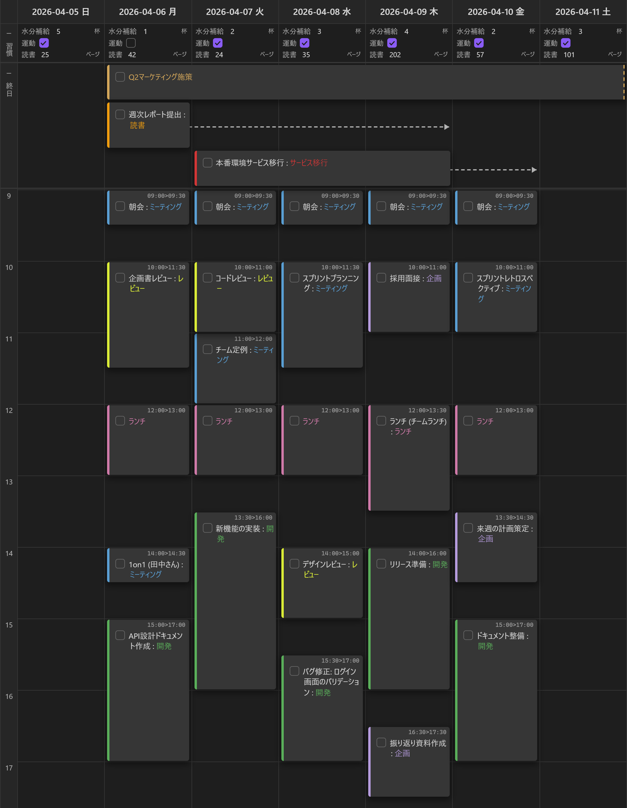

# Task Viewer

**Simple syntax, rich views.**

マークダウンにシンプルな記法でタスクを書くと、タイムラインやカレンダーなどのビジュアルビューで管理できるObsidianプラグインです。記法はプレーンテキストとして読める簡潔さを保ちつつ、ビューではドラッグ&ドロップやタイマーなどリッチな操作ができます。



---

## 特徴

- **シンプルな記法** — タスク行に `@start>end>due` を加えるだけ。マークダウンとしてそのまま読める
- **6つのビュー** — Timeline, Schedule, Calendar, Mini Calendar, Kanban, Timer
- **ビュー上で直接操作** — ドラッグ&ドロップで時刻・日付を変更、伸縮ハンドルで期間を調整
- **マークダウンファースト** — すべてのタスク情報はマークダウンファイルに保存。独自DBなし、ロックインなし

---

## クイックスタート

### 1. タスクを書く

```markdown
- [ ] 会議の準備 @2026-02-05T14:00>15:00
- [ ] レポート提出 @2026-02-05>>2026-02-10
```

### 2. ビューを開く

コマンドパレット(`Ctrl/Cmd + P`) → **Task Viewer: Open Timeline View**

### 3. ビュー上で操作する

- タスクカードをドラッグして時刻を変更
- 上下の端をドラッグして開始・終了時刻を調整
- チェックボックスをクリックして完了

---

## 記法

### インライン記法

マークダウンファイルの任意の場所にタスクを記述します。

```markdown
- [ ] タスク名 @2026-02-05                    ← 日付のみ
- [ ] タスク名 @2026-02-05T14:00>15:00        ← 時刻付き
- [ ] タスク名 @2026-02-05>2026-02-07         ← 開始〜終了
- [ ] タスク名 @2026-02-05>>2026-02-10        ← 開始と締切
```

子タスクは親の日付を継承します:

```markdown
- [ ] 会議 @2026-01-28T15:00>16:30
    - [ ] 準備 @14:00>15:00
    - [ ] 片付け @16:30>17:00
```

### Frontmatter記法

ファイル全体を1つのタスクとして扱えます。プロジェクトや期間の長いタスクに便利です。

```yaml
---
tv-start: 2026-02-01
tv-end: 2026-02-15
tv-due: 2026-02-20
tv-content: ウェブサイトリニューアル
---
```

記法の全パターンやオプションの詳細は [記法リファレンス](docs/notation.md) をご覧ください。

---

## ビュー

すべてのビューはコマンドパレットから開けます。

### Timeline

24時間タイムラインと終日タスク欄。タスクを時間軸上にカードとして表示し、ドラッグ&ドロップで操作できます。

`[screenshot: Timeline View]`

### Schedule

リスト形式のスケジュール表示。タスクを一覧で確認・操作できます。

`[screenshot: Schedule View]`

### Calendar

月間カレンダー。日ごとのタスクを俯瞰できます。

`[screenshot: Calendar View]`

### Mini Calendar

サイドバー向けのコンパクトなカレンダー。

`[screenshot: Mini Calendar View]`

### Kanban

カンバンボード。ステータスごとにタスクをカラム表示します。

`[screenshot: Kanban View]`

### Timer

ポモドーロ、カウントダウン、カウントアップ、インターバルの4モード。タスクと連携して作業時間を計測できます。

`[screenshot: Timer View]`

各ビューの詳細な操作方法は [docs/views/](docs/views/) をご覧ください。

---

## その他の機能

- **繰り返しタスク** — タスク完了時に次のタスクを自動生成（[詳細](docs/commands.md)）
- **フィルタ・ソート** — タグ、ステータス、日付などで絞り込み・並べ替え
- **プロパティ** — タスクカードの色や線スタイルをカスタマイズ
- **ビューテンプレート** — フィルタやレイアウトの設定を保存・再利用
- **エディタ統合** — エディタ上のタスク行にインラインメニューを表示
- **他プラグイン互換** — Tasks Plugin / Day Planner の記法を読み取り可能（読み取り専用）
- **CLI** — Obsidian CLI からタスクデータにアクセス（[詳細](docs/cli.md)）
- **Public API** — 他のプラグインや DataviewJS から利用可能（[詳細](docs/api.md)）
- **モバイル対応** — タッチ操作・レスポンシブレイアウト対応

---

## ドキュメント

| ドキュメント | 内容 |
|------------|------|
| [記法リファレンス](docs/notation.md) | インライン・Frontmatter記法の全パターン |
| [ビュー詳細](docs/views/) | 各ビューの操作方法 |
| [設定リファレンス](docs/settings.md) | 全設定項目の説明 |
| [コマンド](docs/commands.md) | 繰り返しタスク（next/repeat/move） |
| [CLI](docs/cli.md) | CLI リファレンス（Experimental） |
| [Public API](docs/api.md) | API リファレンス（Experimental） |
| [開発者向け](docs/developer.md) | 内部アーキテクチャ・型仕様 |

---

## インストール

### 手動インストール

1. このリポジトリをクローン
2. `npm install` で依存関係をインストール
3. `npm run build` でビルド
4. `main.js`、`manifest.json`、`styles.css` を Vault の `.obsidian/plugins/obsidian-task-viewer/` にコピー

---

## ライセンス

MIT License
